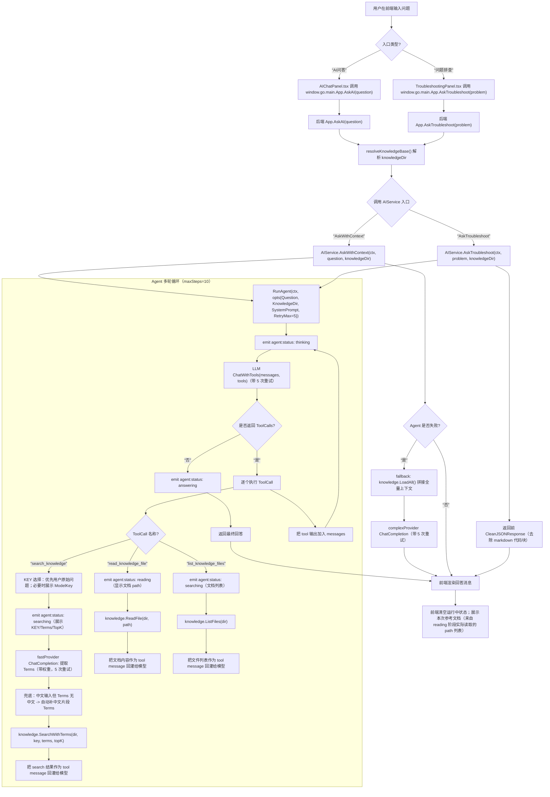

## 问题排查 / AI 问答整体流程（当前实现）

```mermaid
flowchart TD
  A["用户在前端输入问题"] --> B{"入口类型?"}

  B -->|“AI问答”| C["AIChatPanel.tsx 调用 window.go.main.App.AskAI(question)"]
  B -->|“问题排查”| D["TroubleshootingPanel.tsx 调用 window.go.main.App.AskTroubleshoot(problem)"]

  C --> E["后端 App.AskAI(question)"]
  D --> F["后端 App.AskTroubleshoot(problem)"]

  E --> G["resolveKnowledgeBase() 解析 knowledgeDir"]
  F --> G

  G --> H{"调用 AIService 入口"}
  H -->|“AskWithContext”| I["AIService.AskWithContext(ctx, question, knowledgeDir)"]
  H -->|“AskTroubleshoot”| J["AIService.AskTroubleshoot(ctx, problem, knowledgeDir)"]

  I --> K["RunAgent(ctx, opts{Question, KnowledgeDir, SystemPrompt, RetryMax=5})"]
  J --> K

  subgraph S["Agent 多轮循环（maxSteps=10）"]
    K --> S1["emit agent:status: thinking"]
    S1 --> S2["LLM ChatWithTools(messages, tools)（带 5 次重试）"]
    S2 --> S3{"是否返回 ToolCalls?"}

    S3 -->|“否”| S4["emit agent:status: answering"]
    S4 --> S5["返回最终回答"]

    S3 -->|“是”| S6["逐个执行 ToolCall"]

    S6 --> T1{"ToolCall 名称?"}
    T1 -->|“search_knowledge”| T2["KEY 选择：优先用户原始问题；必要时展示 ModelKey"]
    T2 --> T3["emit agent:status: searching（展示 KEY/Terms/TopK）"]
    T3 --> T4["fastProvider ChatCompletion: 提取 Terms（带权重，5 次重试）"]
    T4 --> T5["兜底：中文输入但 Terms 无中文 -> 自动补中文片段 Terms"]
    T5 --> T6["knowledge.SearchWithTerms(dir, key, terms, topK)"]
    T6 --> T7["把 search 结果作为 tool message 回灌给模型"]

    T1 -->|“read_knowledge_file”| R1["emit agent:status: reading（显示文档 path）"]
    R1 --> R2["knowledge.ReadFile(dir, path)"]
    R2 --> R3["把文档内容作为 tool message 回灌给模型"]

    T1 -->|“list_knowledge_files”| L1["emit agent:status: searching（文档列表）"]
    L1 --> L2["knowledge.ListFiles(dir)"]
    L2 --> L3["把文件列表作为 tool message 回灌给模型"]

    S6 --> S7["把 tool 输出加入 messages"]
    S7 --> S1
  end

  S5 --> U["前端渲染回答消息"]
  U --> V["前端清空运行中状态；展示 本次参考文档（来自 reading 阶段实际读取的 path 列表）"]

  I --> W{"Agent 是否失败?"}
  W -->|“是”| X["fallback: knowledge.LoadAll() 拼接全量上下文"]
  X --> Y["complexProvider ChatCompletion（带 5 次重试）"]
  Y --> U
  W -->|“否”| U

  J --> Z["返回前 CleanJSONResponse（去除 markdown 代码块）"]
  Z --> U
```
