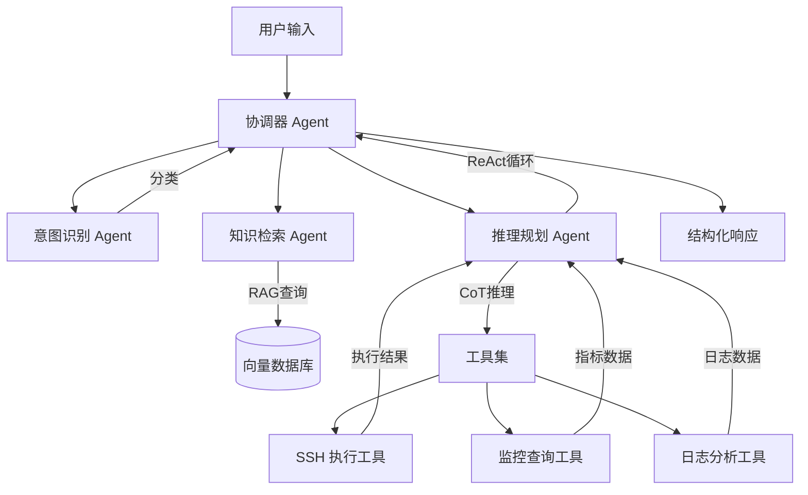
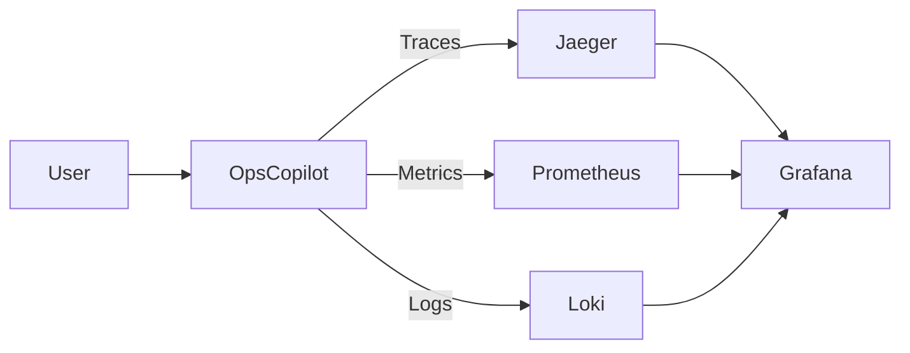
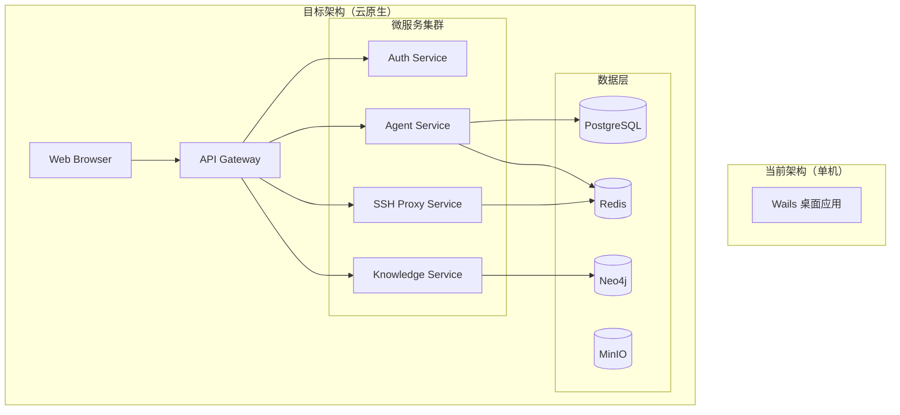

# OpsCopilot 技术演进路线图

## 📊 现状分析

### 当前系统架构的优势
- ✅ 快速原型验证，核心功能可用
- ✅ Prompt Engineering 基础扎实
- ✅ UI/UX 体验良好
- ✅ 代码结构清晰，易于维护

### 现状的局限性
- ⚠️ **AI 能力单薄**：仅使用简单的 Prompt → Response 模式，无状态管理、无推理链、无工具调用
- ⚠️ **缺乏智能化**：AI 只是"查询工具"，未真正介入运维决策链路
- ⚠️ **知识孤岛**：RAG 仅做检索，无知识图谱、无关系推理
- ⚠️ **可观测性弱**：缺乏系统级监控、追踪、性能分析
- ⚠️ **扩展性受限**：非插件化架构，难以集成外部工具
- ⚠️ **协同能力差**：单机应用，无法支持团队协作

---

## 🎯 演进总体目标

**从"AI辅助工具"升级为"智能运维平台"**

### 三年愿景
1. **Year 1（当前 → AI Agent 化）**：引入 Agent 架构，实现真正的智能决策
2. **Year 2（平台化）**：构建插件生态，集成可观测性体系
3. **Year 3（AIOps）**：自动化故障诊断、根因分析、自愈系统

---

## 🚀 Phase 1: AI Agent 化改造（技术深度提升）

### 1.1 引入 LangChain / LangGraph 架构

**问题**：当前系统是"单次调用模式"，AI 无记忆、无工具、无推理链。

**方案**：改造为 **Multi-Agent System**

#### 架构设计



#### 核心技术点

##### 1.1.1 **Chain-of-Thought (CoT) 推理链**

**当前**：
```
用户：数据库慢 → AI：执行 show processlist
```

**改造后**：
```
用户：数据库慢

AI 内部推理链（可见）：
  Thought 1: 数据库慢可能是连接数、慢查询、锁、IO 等原因
  Action 1: 使用 MonitorTool 查询数据库 QPS 和连接数
  Observation 1: 连接数正常(50/200)，QPS 激增(2000→8000)
  
  Thought 2: QPS 激增说明可能有慢查询或索引失效
  Action 2: 使用 SSHTool 执行 `mysqldumpslow -s t slow.log | head -5`
  Observation 2: 发现一个全表扫描查询占用 5s
  
  Thought 3: 定位到具体慢查询，建议添加索引
  Final Answer: 根本原因是 xxx 查询未使用索引，建议...
```

**实现**：
```go
// pkg/agent/reasoning_agent.go
type ReasoningAgent struct {
    llm      llm.Provider
    tools    []Tool
    memory   *ConversationMemory
}

type ThoughtStep struct {
    Thought     string
    Action      string
    ActionInput map[string]interface{}
    Observation string
}

func (a *ReasoningAgent) ReAct(question string, maxSteps int) ([]ThoughtStep, string) {
    steps := []ThoughtStep{}
    
    for i := 0; i < maxSteps; i++ {
        // 1. 生成 Thought
        thought := a.generateThought(question, steps)
        
        // 2. 选择 Action（工具调用）
        action, input := a.selectAction(thought)
        
        // 3. 执行 Action
        observation := a.executeTool(action, input)
        
        steps = append(steps, ThoughtStep{
            Thought:     thought,
            Action:      action,
            ActionInput: input,
            Observation: observation,
        })
        
        // 4. 判断是否完成
        if a.shouldFinish(observation) {
            break
        }
    }
    
    // 5. 生成最终答案
    finalAnswer := a.generateAnswer(question, steps)
    return steps, finalAnswer
}
```

##### 1.1.2 **Tool-Use（工具调用）能力**

**定义工具协议**：
```go
// pkg/agent/tool.go
type Tool interface {
    Name() string
    Description() string
    Schema() *JSONSchema  // 工具参数的 JSON Schema
    Execute(ctx context.Context, input map[string]interface{}) (string, error)
}

// 示例：SSH 执行工具
type SSHExecuteTool struct {
    sessionMgr *session.Manager
}

func (t *SSHExecuteTool) Name() string {
    return "ssh_execute"
}

func (t *SSHExecuteTool) Description() string {
    return "Execute shell command on remote server via SSH. Returns command output."
}

func (t *SSHExecuteTool) Schema() *JSONSchema {
    return &JSONSchema{
        Type: "object",
        Properties: map[string]Property{
            "session_id": {Type: "string", Description: "SSH session ID"},
            "command":    {Type: "string", Description: "Shell command to execute"},
        },
        Required: []string{"session_id", "command"},
    }
}

func (t *SSHExecuteTool) Execute(ctx context.Context, input map[string]interface{}) (string, error) {
    sessionID := input["session_id"].(string)
    command := input["command"].(string)
    
    // 执行命令并等待输出（需要实现同步执行模式）
    output, err := t.sessionMgr.ExecuteSync(sessionID, command, 30*time.Second)
    return output, err
}
```

**工具集扩展**：
- `ssh_execute` - 远程命令执行
- `metric_query` - 查询监控指标（集成 Prometheus）
- `log_search` - 日志搜索（集成 Elasticsearch）
- `knowledge_search` - 知识库检索（当前 RAG）
- `sql_query` - 数据库查询（只读）
- `alert_query` - 告警查询
- `topology_query` - 服务拓扑查询

##### 1.1.3 **Memory（记忆）管理**

**当前**：每次对话都是独立的，AI 无上下文。

**改造**：引入多级记忆系统

```go
// pkg/agent/memory.go
type ConversationMemory struct {
    // 短期记忆：当前会话的所有交互
    shortTerm []Message
    
    // 工作记忆：当前任务的关键信息
    workingMemory map[string]interface{}
    
    // 长期记忆：历史故障案例（存储在向量数据库）
    vectorStore VectorStore
}

type Message struct {
    Role      string    // user, assistant, system, tool
    Content   string
    Timestamp time.Time
    Metadata  map[string]interface{}
}

// 示例：压缩长期对话历史
func (m *ConversationMemory) Compress() error {
    if len(m.shortTerm) > 20 {
        // 使用 LLM 压缩前 10 条消息为摘要
        summary := m.summarizeMessages(m.shortTerm[:10])
        m.shortTerm = append([]Message{{
            Role:    "system",
            Content: "Previous conversation summary: " + summary,
        }}, m.shortTerm[10:]...)
    }
    return nil
}
```

##### 1.1.4 **Function Calling（OpenAI 原生支持）**

利用 OpenAI 的原生 Function Calling 能力：

```go
// pkg/llm/openai_provider.go
func (p *OpenAIProvider) ChatCompletionWithTools(
    ctx context.Context,
    messages []ChatMessage,
    tools []Tool,
) (*ToolCallResponse, error) {
    
    functions := make([]openai.FunctionDefinition, len(tools))
    for i, tool := range tools {
        functions[i] = openai.FunctionDefinition{
            Name:        tool.Name(),
            Description: tool.Description(),
            Parameters:  tool.Schema(), // JSON Schema
        }
    }
    
    resp, err := p.client.CreateChatCompletion(ctx, openai.ChatCompletionRequest{
        Model:     p.model,
        Messages:  convertMessages(messages),
        Functions: functions,
        FunctionCall: "auto", // 让模型自动决定是否调用
    })
    
    // 检查是否有 function_call
    if resp.Choices[0].FinishReason == "function_call" {
        return &ToolCallResponse{
            NeedToolCall: true,
            ToolName:     resp.Choices[0].Message.FunctionCall.Name,
            ToolInput:    parseJSON(resp.Choices[0].Message.FunctionCall.Arguments),
        }, nil
    }
    
    return &ToolCallResponse{
        NeedToolCall: false,
        FinalAnswer:  resp.Choices[0].Message.Content,
    }, nil
}
```

---

### 1.2 引入知识图谱（Knowledge Graph）

**问题**：当前 RAG 是"扁平检索"，无法理解实体关系和多跳推理。

**方案**：构建运维领域知识图谱

#### 知识图谱示例

```
(服务:payment-service)-[:DEPENDS_ON]->(服务:mysql-master)
(服务:payment-service)-[:DEPLOYED_ON]->(主机:10.1.1.1)
(主机:10.1.1.1)-[:HAS_ALERT]->(告警:CPU>80%)
(告警:CPU>80%)-[:CAUSED_BY]->(进程:java)
(故障案例:2024-01-15)-[:ROOT_CAUSE]->(问题:索引缺失)
(问题:索引缺失)-[:SOLUTION]->(操作:CREATE INDEX)
```

#### 技术实现

**存储**：使用 **Neo4j** 或嵌入式图数据库 **Cayley**

```go
// pkg/knowledge/graph.go
type KnowledgeGraph struct {
    db *cayley.Handle
}

// 查询：找出所有依赖 mysql-master 的服务
func (kg *KnowledgeGraph) FindDependentServices(target string) ([]string, error) {
    query := cayley.StartPath(kg.db, target).
        In("DEPENDS_ON").
        All()
    
    var services []string
    for result := range query {
        services = append(services, result.String())
    }
    return services, nil
}

// 查询：根因分析（多跳推理）
func (kg *KnowledgeGraph) RootCauseAnalysis(symptom string) (*CausePath, error) {
    // 从症状节点出发，沿着 CAUSED_BY 关系反向查找
    query := cayley.StartPath(kg.db, symptom).
        Out("CAUSED_BY").
        Out("ROOT_CAUSE").
        Limit(1)
    
    // 返回完整路径
    return parsePath(query), nil
}
```

#### 应用场景

1. **故障影响面分析**
   ```
   用户：mysql-master 挂了会影响哪些服务？
   
   图谱查询：
   (mysql-master)<-[:DEPENDS_ON]-(服务A)
   (mysql-master)<-[:DEPENDS_ON]-(服务B)
   
   AI 回答：会影响 payment-service 和 order-service
   ```

2. **历史故障检索**
   ```
   用户：CPU 使用率高
   
   图谱查询：
   (告警:CPU>80%)-[:SIMILAR_TO]->(历史案例:2024-01-15)
   (历史案例:2024-01-15)-[:ROOT_CAUSE]->(进程异常)
   (历史案例:2024-01-15)-[:SOLUTION]->(重启服务)
   
   AI 回答：根据历史案例，可能是某进程异常，建议先检查 top 和 ps aux
   ```

---

### 1.3 多模态输入支持

**问题**：当前只支持文本输入。

**方案**：支持截图、日志文件、监控图表等多模态输入

#### 技术实现

使用 **GPT-4 Vision** 或 **Claude 3** 的图像理解能力：

```go
// pkg/agent/multimodal.go
func (a *Agent) AnalyzeScreenshot(imageBase64 string, question string) (string, error) {
    messages := []llm.ChatMessage{
        {
            Role: "user",
            Content: []ContentPart{
                {Type: "text", Text: question},
                {Type: "image_url", ImageURL: "data:image/png;base64," + imageBase64},
            },
        },
    }
    
    resp, err := a.llm.ChatCompletion(context.Background(), messages)
    return resp, err
}
```

#### 应用场景

1. **监控大盘截图分析**
   - 用户截图 Grafana 大盘
   - AI 识别异常曲线并给出诊断建议

2. **日志文件批量分析**
   - 用户上传 50MB 日志文件
   - AI 自动提取错误信息并聚类

---

## 🏗️ Phase 2: 平台化与可观测性（架构升级）

### 2.1 插件化架构

**问题**：当前系统硬编码集成，扩展性差。

**方案**：实现插件系统，支持第三方工具集成

#### 插件协议设计

```go
// pkg/plugin/plugin.go
type Plugin interface {
    // 元数据
    Metadata() PluginMetadata
    
    // 生命周期
    Initialize(ctx context.Context, config map[string]interface{}) error
    Start(ctx context.Context) error
    Stop(ctx context.Context) error
    
    // 功能扩展点
    RegisterTools() []agent.Tool
    RegisterCommands() []Command
    RegisterUI() UIExtension
}

type PluginMetadata struct {
    ID          string
    Name        string
    Version     string
    Author      string
    Description string
    Homepage    string
}

// 示例：Prometheus 监控插件
type PrometheusPlugin struct {
    client *prometheus.Client
}

func (p *PrometheusPlugin) RegisterTools() []agent.Tool {
    return []agent.Tool{
        &MetricQueryTool{client: p.client},
        &AlertQueryTool{client: p.client},
    }
}
```

#### 插件生态规划

| 插件名称 | 功能 | 优先级 |
|---------|------|-------|
| **Prometheus Plugin** | 监控指标查询 | P0 |
| **Elasticsearch Plugin** | 日志搜索分析 | P0 |
| **Kubernetes Plugin** | K8s 资源管理 | P1 |
| **Grafana Plugin** | 可视化图表嵌入 | P1 |
| **Jira Plugin** | 工单自动创建 | P2 |
| **PagerDuty Plugin** | 告警通知集成 | P2 |
| **Ansible Plugin** | 自动化脚本执行 | P2 |

---

### 2.2 可观测性体系

**问题**：系统自身是黑盒，无法追踪 AI 决策链路和性能瓶颈。

**方案**：集成 **OpenTelemetry**，实现全链路追踪

#### 架构设计



#### 实现示例

```go
// pkg/telemetry/tracer.go
import (
    "go.opentelemetry.io/otel"
    "go.opentelemetry.io/otel/trace"
)

func (a *Agent) ReActWithTracing(ctx context.Context, question string) (string, error) {
    // 创建 Span
    tracer := otel.Tracer("opscopilot.agent")
    ctx, span := tracer.Start(ctx, "agent.ReAct",
        trace.WithAttributes(
            attribute.String("question", question),
        ),
    )
    defer span.End()
    
    // 子 Span：意图识别
    ctx, intentSpan := tracer.Start(ctx, "agent.identifyIntent")
    intent := a.identifyIntent(ctx, question)
    intentSpan.SetAttributes(attribute.String("intent", intent))
    intentSpan.End()
    
    // 子 Span：工具调用
    ctx, toolSpan := tracer.Start(ctx, "agent.executeTool")
    result := a.executeTool(ctx, intent)
    toolSpan.SetAttributes(attribute.Int("result_size", len(result)))
    toolSpan.End()
    
    return result, nil
}
```

#### 可视化效果

在 Grafana Tempo 中可以看到：
```
Trace: user_question_handling (total: 5.2s)
  ├─ agent.identifyIntent (120ms)
  ├─ agent.executeTool (3.8s)
  │   ├─ ssh.connect (1.2s)
  │   └─ ssh.executeCommand (2.6s)
  └─ llm.generateResponse (1.3s)
      ├─ openai.api_call (1.1s)
      └─ response.parse (200ms)
```

---

### 2.3 事件溯源（Event Sourcing）

**问题**：当前只保存最终状态，无法回溯历史变更。

**方案**：引入事件溯源架构

#### 核心概念

```go
// pkg/eventsource/event.go
type Event struct {
    ID          string
    AggregateID string    // 聚合根 ID（如 session_id）
    Type        string    // 事件类型
    Payload     json.RawMessage
    Timestamp   time.Time
    UserID      string
    Metadata    map[string]interface{}
}

// 示例事件
var (
    SessionCreatedEvent      = "session.created"
    CommandExecutedEvent     = "command.executed"
    OutputReceivedEvent      = "output.received"
    SessionTerminatedEvent   = "session.terminated"
)

// 事件存储
type EventStore interface {
    Append(ctx context.Context, event *Event) error
    Load(ctx context.Context, aggregateID string, fromVersion int) ([]*Event, error)
    LoadByType(ctx context.Context, eventType string, since time.Time) ([]*Event, error)
}
```

#### 应用场景

1. **时间旅行调试**
   ```go
   // 重放某个会话的所有事件
   events := eventStore.Load(ctx, sessionID, 0)
   session := NewSession()
   for _, evt := range events {
       session.Apply(evt)  // 重建状态
   }
   ```

2. **行为分析**
   ```sql
   -- 查询所有用户执行的命令频率
   SELECT payload->>'command', COUNT(*) 
   FROM events 
   WHERE type = 'command.executed'
   GROUP BY payload->>'command'
   ORDER BY count DESC;
   ```

3. **审计日志**
   - 完整记录所有操作
   - 支持监管合规要求

---

## 🤖 Phase 3: AIOps 能力（智能运维）

### 3.1 自动化故障诊断（AutoDiagnosis）

**目标**：从"AI 给建议"升级为"AI 自动执行诊断"

#### 技术方案

```go
// pkg/aiops/diagnosis.go
type AutoDiagnoser struct {
    agent      *agent.ReasoningAgent
    policyRepo *PolicyRepository
}

// 诊断策略
type DiagnosisPolicy struct {
    Trigger    Condition       // 触发条件（如告警）
    Workflow   []DiagnosisStep // 诊断步骤
    Approval   ApprovalRule    // 审批规则
}

type DiagnosisStep struct {
    Type   string              // check_metric, execute_command, analyze_log
    Params map[string]interface{}
    Retry  int
}

// 自动诊断流程
func (ad *AutoDiagnoser) Diagnose(ctx context.Context, alert Alert) (*DiagnosisReport, error) {
    // 1. 匹配诊断策略
    policy := ad.policyRepo.Match(alert)
    
    // 2. 执行工作流
    report := &DiagnosisReport{AlertID: alert.ID}
    for i, step := range policy.Workflow {
        // 使用 Agent 执行步骤
        result, err := ad.agent.ExecuteStep(ctx, step)
        report.Steps = append(report.Steps, StepResult{
            Index:  i,
            Step:   step,
            Result: result,
            Error:  err,
        })
        
        // AI 决策：是否继续
        if ad.shouldStop(result) {
            break
        }
    }
    
    // 3. 生成根因分析
    report.RootCause = ad.analyzeRootCause(report.Steps)
    
    // 4. 推荐修复方案
    report.Recommendation = ad.generateRecommendation(report.RootCause)
    
    return report, nil
}
```

#### 示例场景

```yaml
# policies/cpu_high.yaml
trigger:
  alert_name: "HighCPU"
  threshold: 80
  duration: 5m

workflow:
  - type: check_metric
    params:
      metric: node_cpu_usage
      range: 1h
      
  - type: execute_command
    params:
      command: "top -b -n 1 | head -20"
      session: auto_select
      
  - type: analyze_log
    params:
      log_path: "/var/log/app.log"
      pattern: "OutOfMemoryError|StackOverflow"
      
  - type: ai_reasoning
    params:
      prompt: "Based on the above metrics, command outputs, and logs, what is the root cause?"

approval:
  type: auto  # 自动执行，无需审批
  # type: manual  # 需要人工确认
```

---

### 3.2 根因分析（Root Cause Analysis）

**目标**：从海量监控数据中自动定位故障根因

#### 技术方案：因果推断 + 图分析

```go
// pkg/aiops/rca.go
type RCAEngine struct {
    kg           *knowledge.KnowledgeGraph
    metricStore  MetricStore
    causalModel  CausalModel
}

// 因果模型（使用贝叶斯网络）
type CausalModel struct {
    nodes []CausalNode
    edges []CausalEdge
}

type CausalNode struct {
    Metric      string
    Probability float64
}

type CausalEdge struct {
    From   string
    To     string
    Weight float64  // 因果强度
}

// RCA 算法
func (rca *RCAEngine) Analyze(ctx context.Context, symptom Metric) (*RCAResult, error) {
    // 1. 获取异常时间窗口的所有指标
    metrics := rca.metricStore.QueryTimeRange(symptom.Timestamp.Add(-10*time.Minute), symptom.Timestamp)
    
    // 2. 检测异常指标（使用统计方法）
    anomalies := detectAnomalies(metrics)
    
    // 3. 构建依赖图（从知识图谱获取）
    depGraph := rca.kg.GetDependencyGraph()
    
    // 4. 使用 PageRank 算法计算根因得分
    scores := pageRank(depGraph, anomalies)
    
    // 5. 使用 LLM 生成可读的根因报告
    report := rca.generateReport(scores)
    
    return &RCAResult{
        RootCauses: scores[:3],  // Top 3
        Report:     report,
    }, nil
}
```

---

### 3.3 预测性维护（Predictive Maintenance）

**目标**：在故障发生前预警

#### 技术方案：时序预测 + 异常检测

```go
// pkg/aiops/prediction.go
type PredictionEngine struct {
    model TimeSeriesModel  // LSTM / Prophet
}

// 训练预测模型
func (pe *PredictionEngine) Train(ctx context.Context, metrics []Metric) error {
    // 1. 数据预处理
    normalized := normalize(metrics)
    
    // 2. 特征工程
    features := extractFeatures(normalized)
    
    // 3. 训练模型（调用 Python 微服务）
    return pe.model.Fit(features)
}

// 预测未来指标
func (pe *PredictionEngine) Predict(ctx context.Context, metricName string, horizon time.Duration) ([]PredictedMetric, error) {
    // 1. 获取历史数据
    history := pe.metricStore.Query(metricName, 7*24*time.Hour)
    
    // 2. 预测
    predictions := pe.model.Forecast(history, horizon)
    
    // 3. 检测是否会超过阈值
    for _, pred := range predictions {
        if pred.Value > threshold && pred.Confidence > 0.8 {
            // 发出预警
            alert := Alert{
                Type:    "Prediction",
                Message: fmt.Sprintf("%s will exceed %f at %s (confidence: %.2f)", metricName, threshold, pred.Timestamp, pred.Confidence),
            }
            pe.sendAlert(alert)
        }
    }
    
    return predictions, nil
}
```

---

### 3.4 自愈系统（Self-Healing）

**目标**：自动执行修复操作

#### 技术方案：规则引擎 + 审批流

```go
// pkg/aiops/healing.go
type HealingEngine struct {
    rules    []HealingRule
    executor ActionExecutor
}

type HealingRule struct {
    Condition  Condition   // 触发条件
    Actions    []Action    // 修复动作
    Approval   ApprovalRule
    MaxRetry   int
}

type Action struct {
    Type   string  // restart_service, scale_up, rollback
    Params map[string]interface{}
}

// 示例规则
var rules = []HealingRule{
    {
        Condition: Condition{
            Metric:    "service.health",
            Operator:  "==",
            Value:     "unhealthy",
            Duration:  5 * time.Minute,
        },
        Actions: []Action{
            {Type: "restart_service", Params: map[string]interface{}{"service": "payment-service"}},
        },
        Approval: ApprovalRule{Type: "auto", MaxImpact: "low"},
        MaxRetry: 3,
    },
}

// 执行自愈
func (he *HealingEngine) Heal(ctx context.Context, incident Incident) error {
    rule := he.matchRule(incident)
    
    // 请求审批（如果需要）
    if rule.Approval.Type == "manual" {
        approved := he.requestApproval(rule, incident)
        if !approved {
            return ErrApprovalDenied
        }
    }
    
    // 执行动作
    for i := 0; i < rule.MaxRetry; i++ {
        err := he.executor.Execute(ctx, rule.Actions)
        if err == nil {
            // 验证修复效果
            if he.verify(incident) {
                return nil
            }
        }
        time.Sleep(time.Minute)
    }
    
    return ErrHealingFailed
}
```

---

## 🌐 Phase 4: 云原生与协作（架构重构）

### 4.1 从桌面应用到 Web 服务

**问题**：Wails 是单机应用，无法支持团队协作。

**方案**：重构为 B/S 架构

#### 架构演进



#### 技术选型

| 组件 | 技术栈 | 说明 |
|------|-------|------|
| **Frontend** | Vue 3 / React | SPA 单页应用 |
| **API Gateway** | Kong / Traefik | 统一入口，限流、鉴权 |
| **Backend** | Go + Gin + GRPC | 微服务架构 |
| **WebSocket** | gorilla/websocket | 终端实时通信 |
| **Message Queue** | NATS / Kafka | 事件驱动 |
| **Database** | PostgreSQL | 主数据库 |
| **Cache** | Redis | 会话缓存 |
| **Graph DB** | Neo4j | 知识图谱 |
| **Object Storage** | MinIO | 日志、截图存储 |
| **Orchestration** | Kubernetes | 容器编排 |

---

### 4.2 多租户与权限管理

**目标**：支持企业级多团队使用

#### 数据隔离

```sql
-- 所有表添加 tenant_id 字段
CREATE TABLE sessions (
    id UUID PRIMARY KEY,
    tenant_id UUID NOT NULL,  -- 租户 ID
    user_id UUID NOT NULL,
    ...
);

CREATE INDEX idx_sessions_tenant ON sessions(tenant_id);

-- Row-Level Security (PostgreSQL 特性)
ALTER TABLE sessions ENABLE ROW LEVEL SECURITY;

CREATE POLICY tenant_isolation ON sessions
    USING (tenant_id = current_setting('app.current_tenant')::UUID);
```

#### RBAC 权限模型

```go
// pkg/auth/rbac.go
type Role string

const (
    RoleAdmin    Role = "admin"      // 全部权限
    RoleOperator Role = "operator"   // 执行操作
    RoleViewer   Role = "viewer"     // 只读
)

type Permission string

const (
    PermSSHConnect    Permission = "ssh:connect"
    PermSSHExecute    Permission = "ssh:execute"
    PermKnowledgeRead Permission = "knowledge:read"
    PermKnowledgeWrite Permission = "knowledge:write"
)

var rolePermissions = map[Role][]Permission{
    RoleAdmin:    {PermSSHConnect, PermSSHExecute, PermKnowledgeRead, PermKnowledgeWrite},
    RoleOperator: {PermSSHConnect, PermSSHExecute, PermKnowledgeRead},
    RoleViewer:   {PermKnowledgeRead},
}
```

---

### 4.3 实时协作

**目标**：多人同时查看同一终端会话

#### 技术方案：CRDT（Conflict-free Replicated Data Type）

```go
// pkg/collaboration/session.go
type CollaborativeSession struct {
    ID       string
    Members  map[string]*Member  // user_id -> Member
    CRDT     *TerminalCRDT       // 终端状态的 CRDT
}

type Member struct {
    UserID   string
    Role     MemberRole  // owner, editor, viewer
    Cursor   CursorPosition
}

// 广播用户光标位置
func (cs *CollaborativeSession) BroadcastCursor(userID string, pos CursorPosition) {
    for memberID, member := range cs.Members {
        if memberID != userID {
            sendMessage(member.WebSocketConn, CursorMoveEvent{
                UserID:   userID,
                Position: pos,
            })
        }
    }
}
```

---

## 📊 技术指标与里程碑

### 性能目标

| 指标 | 当前 | Year 1 | Year 2 | Year 3 |
|------|------|--------|--------|--------|
| **AI 响应时间** | 2-5s | <2s | <1s | <500ms |
| **SSH 连接耗时** | 1-3s | <1s | <500ms | <300ms |
| **并发用户数** | 1 | 100 | 1000 | 10000 |
| **知识库规模** | 10 docs | 1000 docs | 10000 docs | 100000 docs |
| **Agent 推理步数** | 1 | 5 | 10 | 20 |
| **故障自愈率** | 0% | 10% | 30% | 50% |

### 研发里程碑

#### Q1-Q2: Agent 化改造
- [ ] 实现 ReAct 推理框架
- [ ] 集成 5+ 工具（SSH, Metrics, Logs）
- [ ] 引入 Function Calling
- [ ] 实现对话记忆管理

#### Q3-Q4: 平台化
- [ ] 设计插件协议
- [ ] 开发 Prometheus/ES 插件
- [ ] 集成 OpenTelemetry
- [ ] 实现事件溯源

#### Year 2: AIOps 能力
- [ ] 自动化故障诊断
- [ ] 根因分析引擎
- [ ] 预测性维护
- [ ] 自愈系统 MVP

#### Year 3: 云原生重构
- [ ] 微服务架构
- [ ] 多租户支持
- [ ] 实时协作
- [ ] 移动端支持

---

## 🎓 技术深度提升方向

### 论文与前沿技术

1. **ReAct: Synergizing Reasoning and Acting in Language Models** (ICLR 2023)
   - 实现思考-行动-观察循环

2. **Retrieval-Augmented Generation for Knowledge-Intensive NLP Tasks** (NeurIPS 2020)
   - 优化 RAG 检索策略

3. **Graph Neural Networks for Root Cause Analysis**
   - 使用 GNN 提升根因分析准确性

4. **Causal Discovery in Time Series**
   - 基于格兰杰因果关系的故障预测

5. **AutoML for AIOps**
   - 自动化机器学习模型训练

### 开源贡献方向

- 贡献 LangChain-Go 社区
- 开源运维领域 Agent Toolkit
- 发布运维知识图谱标准
- 构建 AIOps Benchmark

---

## 💡 总结与建议

### 技术债务优先级

**P0 (立即解决)**
1. 引入 Agent 架构（ReAct 框架）
2. 实现 Tool-Use 能力
3. 添加单元测试覆盖率到 80%+

**P1 (3个月内)**
4. 集成 OpenTelemetry 可观测性
5. 实现插件系统
6. 引入知识图谱

**P2 (6个月内)**
7. 自动化故障诊断
8. 根因分析引擎
9. 事件溯源架构

### 技术选型建议

- **LLM**: 优先使用 OpenAI GPT-4，备选 Claude 3.5 / DeepSeek
- **Agent 框架**: LangChain-Go 或自研（更灵活）
- **图数据库**: Neo4j（成熟）或 Cayley（嵌入式）
- **可观测性**: OpenTelemetry + Grafana Stack
- **消息队列**: NATS（轻量）或 Kafka（高吞吐）

### 团队能力建设

- 学习 LangChain / LangGraph 源码
- 阅读 AIOps 相关论文
- 掌握知识图谱技术
- 熟悉分布式系统架构

---

<div align="center">

**从工具到平台，从辅助到智能，从单机到云端**

*OpsCopilot 的征途是星辰大海* ✨

</div>
