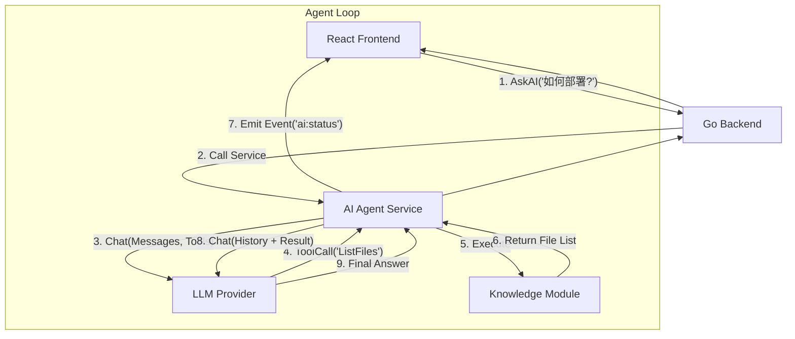

# OpsCopilot Agentic RAG 系统设计文档与迭代计划

本文档详细描述了将 OpsCopilot 从“全量上下文拼接”升级为“AI-FunctionCall 驱动的 Agentic RAG”的架构设计与实施路线。

## 1. 背景与目标

**现状**：当前通过 `knowledge.LoadAll()` 将所有 Markdown 暴力拼接，导致 Token 浪费、噪声干扰、且无法处理大规模文档。
**目标**：

1. **精准检索**：利用 LLM 的推理能力自主定位所需文档（Agentic Retrieval）。
2. **状态感知**：前端实时展示 AI 的思考与操作过程（如“正在搜索...”、“正在阅读...”）。
3. **零外部依赖**：仅依赖 LLM 模型本身的能力，无需向量数据库。

## 2. 系统架构设计

### 2.1 模块交互图



### 2.2 核心模块设计

#### A. LLM 层升级 (`pkg/llm`)

扩展现有的 `Provider` 接口，支持 Function Calling 标准。

```go
type Tool struct {
    Type     string           `json:"type"` // "function"
    Function FunctionDef      `json:"function"`
}

type ChatResponse struct {
    Content   string
    ToolCalls []ToolCall      // AI 返回的工具调用请求
}

type Provider interface {
    // 升级后的接口，支持传入 Tools
    ChatWithTools(ctx context.Context, messages []ChatMessage, tools []Tool) (*ChatResponse, error)
}
```

#### B. 知识库工具化 (`pkg/knowledge`)

将知识库封装为两个标准工具：

1. **`list_knowledge_files`**

   * **描述**: "List all available documentation files in the knowledge base to understand what information is available."

   * **参数**: 无

   * **返回**: 文件路径列表 `["deploy.md", "troubleshoot/network.md", ...]`

2. **`read_knowledge_file`**

   * **描述**: "Read the content of a specific documentation file."

   * **参数**: `{"path": "string"}`

   * **返回**: 文件的完整 Markdown 内容。

#### C. AI 编排层 (`pkg/ai`)

实现 **ReAct (Reasoning + Acting)** 循环：

1. **Input**: 用户问题。
2. **Loop**:

   * 将当前对话历史 + 工具定义发送给 LLM。

   * **Case 1**: LLM 返回文本 -> 循环结束，返回结果。

   * **Case 2**: LLM 返回 `ToolCall` ->

     * 发送事件 `ai:status` (e.g., "正在检索文档列表...")。

     * 执行对应 Go 函数。

     * 将结果作为 `ToolMessage` 追加到历史。

     * 继续下一轮循环。

   * **Max Steps**: 设置最大循环次数（如 5 次）防止死循环。

#### D. 前端状态协议

通过 Wails 事件机制 `runtime.EventsEmit` 通讯。

* **事件名**: `agent:status`

* **Payload**:

  ```json
  {
    "stage": "searching",  // searching, reading, thinking, answering
    "message": "正在查阅文档: deploy.md...",
    "timestamp": 1716300000
  }
  ```

***

## 3. 迭代计划 (Iteration Plan)

### Phase 1: 基础设施构建 (Backend Foundation)

* **任务 1.1**: 升级 `pkg/llm`，封装 `go-openai` 的 Tool 功能，确保向后兼容。

* **任务 1.2**: 在 `pkg/knowledge` 中实现 `ListFiles` 和 `ReadFile` 函数，并生成对应的 JSON Schema 定义。

* **验证**: 编写单元测试，确保 LLM 能正确识别工具定义，Knowledge 能正确读取文件。

### Phase 2: Agent 核心逻辑 (Agent Loop)

* **任务 2.1**: 在 `pkg/ai` 中实现 `AgentCore` 结构体，包含 ReAct 循环逻辑。

* **任务 2.2**: 重构 `AskWithContext`，接入 `AgentCore`。

* **任务 2.3**: 实现 `AskTroubleshoot` 的 Agent 版本（排查问题时可能需要读取多个文件）。

* **验证**: 命令行测试复杂问题（如“根据文档说明，如何配置 SSH？”），观察日志中的工具调用链。

### Phase 3: 前端体验升级 (UI/UX)

* **任务 3.1**: 在 `App.go` 中注入 Context，确保 Service 层能发送 Wails 事件。

* **任务 3.2**: 前端 `Chat` 组件增加 `StatusIndicator`，监听 `agent:status` 事件。

* **任务 3.3**: 优化 UI 展示，当 AI 在查阅文档时显示动态 Loading 效果。

### Phase 4: 兜底与优化 (Fallback & Optimization)

* **任务 4.1**: **模型兼容性检查**。如果配置的模型（如某些本地模型）不支持 Tools，自动降级回“全量拼接”模式。

* **任务 4.2**: **缓存机制**。对 `ListFiles` 结果进行缓存，避免每次都扫描磁盘。

* **任务 4.3**: **Token 保护**。如果 `read_knowledge_file` 读取的文件过大，自动进行截断或摘要。

## 4. 风险评估

1. **模型能力**: 若用户使用较弱模型（< GPT-3.5 级别），可能无法正确调用工具或陷入循环。 -> *对策：提供配置开关，允许用户强制关闭 Agent 模式。*
2. **延迟增加**: 多轮对话（2-3 轮）会比单轮对话慢。 -> *对策：前端通过实时状态反馈（"正在思考..."）缓解用户等待焦虑。*

