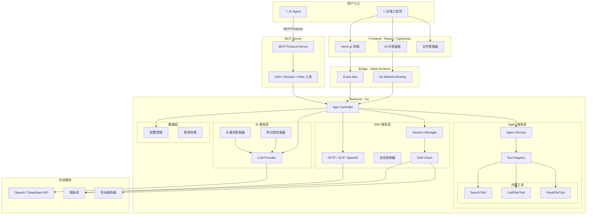

# OpsCopilot

<div align="center">

**AI 驱动的智能运维助手 / AI Agent 远程执行工具**

[](https://go.dev/)
[](https://wails.io/)
[](https://reactjs.org/)
[](https://www.typescriptlang.org/)

*让运维经验沉淀为知识，让 AI Agent 拥有远程执行能力*

</div>

---
## 📦 下载地址
https://github.com/Tudou77826/OpsCopilot/releases

## 📖 项目简介

OpsCopilot 是一款兼具**人机交互**与**AI Agent 工具**双重属性的智能运维平台：

| 角色 | 面向 | 核心能力 |
|------|------|---------|
| **运维助手** | 运维工程师 | AI 连接解析、知识库搜索、故障定位 Agent、会话录制 |
| **知识引擎** | 团队 | 排查经验自动沉淀、SOP 文档管理、知识复用 |
| **MCP Server** | AI Agent | SSH 远程执行、文件管理、支持命令、路径安全白名单 |

```
┌──────────────────────────────────────────────────────────────────────────┐
│                         OpsCopilot 双模架构                               │
├──────────────────────────────────────────────────────────────────────────┤
│                                                                          │
│  👨‍💻 人类模式                        🤖 Agent 模式                        │
│  ──────────────────────              ──────────────────────               │
│  终端操作 ◀──▶ SSH 连接             Claude / Cursor / ...                │
│  AI 对话  ◀──▶ 知识库搜索              │                                  │
│  故障定位 ◀──▶ Agent 推理             MCP Protocol                       │
│  过程录制 ◀──▶ 知识沉淀                │                                   │
│                                        ▼                                  │
│                                    OpsCopilot MCP Server                 │
│                                     ├─ ssh_exec     (远程命令执行)       │
│                                     ├─ server_connect/disconnect        │
│                                     ├─ file_upload/download              │
│                                                                          │
└──────────────────────────────────────────────────────────────────────────┘
```

---

## ✨ 核心功能

### 1. 🤖 AI 智能连接解析


通过自然语言描述连接意图，AI 自动解析并生成连接配置：

```text
用户输入：连接支付系统的 4 个节点 10.1.1.1-4，通过跳板机 172.16.0.1 用户 jump_user 密码 xxx，登录用户 app_user，需要切换 root

AI 解析：自动识别 IP 范围、跳板机配置、用户凭证、提权需求
结果：   生成 4 个完整的 SSH 连接配置
```

### 2. 🔍 智能知识库搜索


结合企业内部运维文档，提供精准的问题解答和命令建议：

```text
用户提问：支付服务响应慢怎么排查？

AI 策略：
  1. 关键词提取：支付(5.0), 响应慢(4.5), 性能(3.0)
  2. 混合检索：向量语义 + 关键词精确匹配
  3. 返回：《支付系统 SOP》相关章节 + 具体排查命令

推荐命令：
  - systemctl status payment-service
  - jstat -gc <PID>
  - tail -f /var/log/payment/slow.log
```

### 3. 🧠 定位助手（Agent 模式）


输入故障现象，AI 自主调用工具进行诊断：

```
┌─────────────────────────────────────────────────────────────────┐
│  用户: MySQL 连接池满了怎么办？                                  │
├─────────────────────────────────────────────────────────────────┤
│                                                                  │
│  Agent 思考过程:                                                 │
│  1. [search_knowledge] 搜索知识库... 找到 3 篇相关文档           │
│  2. [read_knowledge_file] 阅读《MySQL运维手册》...               │
│  3. [read_knowledge_file] 阅读《MySQL运维手册》...               │
│  4. [search_knowledge] 搜索连接池配置相关内容...                 │
│                                                                  │
│  诊断结果:                                                       │
│  - 当前活跃连接: 145 / 最大连接: 150                             │
│  - 发现 3 个长时间运行的查询                                      │
│  - 建议: 优化慢查询或增加连接池大小                               │
│                                                                  │
└─────────────────────────────────────────────────────────────────┘
```

### 4. 🔌 MCP Server（面向 AI Agent）

OpsCopilot 可作为 **MCP Server** 运行，让 Claude、Cursor 等 AI Agent 直接获得 SSH 远程操作能力：

将 `mcp-server.exe` 与 `sessions.json`、`command_whitelist.json`、`docs/` 放在同一目录，然后配置：

```json
{
  "mcpServers": {
    "opscopilot": {
      "type": "local",
      "command": ["path/to/mcp-server.exe"]
    }
  }
}
```

**可用 MCP 工具**：

| 工具 | 功能 |
|------|------|
| `server_list` | 列出所有可用服务器及连接状态 |
| `server_connect` | 连接到指定服务器（支持跳板机） |
| `server_disconnect` | 断开服务器连接 |
| `ssh_exec` | 在远程服务器执行命令（白名单管控） |
| `session_start` | 开始排查会话 |
| `session_status` | 查看当前会话状态 |
| `session_end` | 结束会话，生成排查报告并归档到知识库 |
| `get_hints` | 基于知识库获取排查思路提示 |

**实际使用效果** — 在 Claude Code 中直接操作远程服务器：

```text
👤 你: 帮我看看生产环境 web-01 的磁盘使用情况

🤖 Claude: 我来连接服务器查看。
  → 调用 server_connect("web-01")
  → 调用 ssh_exec("web-01", "df -h")

  Filesystem      Size  Used Avail Use% Mounted on
  /dev/sda1       100G   78G   22G  78% /
  /dev/sdb1       500G  490G   10G  98% /data   ⚠️

  /data 分区使用率已达 98%，建议清理旧日志。
  → 调用 ssh_exec("web-01", "du -sh /data/log/* | sort -rh | head -5")

  4.2G   /data/log/app/access.log.2025-03-*
  2.8G   /data/log/app/error.log.2025-03-*
  ...
```

**安全机制**：
- 命令白名单：按服务器 IP 粒度配置允许执行的命令
- LLM 风险检测：对不在白名单中的命令进行 AI 风险评估
- 空闲超时：自动断开长时间无操作的连接
- 审计录制：所有 MCP 操作均记录到排查会话

### 5. 📝 排查过程录制与知识沉淀

自动记录排查过程，生成可归档的 Markdown 文档：

```markdown
# MySQL 连接池满排查记录

## 问题描述
应用报错 "Too many connections"，服务不可用

## 排查过程
- 16:32 执行 `show processlist`，发现 145 个连接
- 16:35 执行 `show full processlist`，定位到 3 个长时间查询
- 16:40 分析慢查询日志，发现未使用索引的全表扫描

## 根本原因
定时任务使用全表扫描查询，导致连接占用时间过长

## 解决方案
1. 为查询添加索引：`CREATE INDEX idx_order_time ON orders(create_time)`
2. 优化定时任务查询语句
3. 调整 wait_timeout 减少空闲连接占用

## 关键命令
```bash
# 查看连接状态
show processlist;

# 查看最大连接数
SHOW VARIABLES LIKE 'max_connections';

# 分析慢查询
mysqldumpslow -s t /var/log/mysql/slow.log | head -10
```

### 6. ⌨️ 智能命令补全


内置 Linux 命令知识库，支持命令名、选项、常用组合的智能补全：

```text
输入：grep -r
建议：
  -rni    递归搜索 + 显示行号 + 忽略大小写
  -rn     递归搜索 + 显示行号
  -rl     只显示匹配的文件名

输入：tar -
建议：
  -czvf   创建 gzip 压缩包
  -xzvf   解压 gzip 压缩包
  -tvf    列出压缩包内容
```

### 7. 🚀 LLM 指令快查（Ctrl+K）


忘记命令？用自然语言描述，AI 帮你生成：

```text
┌──────────────────────────────────────────────────────────────┐
│  🔍 命令查询                                         [×]     │
├──────────────────────────────────────────────────────────────┤
│  查看当前目录下最大的10个文件                        [生成]  │
├──────────────────────────────────────────────────────────────┤
│  ✅ 生成结果：                                               │
│                                                               │
│  du -ah . | sort -rh | head -10                              │
│                                                               │
│  📝 说明：计算当前目录下所有文件大小，按人类可读格式排序，   │
│     显示前10个最大的文件。                                    │
│                                                               │
│  [📋 复制] [⌨️ 输入到终端] [🔄 重新生成]                     │
└──────────────────────────────────────────────────────────────┘
```

### 8. 📡 多节点终端管理

- **并发连接**：一键启动多个 SSH 会话（支持跳板机穿透）
- **命令广播**：同步执行命令到多个节点
- **自动提权**：智能检测 `sudo` 密码提示并自动输入
- **会话持久化**：保存连接配置，快速重连
- **文件管理**：内置 SFTP/SCP 文件传输，支持拖拽上传下载

---

## 🏗️ 技术架构



### 核心模块说明

| 模块 | 路径 | 职责 |
|------|------|------|
| **MCP Server** | `pkg/mcpserver/` | MCP 协议服务端，暴露工具给外部 AI Agent |
| **Agent Service** | `pkg/ai/agent.go` | ReAct 循环，协调 LLM 和工具 |
| **Tool Registry** | `pkg/tools/registry.go` | 工具注册和管理 |
| **Knowledge Tools** | `pkg/tools/knowledge/` | 知识库搜索、列表、读取 |
| **Term Extractor** | `pkg/ai/agent.go` | LLM 增强的关键词提取 |
| **SSH Client** | `pkg/sshclient/` | SSH 连接、跳板机穿透、自动提权 |
| **File Transfer** | `pkg/filetransfer/` | SFTP / SCP / Base64 文件传输 |
| **Recorder** | `pkg/recorder/` | 终端会话录制与知识沉淀 |

---

## 🚀 快速开始

### 环境要求

- **Go** 1.21+
- **Node.js** 18+
- **Wails CLI** v2
- 操作系统：Windows 10+ / macOS 12+ / Linux

### 安装 Wails CLI

```bash
go install github.com/wailsapp/wails/v2/cmd/wails@latest
```

### 克隆项目

```bash
git clone https://github.com/Tudou77826/OpsCopilot.git
cd OpsCopilot
```

### 开发模式运行

```bash
wails dev
```

### 生产构建

```bash
wails build
```

### 配置 AI 服务

首次运行后，点击 **设置** 配置 LLM：

```json
{
  "llm": {
    "APIKey": "sk-your-api-key",
    "BaseURL": "https://api.openai.com/v1",
    "FastModel": "gpt-4o-mini",
    "ComplexModel": "gpt-4o"
  },
  "docs": {
    "dir": "docs"
  }
}
```

支持所有兼容 OpenAI 协议的服务（DeepSeek、Claude、本地 Ollama 等）。

---

## 🔌 MCP Server 配置

OpsCopilot 启动后自动监听 MCP 连接。在 AI Agent 的配置文件中添加：

### Claude Desktop

编辑 `claude_desktop_config.json`：

```json
{
  "mcpServers": {
    "opscopilot": {
      "command": "C:\\path\\to\\OpsCopilot.exe",
      "args": ["--mcp"]
    }
  }
}
```

### Cursor / Claude Code

在项目或全局的 `.mcp.json` 中添加：

```json
{
  "mcpServers": {
    "opscopilot": {
      "command": "/path/to/OpsCopilot",
      "args": ["--mcp"]
    }
  }
}
```

### 服务器配置

在 OpsCopilot 的 `sessions.json` 中预配置服务器：

```json
[
  {
    "name": "web-01",
    "host": "10.1.1.1",
    "user": "app_user",
    "bastion": {
      "host": "172.16.0.1",
      "user": "jump_user"
    }
  }
]
```

### 命令白名单

在 `config.json` 中配置允许 AI Agent 执行的命令：

```json
{
  "mcpWhitelist": {
    "10.1.1.*": [
      "ps", "top", "df", "du", "free", "uptime",
      "cat", "head", "tail", "grep", "ls", "find",
      "systemctl status *", "journalctl *", "docker ps",
      "docker logs *", "netstat", "ss", "ping", "curl"
    ]
  }
}
```

---

## 📚 知识库配置

将团队内部 SOP 文档（Markdown 格式）放入 `docs/` 目录：

```
docs/
├── database/
│   ├── mysql_maintenance.md
│   └── redis_troubleshooting.md
├── network/
│   └── dns_issues.md
└── application/
    └── java_oom_analysis.md
```

应用启动时会自动加载文档，作为 AI 问答和 MCP `get_hints` 的上下文来源。

---

## 🛠️ 项目结构

```
OpsCopilot/
├── main.go                    # 应用入口
├── app.go                     # Wails App 控制器
├── pkg/                       # Go 后端核心逻辑
│   ├── ai/                    # AI 服务
│   │   ├── agent.go           # Agent 循环 + 关键词提取
│   │   └── intent.go          # 意图识别
│   ├── mcpserver/             # MCP Server（面向 AI Agent）
│   │   ├── server.go          # MCP 协议服务端
│   │   └── tools.go           # MCP 工具实现
│   ├── tools/                 # 工具系统
│   │   ├── interface.go       # Tool 接口定义
│   │   ├── registry.go        # 工具注册器
│   │   └── knowledge/         # 知识库工具
│   ├── knowledge/             # 知识库核心
│   ├── filetransfer/          # 文件传输（SFTP/SCP/Base64）
│   ├── recorder/              # 会话录制
│   ├── script/                # 脚本管理
│   ├── sshclient/             # SSH 客户端
│   ├── terminal/              # 终端解析
│   └── config/                # 配置管理
├── frontend/                  # React 前端
│   └── src/
│       ├── components/        # UI 组件
│       └── App.tsx            # 根组件
├── docs/                      # 知识库文档目录
└── config.json                # 用户配置文件
```

---

## 🗺️ 发展路线

### 已完成

- [x] AI 智能连接解析
- [x] 知识库搜索（关键词 + LLM 增强）
- [x] 定位 Agent（知识库工具调用）
- [x] 会话录制与知识沉淀
- [x] 多节点终端管理
- [x] 智能命令补全（自定义延迟 + 常用组合）
- [x] LLM 指令快查（Ctrl+K 自然语言生成命令）
- [x] MCP Server（面向 AI Agent 的 SSH 远程执行）
- [x] 文件传输（SFTP / SCP / Base64 拖拽上传下载）
- [x] 跳板机穿透与自动提权

### 进行中

- [ ] 向量检索增强（语义搜索）
- [ ] 知识使用率统计
- [ ] 知识生命周期管理

### 计划中

- [ ] 混合检索（向量 + 关键词）
- [ ] 知识评分与去重
- [ ] Git 同步（团队知识共享）
- [ ] Agent 诊断推理（多轮诊断）
- [ ] Agent 自动执行（安全机制）

---

## 🔒 安全性

- **密码存储**：使用操作系统级密钥链（Windows Credential Manager / macOS Keychain）
- **日志脱敏**：自动过滤日志中的密码字段
- **传输加密**：SSH 协议原生加密，无明文传输
- **命令白名单**：MCP 模式下按服务器粒度限制可执行命令
- **LLM 风险检测**：对白名单外的命令进行 AI 安全评估
- **空闲超时**：自动断开长时间无操作的连接

---

## 🤝 贡献指南

欢迎提交 Issue 和 Pull Request！

### 代码规范

- Go 代码遵循 `gofmt` 和 `golint` 标准
- 前端代码使用 ESLint + Prettier
- 提交信息遵循 [Conventional Commits](https://www.conventionalcommits.org/)

---

## 📄 许可证

本项目采用 MIT 许可证，详见 [LICENSE](LICENSE) 文件。

---

## 🙏 致谢

- [Wails](https://wails.io/) - 优雅的 Go + Web 桌面应用框架
- [xterm.js](https://xtermjs.org/) - 强大的终端模拟器
- [OpenAI](https://openai.com/) - 大语言模型 API

---

<div align="center">
Made with ❤️ by DevOps Engineers, for DevOps Engineers
</div>
