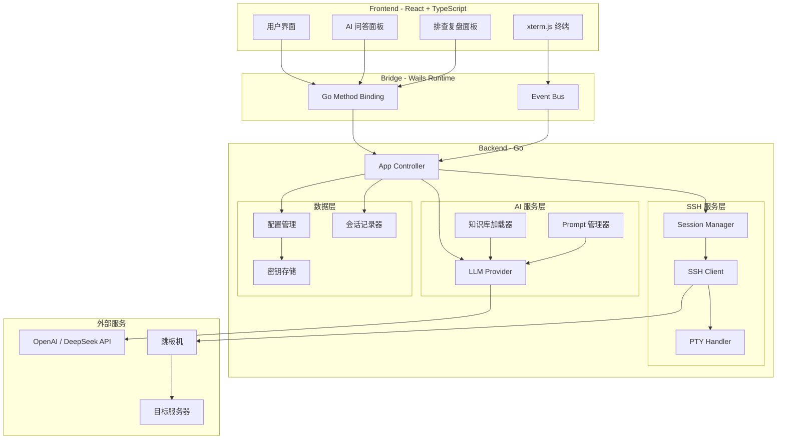

# OpsCopilot

<div align="center">

**AI 驱动的智能运维助手**

[](https://go.dev/)
[](https://wails.io/)
[](https://reactjs.org/)
[](https://www.typescriptlang.org/)

*将自然语言、知识库和 AI 推理能力融入日常运维工作流*

</div>

---

## 📖 项目简介

OpsCopilot 是一款面向运维工程师的**智能化操作助手**，通过深度集成 LLM（大语言模型），将传统的"记忆驱动"运维模式升级为"AI 辅助决策"模式。

### 🎯 核心价值

- **降低认知负担**：无需记忆复杂的命令参数和故障处理流程
- **知识库驱动**：基于企业内部 SOP 文档提供定制化建议
- **多节点协同**：一键连接、命令广播、统一管理
- **故障复盘**：自动记录排查过程，生成结构化报告

---

## ✨ 核心功能

### 1. 🤖 AI 智能连接解析

通过自然语言描述连接意图，AI 自动解析并生成连接配置：

```text
用户输入：连接支付系统的 4 个节点 10.1.1.1-4，通过跳板机 172.16.0.1 用户 jump_user 密码 xxx，登录用户 app_user，需要切换 root
         
AI 解析：自动识别 IP 范围、跳板机配置、用户凭证、提权需求
结果：   生成 4 个完整的 SSH 连接配置
```

**技术亮点**：
- 基于 Few-Shot Prompt Engineering 的结构化输出
- 支持 IP 范围扩展、凭证继承、跳板机配置
- JSON Schema 验证确保输出可靠性

### 2. 🔍 知识库增强问答（RAG）

结合企业内部运维文档，提供精准的问题解答和命令建议：

```text
用户提问：支付服务响应慢怎么排查？

AI 回答：基于《支付系统 SOP》文档
  1. 检查服务状态：systemctl status payment-service
  2. 查看 JVM 堆内存：jstat -gc <PID>
  3. 分析慢查询日志：tail -f /var/log/payment/slow.log
  ...
```

**技术亮点**：
- 文档自动索引和向量化（支持 Markdown/PDF）
- 上下文感知的命令模板生成（使用 `<PLACEHOLDER>` 标记可变参数）
- 区分"文档知识"和"通用知识"的来源标注

### 3. 🧠 智能故障排查助手

输入故障现象，AI 生成结构化的排查计划：

**输入**：
```text
数据库连接池耗尽，大量请求超时
```

**输出**（结构化 JSON）：
```json
{
  "steps": [
    {"step": 1, "title": "检查连接池配置", "description": "查看当前连接池大小和活跃连接数..."},
    {"step": 2, "title": "分析慢查询", "description": "定位是否存在长时间占用连接的查询..."}
  ],
  "commands": [
    {"command": "show processlist", "description": "查看 MySQL 活跃连接", "risk": "Low"},
    {"command": "SHOW VARIABLES LIKE 'max_connections'", "description": "查看最大连接数配置", "risk": "Low"}
  ]
}
```

**技术亮点**：
- 步骤（思路）与命令（操作）分离设计
- 风险等级标注（Low/Medium/High）
- 支持参数模板化，提高命令复用性

### 4. 📡 多节点终端管理

- **并发连接**：一键启动多个 SSH 会话（支持跳板机穿透）
- **命令广播**：同步执行命令到多个节点
- **自动提权**：智能检测 `sudo` 密码提示并自动输入
- **会话持久化**：保存连接配置，快速重连

**技术亮点**：
- 基于 `golang.org/x/crypto/ssh` 的双层隧道实现
- PTY（伪终端）+ ANSI 转义序列完整支持
- 前端 xterm.js 渲染，支持 Tab/Grid 双布局模式

### 5. 📝 故障复盘与知识沉淀

自动记录排查过程，生成可归档的 Markdown 报告：

```markdown
## 问题描述
支付服务响应时间从 200ms 上升至 5s

## 排查过程
- 16:32 执行 `top` 命令，发现 CPU 使用率正常
- 16:35 执行 `netstat -an | grep 3306`，发现大量 TIME_WAIT
- 16:40 查看数据库慢查询日志，发现未使用索引的查询

## 根本原因
某个定时任务使用全表扫描查询，导致数据库连接占用时间过长

## 解决方案
- 为查询添加索引：CREATE INDEX idx_order_time ON orders(create_time)
- 优化定时任务查询语句
...

## 关键命令清单
\`\`\`bash
# 查看数据库连接状态
netstat -an | grep <PORT>

# 分析慢查询
mysqldumpslow -s t /var/log/mysql/slow.log | head -10
\`\`\`
```

**技术亮点**：
- 实时记录终端输入输出（Event Sourcing 思想）
- AI 生成结构化总结（问题描述、排查过程、根因、方案）
- 自动提取关键命令并模板化

---

## 🏗️ 技术架构



### 技术栈

| 层级 | 技术选型 | 说明 |
|------|---------|------|
| **前端** | React 18 + TypeScript | UI 组件化开发 |
| | xterm.js + xterm-addon-fit | 终端渲染和自适应 |
| | CSS Grid + Flexbox | 响应式布局 |
| **桥接** | Wails v2 | Go ↔ JS 双向通信 |
| **后端** | Go 1.21+ | 高性能并发处理 |
| | golang.org/x/crypto/ssh | SSH 协议实现 |
| | sashabaranov/go-openai | LLM API 调用 |
| | zalando/go-keyring | 操作系统级密钥存储 |
| **AI** | OpenAI API / DeepSeek | 兼容 OpenAI 协议的 LLM 服务 |

---

## 🚀 快速开始

### 环境要求

- **Go** 1.21+
- **Node.js** 18+
- **Wails CLI** v2
- 操作系统：Windows 10+ / macOS 12+ / Linux

### 安装 Wails CLI

```bash
go install github.com/wailsapp/wails/v2/cmd/wails@latest
```

### 克隆项目

```bash
git clone https://github.com/yourusername/opscopilot.git
cd opscopilot
```

### 开发模式运行

```bash
# 自动编译 Go 后端和前端，支持热重载
wails dev
```

访问 `http://localhost:34115` 可在浏览器中调试（可调用 Go 方法）。

### 生产构建

```bash
# 构建可执行文件
wails build

# 构建结果在 build/bin/ 目录
```

### 配置 AI 服务

首次运行后，点击 **设置⚙️** 配置 LLM：

```json
{
  "llm": {
    "APIKey": "sk-your-api-key",
    "BaseURL": "https://api.openai.com/v1",
    "Model": "gpt-4"
  }
}
```

支持所有兼容 OpenAI 协议的服务（DeepSeek、Claude、本地 Ollama 等）。

---

## 📚 知识库配置

将企业内部 SOP 文档（Markdown 格式）放入 `docs/` 目录：

```
docs/
├── linux_basics.md          # Linux 常用命令参考
├── payment_system_sop.md    # 支付系统运维手册
└── troubleshooting_history.md  # 历史故障记录（自动生成）
```

应用启动时会自动加载文档，作为 AI 问答的上下文。

---

## 🎨 界面预览

### 主界面 - Tab 模式
```
┌─────────────────────────────────────────────────────────┐
│ [+ 新建连接] ⚙️  [Tab模式] [Grid模式]          🖥️💬🩺 │
├─────────────────────────────────────────────────────────┤
│ ┌─────┬─────┬─────┬─────┐                              │
│ │ Web │ DB  │ App │ MQ  │  ← Terminal Tabs             │
│ ├─────┴─────┴─────┴─────┘                              │
│ │ [root@web-01 ~]#                                     │
│ │ $ top                                                │
│ │ ...                                                  │
│ │                                                      │
│ │                                                      │
│ └──────────────────────────────────────────────────────┘
└─────────────────────────────────────────────────────────┘
```

### Grid 模式 - 2x2 布局
```
┌──────────────────┬──────────────────┐
│  Web-01          │  Web-02          │
│  $ netstat -tlnp │  $ netstat -tlnp │
│  ...             │  ...             │
├──────────────────┼──────────────────┤
│  DB-01           │  DB-02           │
│  $ mysql> ...    │  $ mysql> ...    │
│  ...             │  ...             │
└──────────────────┴──────────────────┘
```

---

## 📖 使用示例

### 示例 1：智能连接

1. 点击 **[+ 新建连接]**
2. 在文本框输入：
   ```
   连接 192.168.1.100-103 四台服务器，用户名 admin 密码 Admin@123，
   通过跳板机 10.0.0.1 用户 jumper 密码 Jump@456
   ```
3. 点击 **[AI 解析]**
4. 确认生成的 4 个连接配置
5. 点击 **[全部连接]**

### 示例 2：故障排查

1. 点击右侧 **🩺 定位助手**
2. 输入问题：`Java 应用 OOM 怎么排查`
3. AI 返回排查步骤和命令列表
4. 点击命令卡片 **[复制]** 或 **[发送到终端]**

### 示例 3：问题复盘

1. 在 **定位助手** 中点击 **[开始排查]**
2. 执行各种命令（自动记录）
3. 完成后点击 **[结束排查]**
4. 输入根因，AI 自动生成 Markdown 报告
5. 报告自动追加到 `docs/troubleshooting_history.md`

---

## 🧪 测试

```bash
# 运行所有单元测试
go test ./...

# 运行特定包的测试
go test ./pkg/sshclient -v

# 运行测试并生成覆盖率报告
go test -cover ./...
```

---

## 🛠️ 项目结构

```
OpsCopilot/
├── main.go                    # 应用入口
├── app.go                     # Wails App 控制器
├── pkg/                       # Go 后端核心逻辑
│   ├── ai/                    # AI 服务（LLM 调用、Prompt 管理）
│   ├── config/                # 配置管理
│   ├── knowledge/             # 知识库加载器
│   ├── llm/                   # LLM Provider 抽象
│   ├── secretstore/           # 密钥存储（操作系统 Keyring）
│   ├── session/               # SSH Session 管理
│   ├── session_recorder/      # 排查会话记录器
│   ├── sessionmanager/        # 持久化会话管理
│   ├── sshclient/             # SSH 客户端（含跳板机、自动提权）
│   └── terminal/              # 终端数据解析（ANSI 处理）
├── frontend/                  # React 前端
│   ├── src/
│   │   ├── components/        # UI 组件
│   │   │   ├── Terminal/      # xterm.js 终端组件
│   │   │   ├── LayoutManager/ # Tab/Grid 布局管理
│   │   │   ├── Sidebar/       # 侧边栏（会话、排查、问答）
│   │   │   ├── SmartConnectModal/  # 智能连接对话框
│   │   │   ├── SettingsModal/      # 设置面板
│   │   │   └── ConfirmCloseModal/  # 关闭确认对话框
│   │   ├── utils/             # 工具函数
│   │   ├── types.ts           # TypeScript 类型定义
│   │   └── App.tsx            # 根组件
│   └── wailsjs/               # Wails 自动生成的绑定
├── docs/                      # 知识库文档目录
│   ├── linux_basics.md
│   ├── payment_system_sop.md
│   └── troubleshooting_history.md
├── config.json                # 用户配置文件
├── sessions.json              # 持久化会话列表
└── wails.json                 # Wails 项目配置
```

---

## 🔒 安全性

- **密码存储**：使用操作系统级密钥链（Windows Credential Manager / macOS Keychain）
- **日志脱敏**：自动过滤日志中的密码字段
- **传输加密**：SSH 协议原生加密，无明文传输
- **权限最小化**：应用仅需网络访问权限

---

## 🤝 贡献指南

欢迎提交 Issue 和 Pull Request！

### 开发流程

1. Fork 本仓库
2. 创建特性分支：`git checkout -b feature/AmazingFeature`
3. 提交代码：`git commit -m 'Add some AmazingFeature'`
4. 推送分支：`git push origin feature/AmazingFeature`
5. 提交 Pull Request

### 代码规范

- Go 代码遵循 `gofmt` 和 `golint` 标准
- 前端代码使用 ESLint + Prettier
- 提交信息遵循 [Conventional Commits](https://www.conventionalcommits.org/)

---

## 📄 许可证

本项目采用 MIT 许可证，详见 [LICENSE](LICENSE) 文件。

---

## 🙏 致谢

- [Wails](https://wails.io/) - 优雅的 Go + Web 桌面应用框架
- [xterm.js](https://xtermjs.org/) - 强大的终端模拟器
- [OpenAI](https://openai.com/) - 大语言模型 API
- [go-openai](https://github.com/sashabaranov/go-openai) - Go 语言 OpenAI SDK

---

## 📬 联系方式

- Issues: [GitHub Issues](https://github.com/yourusername/opscopilot/issues)
- Email: your.email@example.com

---

<div align="center">
Made with ❤️ by DevOps Engineers, for DevOps Engineers
</div>
