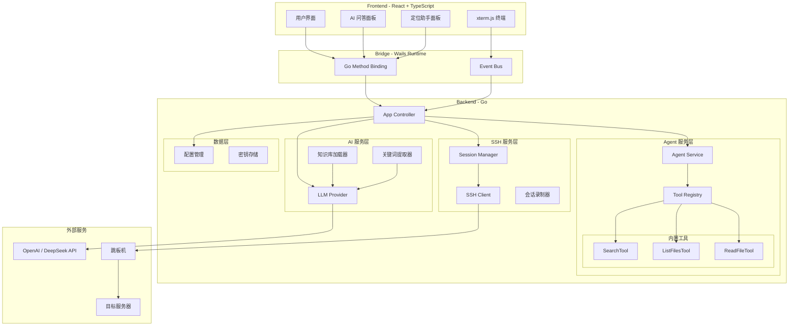

# OpsCopilot

<div align="center">

**AI 驱动的智能运维助手**

[](https://go.dev/)
[](https://wails.io/)
[](https://reactjs.org/)
[](https://www.typescriptlang.org/)

*让运维经验沉淀为知识，让知识复用更高效*

</div>

---
## 📦 下载地址
https://github.com/Tudou77826/OpsCopilot/releases

## 📖 项目简介

OpsCopilot 是一款面向运维工程师的**智能化操作助手**，通过深度集成 LLM（大语言模型），将传统的"记忆驱动"运维模式升级为"AI 辅助决策"模式。

### 🎯 核心价值

OpsCopilot 的核心目标是建立**运维知识的完整闭环**：

```
┌─────────────────────────────────────────────────────────────────────────┐
│                         运维知识价值闭环                                 │
├─────────────────────────────────────────────────────────────────────────┤
│                                                                          │
│    问题发生 ──▶ AI 辅助定位 ──▶ 人工解决 ──▶ 自动沉淀 ──▶ 知识复用      │
│        │             │             │            │            │           │
│        ▼             ▼             ▼            ▼            ▼           │
│    [故障现象]    [搜索知识库]   [执行命令]   [录制过程]   [下次快速定位] │
│                                                                          │
│    ✨ 每次定位都让知识库更强大，知识库越强定位越准确 ✨                   │
│                                                                          │
└─────────────────────────────────────────────────────────────────────────┘
```

| 价值点 | 描述 |
|-------|------|
| **降低认知负担** | 无需记忆复杂的命令参数和故障处理流程 |
| **知识库驱动** | 基于团队内部 SOP 文档提供定制化建议 |
| **经验自动沉淀** | 录制排查过程，自动生成可复用的知识文档 |
| **多节点协同** | 一键连接、命令广播、统一管理 |

---

## ✨ 核心功能

### 1. 🤖 AI 智能连接解析


通过自然语言描述连接意图，AI 自动解析并生成连接配置：

```text
用户输入：连接支付系统的 4 个节点 10.1.1.1-4，通过跳板机 172.16.0.1 用户 jump_user 密码 xxx，登录用户 app_user，需要切换 root

AI 解析：自动识别 IP 范围、跳板机配置、用户凭证、提权需求
结果：   生成 4 个完整的 SSH 连接配置
```

### 2. 🔍 智能知识库搜索


结合企业内部运维文档，提供精准的问题解答和命令建议：

```text
用户提问：支付服务响应慢怎么排查？

AI 策略：
  1. 关键词提取：支付(5.0), 响应慢(4.5), 性能(3.0)
  2. 混合检索：向量语义 + 关键词精确匹配
  3. 返回：《支付系统 SOP》相关章节 + 具体排查命令

推荐命令：
  - systemctl status payment-service
  - jstat -gc <PID>
  - tail -f /var/log/payment/slow.log
```

**技术亮点**：
- LLM 增强的关键词提取（支持中英文混合）
- 关键词缓存，避免重复 LLM 调用
- 中文优先策略，优化中文知识库搜索效果

### 3. 🧠 定位助手（Agent 模式）


输入故障现象，AI 自主调用工具进行诊断：

```
┌─────────────────────────────────────────────────────────────────┐
│  用户: MySQL 连接池满了怎么办？                                  │
├─────────────────────────────────────────────────────────────────┤
│                                                                  │
│  Agent 思考过程:                                                 │
│  1. [search_knowledge] 搜索知识库... 找到 3 篇相关文档           │
│  2. [read_knowledge_file] 阅读《MySQL运维手册》...               │
│  3. [read_knowledge_file] 阅读《MySQL运维手册》...               │
│  4. [search_knowledge] 搜索连接池配置相关内容...                 │
│                                                                  │
│  诊断结果:                                                       │
│  - 当前活跃连接: 145 / 最大连接: 150                             │
│  - 发现 3 个长时间运行的查询                                      │
│  - 建议: 优化慢查询或增加连接池大小                               │
│                                                                  │
└─────────────────────────────────────────────────────────────────┘
```

**可用工具**：
| 工具 | 功能 |
|-----|------|
| `search_knowledge` | 搜索知识库内容 |
| `list_knowledge_files` | 列出知识库文件 |
| `read_knowledge_file` | 读取具体文档 |

### 4. 📝 排查过程录制与知识沉淀

自动记录排查过程，生成可归档的 Markdown 文档：

```markdown
# MySQL 连接池满排查记录

## 问题描述
应用报错 "Too many connections"，服务不可用

## 排查过程
- 16:32 执行 `show processlist`，发现 145 个连接
- 16:35 执行 `show full processlist`，定位到 3 个长时间查询
- 16:40 分析慢查询日志，发现未使用索引的全表扫描

## 根本原因
定时任务使用全表扫描查询，导致连接占用时间过长

## 解决方案
1. 为查询添加索引：`CREATE INDEX idx_order_time ON orders(create_time)`
2. 优化定时任务查询语句
3. 调整 wait_timeout 减少空闲连接占用

## 关键命令
```bash
# 查看连接状态
show processlist;

# 查看最大连接数
SHOW VARIABLES LIKE 'max_connections';

# 分析慢查询
mysqldumpslow -s t /var/log/mysql/slow.log | head -10
```

**技术亮点**：
- 实时录制终端输入输出
- AI 自动生成结构化总结
- 提取关键命令并模板化
- 自动追加到知识库

### 5. 📡 多节点终端管理

- **并发连接**：一键启动多个 SSH 会话（支持跳板机穿透）
- **命令广播**：同步执行命令到多个节点
- **自动提权**：智能检测 `sudo` 密码提示并自动输入
- **会话持久化**：保存连接配置，快速重连

---

## 🏗️ 技术架构



### 核心模块说明

| 模块 | 路径 | 职责 |
|-----|------|------|
| **Agent Service** | `pkg/ai/agent.go` | ReAct 循环，协调 LLM 和工具 |
| **Tool Registry** | `pkg/tools/registry.go` | 工具注册和管理 |
| **Knowledge Tools** | `pkg/tools/knowledge/` | 知识库搜索、列表、读取 |
| **Term Extractor** | `pkg/ai/agent.go` | LLM 增强的关键词提取 |
| **Recorder** | `pkg/recorder/` | 终端会话录制 |

---

## 🚀 快速开始

### 环境要求

- **Go** 1.21+
- **Node.js** 18+
- **Wails CLI** v2
- 操作系统：Windows 10+ / macOS 12+ / Linux

### 安装 Wails CLI

```bash
go install github.com/wailsapp/wails/v2/cmd/wails@latest
```

### 克隆项目

```bash
git clone https://github.com/Tudou77826/OpsCopilot.git
cd OpsCopilot
```

### 开发模式运行

```bash
wails dev
```

### 生产构建

```bash
wails build
```

### 配置 AI 服务

首次运行后，点击 **设置⚙️** 配置 LLM：

```json
{
  "llm": {
    "APIKey": "sk-your-api-key",
    "BaseURL": "https://api.openai.com/v1",
    "FastModel": "gpt-4o-mini",
    "ComplexModel": "gpt-4o"
  },
  "docs": {
    "dir": "docs"
  }
}
```

支持所有兼容 OpenAI 协议的服务（DeepSeek、Claude、本地 Ollama 等）。

---

## 📚 知识库配置

将团队内部 SOP 文档（Markdown 格式）放入 `docs/` 目录：

```
docs/
├── database/
│   ├── mysql_maintenance.md
│   └── redis_troubleshooting.md
├── network/
│   └── dns_issues.md
└── application/
    └── java_oom_analysis.md
```

应用启动时会自动加载文档，作为 AI 问答的上下文来源。

---

## 🛠️ 项目结构

```
OpsCopilot/
├── main.go                    # 应用入口
├── app.go                     # Wails App 控制器
├── pkg/                       # Go 后端核心逻辑
│   ├── ai/                    # AI 服务
│   │   ├── agent.go           # Agent 循环 + 关键词提取
│   │   └── intent.go          # 意图识别
│   ├── tools/                 # 工具系统
│   │   ├── interface.go       # Tool 接口定义
│   │   ├── registry.go        # 工具注册器
│   │   └── knowledge/         # 知识库工具
│   │       ├── search.go      # 搜索工具
│   │       ├── list_files.go  # 列表工具
│   │       └── read_file.go   # 读取工具
│   ├── knowledge/             # 知识库核心
│   │   ├── loader.go          # 文档加载
│   │   ├── search.go          # 搜索算法
│   │   └── tools.go           # 底层操作
│   ├── recorder/              # 会话录制
│   ├── script/                # 脚本管理
│   ├── sshclient/             # SSH 客户端
│   ├── terminal/              # 终端解析
│   └── config/                # 配置管理
├── frontend/                  # React 前端
│   └── src/
│       ├── components/        # UI 组件
│       └── App.tsx            # 根组件
├── docs/                      # 知识库文档目录
└── config.json                # 用户配置文件
```

---

## 🗺️ 发展路线

### 已完成 ✅

- [x] AI 智能连接解析
- [x] 知识库搜索（关键词 + LLM 增强）
- [x] 定位 Agent（知识库工具调用）
- [x] 会话录制与知识沉淀
- [x] 多节点终端管理

### 进行中 🚧

- [ ] 向量检索增强（语义搜索）
- [ ] 知识使用率统计
- [ ] 知识生命周期管理

### 计划中 📋

- [ ] 混合检索（向量 + 关键词）
- [ ] 知识评分与去重
- [ ] Git 同步（团队知识共享）
- [ ] Agent 诊断推理（多轮诊断）
- [ ] Agent 自动执行（安全机制）

---

## 🔒 安全性

- **密码存储**：使用操作系统级密钥链（Windows Credential Manager / macOS Keychain）
- **日志脱敏**：自动过滤日志中的密码字段
- **传输加密**：SSH 协议原生加密，无明文传输
- **权限最小化**：应用仅需网络访问权限

---

## 🤝 贡献指南

欢迎提交 Issue 和 Pull Request！

### 代码规范

- Go 代码遵循 `gofmt` 和 `golint` 标准
- 前端代码使用 ESLint + Prettier
- 提交信息遵循 [Conventional Commits](https://www.conventionalcommits.org/)

---

## 📄 许可证

本项目采用 MIT 许可证，详见 [LICENSE](LICENSE) 文件。

---

## 🙏 致谢

- [Wails](https://wails.io/) - 优雅的 Go + Web 桌面应用框架
- [xterm.js](https://xtermjs.org/) - 强大的终端模拟器
- [OpenAI](https://openai.com/) - 大语言模型 API

---

<div align="center">
Made with ❤️ by DevOps Engineers, for DevOps Engineers
</div>
