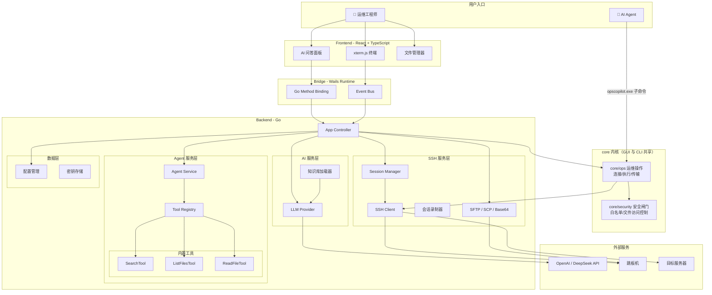

# OpsCopilot


<div align="center">


**AI 驱动的智能运维助手 / 单 exe 双模：GUI + CLI**

[](https://go.dev/)
[](https://wails.io/)
[](https://reactjs.org/)
[](https://www.typescriptlang.org/)

*让运维经验沉淀为知识，单 exe 同时服务人与 AI Agent*

</div>

---
## 📦 下载地址
https://github.com/Tudou77826/OpsCopilot/releases

## 📖 项目简介

OpsCopilot 是一款兼具**人机交互**与**AI Agent 工具**双重属性的智能运维平台，核心目标是建立**运维知识的完整闭环**：

```
问题发生 ──▶ AI 辅助定位 ──▶ 人工解决 ──▶ 自动沉淀 ──▶ 知识复用 ──▶ 团队共享
    ↑                                                           │
    └───────────────────────────────────────────────────────────┘
```

| 角色 | 面向 | 核心能力 |
|------|------|---------|
| **运维助手** | 运维工程师 | AI 连接解析、知识库搜索、故障定位 Agent、会话录制 |
| **知识引擎** | 团队 | 排查经验自动沉淀、SOP 文档管理、知识复用、团队共享 |
| **CLI 工具** | AI Agent | 单 exe 子命令入口，SSH 远程执行、文件传输、AI 诊断，安全白名单统一管控 |

```
┌──────────────────────────────────────────────────────────────────────────┐
│                         OpsCopilot 双模架构                               │
├──────────────────────────────────────────────────────────────────────────┤
│                                                                          │
│  👨‍💻 人类模式                        🤖 Agent 模式                        │
│  ──────────────────────              ──────────────────────               │
│  终端操作 ◀──▶ SSH 连接             Claude / Cursor / Codex ...           │
│  AI 对话  ◀──▶ 知识库搜索              │  (读取 skill 学会调用)            │
│  故障定位 ◀──▶ Agent 推理              ▼                                  │
│  过程录制 ◀──▶ 知识沉淀            opscopilot.exe <子命令>               │
│  自动归档 ◀──▶ 团队共享              ├─ exec        (远程命令执行)        │
│                                     ├─ diagnose   (AI 故障诊断)          │
│                                     └─ file        (文件上传/下载)        │
│                                                                          │
│                统一安全闸门 core/security（白名单+文件访问控制）          │
└──────────────────────────────────────────────────────────────────────────┘
```

---

## ✨ 核心功能

### 1. 🤖 AI 智能连接解析


通过自然语言描述连接意图，AI 自动解析并生成连接配置：

```text
用户输入：连接支付系统的 4 个节点 10.1.1.1-4，通过跳板机 172.16.0.1 用户 jump_user 密码 xxx，登录用户 app_user，需要切换 root

AI 解析：自动识别 IP 范围、跳板机配置、用户凭证、提权需求
结果：   生成 4 个完整的 SSH 连接配置
```

### 2. 🔍 智能知识库搜索


结合企业内部运维文档，提供精准的问题解答和命令建议：

```text
用户提问：支付服务响应慢怎么排查？

AI 策略：
  1. 关键词提取：支付(5.0), 响应慢(4.5), 性能(3.0)
  2. 混合检索：向量语义 + 关键词精确匹配
  3. 返回：《支付系统 SOP》相关章节 + 具体排查命令

推荐命令：
  - systemctl status payment-service
  - jstat -gc <PID>
  - tail -f /var/log/payment/slow.log
```

### 3. 🧠 定位助手（Agent 模式）


输入故障现象，AI 自主调用工具进行诊断：

```
┌─────────────────────────────────────────────────────────────────┐
│  用户: MySQL 连接池满了怎么办？                                  │
├─────────────────────────────────────────────────────────────────┤
│                                                                  │
│  Agent 思考过程:                                                 │
│  1. [search_knowledge] 搜索知识库... 找到 3 篇相关文档           │
│  2. [read_knowledge_file] 阅读《MySQL运维手册》...               │
│  3. [read_knowledge_file] 阅读《MySQL运维手册》...               │
│  4. [search_knowledge] 搜索连接池配置相关内容...                 │
│                                                                  │
│  诊断结果:                                                       │
│  - 当前活跃连接: 145 / 最大连接: 150                             │
│  - 发现 3 个长时间运行的查询                                      │
│  - 建议: 优化慢查询或增加连接池大小                               │
│                                                                  │
└─────────────────────────────────────────────────────────────────┘
```

### 4. 💻 CLI 工具（面向 AI Agent）

OpsCopilot 本体即 CLI：同一个 `opscopilot.exe`，带子命令时进入命令行模式，不带则启动图形界面。外部 AI Agent（Claude、Cursor、Codex 等）通过配套的 skill 学会调用，直接获得 SSH 远程操作和 AI 诊断能力。

**优势**：
- **单 exe、单发布、单更新**：不再需要单独的 mcp-server.exe，自动更新只更新一个文件，能力与本体永远同步
- **安全闸门统一**：所有非交互式访问强制过 `core/security` 白名单和文件访问控制，调用方无法绕过
- **AI 诊断可复用**：CLI 直接复用本体的 agent 诊断循环和知识库，外部 AI 拿到的是基于实战经验的诊断

**子命令一览**：

| 子命令 | 功能 | 是否碰服务器 |
|--------|------|------------|
| `exec` | 在远程服务器执行命令（白名单管控、命令级超时） | 是 |
| `diagnose` | 基于知识库的 AI 故障诊断，输出建议命令和排查步骤 | 否（纯知识检索） |
| `file download/upload` | 文件传输（SFTP，文件访问控制管控） | 是 |

**用法示例**：

```bash
# 执行命令（自动连接、白名单优先校验、超时保护）
opscopilot exec --server web-01 --command "df -h" --timeout-sec 30

# AI 诊断（只查知识库给建议，不碰服务器）
opscopilot diagnose --problem "mysql 连接超时"

# 下载日志到本地分析
opscopilot file download --server web-01 --remote /var/log/nginx/error.log --local /tmp/error.log
```

**让 AI Agent 学会调用**：

两种方式任选其一：

1. **GUI 一键安装（推荐）**：打开 `设置 → 高级选项 → AI 接入`，输入 AI Agent 的 skill 目录（如 `C:\Users\xxx\.claude\skills`），点「检测状态」查看是否已安装，再点「安装」即可。安装时命令路径会自动替换为本机 `opscopilot.exe` 的绝对路径，无需手动配置 PATH。后续 OpsCopilot 升级后，同一界面可一键更新到最新版 skill。
2. **手动复制**：将仓库内的 `skills/opscopilot-ops/SKILL.md` 复制到 AI Agent 的 skill 目录，并把其中命令路径改成实际 exe 路径。

AI Agent 读取该 skill 后即可在合适的场景调用上述子命令。

**实际使用效果** — AI Agent 自主排查：

```text
👤 你: 帮我看看生产环境 web-01 的磁盘使用情况

🤖 AI: （读取 skill，学会调用 opscopilot exec）
  → opscopilot exec --server web-01 --command "df -h"

  Filesystem      Size  Used Avail Use% Mounted on
  /dev/sda1       100G   78G   22G  78% /
  /dev/sdb1       500G  490G   10G  98% /data   ⚠️

  /data 分区使用率已达 98%，我来定位大文件。
  → opscopilot exec --server web-01 --command "du -sh /data/log/* | sort -rh | head -5"

  4.2G   /data/log/app/access.log.2025-03-*
  2.8G   /data/log/app/error.log.2025-03-*
```

**安全机制**：
- 命令白名单：按服务器 IP 粒度配置允许执行的命令（在 GUI 中配置，CLI/MCP 等所有非交互入口统一生效）
- 文件访问控制：可读/可写路径、大小上限、本地落地目录均按 IP 策略管控
- 命令级超时：单条命令超时自动 SIGKILL，避免慢命令拖死连接
- 连接自愈：连接失效自动重建，单条故障不影响后续
- 空闲超时：自动断开长时间无操作的连接

### 5. 📝 排查过程录制与知识沉淀

**让一次排查经验成为团队共享知识**

自动记录排查过程，生成可归档的 Markdown 文档，LLM 自动提取关键词和组件信息，归档后立即可被检索：

```
┌─────────────────────────────────────────────────────────────────────────┐
│  知识闭环流程                                                            │
├─────────────────────────────────────────────────────────────────────────┤
│                                                                          │
│  1. 排查会话        执行命令、查看日志、定位问题                          │
│       ↓                                                                 │
│  2. 会话录制        自动记录所有操作和输出                                │
│       ↓                                                                 │
│  3. 归档生成        LLM 提取问题现象、关键词、涉及组件                    │
│       ↓                                                                 │
│  4. 目录索引        自动归类到 服务 → 模块 → 场景 目录                    │
│       ↓                                                                 │
│  5. 知识复用        下次遇到类似问题，AI 自动检索相关经验                 │
│       ↓                                                                 │
│  6. 团队共享        docs/ 目录可 Git 同步，全团队复用                     │
│                                                                          │
└─────────────────────────────────────────────────────────────────────────┘
```

**核心特性**：

- **LLM 辅助归档**：自动提取问题现象、关键词、涉及组件，无需手动整理
- **多级目录**：服务 → 模块 → 场景 三级结构，LLM 快速剪枝定位
- **即时可用**：归档后立即进入目录索引，下次排查即可检索
- **团队共享**：`docs/` 目录可通过 Git 同步，团队经验共享
- **独立存放**：归档文件放入 `archive/` 子目录，与手写 SOP 区隔

**归档文档示例**：

```markdown
---
service: Payment Service
module: 核心支付模块
type: archive
---

# MySQL 连接池满排查记录

## 概述
- **开始时间**: 2026-04-11 14:30:00
- **持续时间**: 300 秒
- **涉及服务器**: 2 台

## 问题现象
应用报错 "Too many connections"，服务不可用

## 关键词
MySQL, 连接池, Too many connections, 连接超时

## 涉及组件
MySQL, Core Service, 连接池

## 根本原因
定时任务使用全表扫描查询，导致连接占用时间过长

## 解决方案
1. 为查询添加索引：`CREATE INDEX idx_order_time ON orders(create_time)`
2. 优化定时任务查询语句
3. 调整 wait_timeout 减少空闲连接占用

## 执行的命令
### 命令 1: show processlist
- **服务器**: 10.0.0.1
**输出**: 145 个活跃连接...

---
*会话ID: xxx* | *归档时间: 2026-04-11*
```

### 6. ⌨️ 智能命令补全


内置 Linux 命令知识库，支持命令名、选项、常用组合的智能补全：

```text
输入：grep -r
建议：
  -rni    递归搜索 + 显示行号 + 忽略大小写
  -rn     递归搜索 + 显示行号
  -rl     只显示匹配的文件名

输入：tar -
建议：
  -czvf   创建 gzip 压缩包
  -xzvf   解压 gzip 压缩包
  -tvf    列出压缩包内容
```

### 7. 🚀 LLM 指令快查（Ctrl+K）


忘记命令？用自然语言描述，AI 帮你生成：

```text
┌──────────────────────────────────────────────────────────────┐
│  🔍 命令查询                                         [×]     │
├──────────────────────────────────────────────────────────────┤
│  查看当前目录下最大的10个文件                        [生成]  │
├──────────────────────────────────────────────────────────────┤
│  ✅ 生成结果：                                               │
│                                                               │
│  du -ah . | sort -rh | head -10                              │
│                                                               │
│  📝 说明：计算当前目录下所有文件大小，按人类可读格式排序，   │
│     显示前10个最大的文件。                                    │
│                                                               │
│  [📋 复制] [⌨️ 输入到终端] [🔄 重新生成]                     │
└──────────────────────────────────────────────────────────────┘
```

### 8. 📡 多节点终端管理

- **并发连接**：一键启动多个 SSH 会话（支持跳板机穿透）
- **命令广播**：同步执行命令到多个节点
- **自动提权**：智能检测 `sudo` 密码提示并自动输入
- **会话持久化**：保存连接配置，快速重连
- **文件管理**：内置 SFTP/SCP 文件传输，支持拖拽上传下载

### 9. 🕐 时间戳实时解析

选中终端中的时间戳数字，置顶栏自动显示解析后的本地时间：

```text
终端输出：Log at 1704067200: service started

用户选中 1704067200 → 置顶栏显示：🕐 2024/01/01 08:00:00
```

- 支持 10 位秒级、13 位毫秒级时间戳
- 范围校验（2000-2030年），避免误识别
- 未识别时静默隐藏，不打扰用户

---

## 🏗️ 技术架构


```mermaid
graph TB
    subgraph "用户入口"
        UI[👤 运维工程师]
        Agent[🤖 AI Agent]
    end

    subgraph "Frontend - React + TypeScript"
        Terminal[xterm.js 终端]
        AI_Panel[AI 问答面板]
        FileMgr[文件管理器]
    end

    subgraph "core 内核（GUI 与 CLI 共享）"
        Ops[core/ops 运维操作<br/>连接/执行/传输]
        Security[core/security 安全闸门<br/>白名单/文件访问控制]
    end

    subgraph "Bridge - Wails Runtime"
        Events[Event Bus]
        Binding[Go Method Binding]
    end

    subgraph "Backend - Go"
        App[App Controller]

        subgraph "Agent 服务层"
            AgentService[Agent Service]
            ToolRegistry[Tool Registry]

            subgraph "内置工具"
                SearchTool[SearchTool]
                ListTool[ListFilesTool]
                ReadTool[ReadFileTool]
            end
        end

        subgraph "AI 服务层"
            LLM[LLM Provider]
            Knowledge[知识库加载器]
        end

        subgraph "SSH 服务层"
            SessionMgr[Session Manager]
            SSHClient[SSH Client]
            Recorder[会话录制器]
            FileTransfer[SFTP / SCP / Base64]
        end

        subgraph "数据层"
            Config[配置管理]
            SecretStore[密钥存储]
        end
    end

    subgraph "外部服务"
        LLM_API[OpenAI / DeepSeek API]
        Bastion[跳板机]
        Target[目标服务器]
    end

    UI --> Terminal
    UI --> AI_Panel
    UI --> FileMgr
    Agent -->|opscopilot.exe 子命令| Ops

    Terminal --> Events
    AI_Panel --> Binding

    Binding --> App
    Events --> App
    App --> Ops

    App --> AgentService
    AgentService --> ToolRegistry
    ToolRegistry --> SearchTool
    ToolRegistry --> ListTool
    ToolRegistry --> ReadTool

    App --> LLM
    App --> SessionMgr
    App --> FileTransfer
    App --> Config

    Ops --> Security
    Ops --> SSHClient
    LLM --> LLM_API
    Knowledge --> LLM

    SessionMgr --> SSHClient
    SSHClient --> Bastion
    SSHClient --> Target
    FileTransfer --> Bastion
```

### 核心模块说明

| 模块 | 路径 | 职责 |
|------|------|------|
| **core/security** | `pkg/core/security/` | 安全闸门：命令白名单、文件访问控制（GUI 与 CLI 共享） |
| **core/ops** | `pkg/core/ops/` | 运维内核：连接管理、命令执行、文件传输、输出限流 |
| **Agent Service** | `pkg/ai/agent.go` | ReAct 循环，协调 LLM 和工具 |
| **Tool Registry** | `pkg/tools/registry.go` | 工具注册和管理 |
| **Knowledge Tools** | `pkg/tools/knowledge/` | 知识库搜索、列表、读取 |
| **SSH Client** | `pkg/sshclient/` | SSH 连接、跳板机穿透、自动提权、命令级超时 |
| **File Transfer** | `pkg/filetransfer/` | SFTP / SCP / Base64 文件传输 |
| **Recorder** | `pkg/recorder/` | 终端会话录制与知识沉淀 |

---

## 🚀 快速开始

### 环境要求

- **Go** 1.21+
- **Node.js** 18+
- **Wails CLI** v2
- 操作系统：Windows 10+ / macOS 12+ / Linux

### 安装 Wails CLI

```bash
go install github.com/wailsapp/wails/v2/cmd/wails@latest
```

### 克隆项目

```bash
git clone https://github.com/Tudou77826/OpsCopilot.git
cd OpsCopilot
```

### 开发模式运行

```bash
wails dev
```

### 生产构建

```bash
wails build
```

### 配置 AI 服务

首次运行后，点击 **设置** 配置 LLM：

```json
{
  "llm": {
    "APIKey": "sk-your-api-key",
    "BaseURL": "https://api.openai.com/v1",
    "FastModel": "gpt-4o-mini",
    "ComplexModel": "gpt-4o"
  },
  "docs": {
    "dir": "docs"
  }
}
```

支持所有兼容 OpenAI 协议的服务（DeepSeek、Claude、本地 Ollama 等）。

---

## 💻 CLI 与 AI Agent 接入

OpsCopilot 本体即 CLI。外部 AI Agent 通过读取 `skills/opscopilot-ops/SKILL.md` 学会调用，无需额外的 server 进程或端口。

### 子命令

```bash
# 执行远程命令（自动连接、白名单优先、超时保护）
opscopilot exec --server <名称> --command "<命令>" [--timeout-sec N]

# AI 诊断（纯知识库检索，不碰服务器）
opscopilot diagnose --problem "<故障现象>"

# 文件传输
opscopilot file download --server <名称> --remote <远程路径> --local <本地路径>
opscopilot file upload   --server <名称> --local <本地路径> --remote <远程路径>
```

不带子命令启动则进入图形界面。环境变量（可选，默认从 exe 所在目录读取）：
- `OPSCOPILOT_SESSIONS_FILE` — sessions.json 路径
- `OPSCOPILOT_WHITELIST_PATH` — 命令白名单配置
- `OPSCOPILOT_FILE_ACCESS_PATH` — 文件访问控制配置
- `OPSCOPILOT_KNOWLEDGE_DIR` — 知识库目录

### 让 AI Agent 学会调用

**GUI 一键安装（推荐）**：`设置 → 高级选项 → AI 接入`，输入 skill 目录（如 `~/.claude/skills`），点「安装」。命令路径会自动替换为绝对路径，升级后可一键更新。

**手动复制**：将 `skills/opscopilot-ops/SKILL.md` 复制到 AI Agent 的 skill 目录：
- **Claude Code**：放入 `~/.claude/skills/` 下的子目录
- **Cursor**：放入规则文件
- **Codex / 通用 Agent**：内容追加到 AGENTS.md

AI 读取后会根据用户问题自主选择合适的子命令。

### 服务器配置

在 OpsCopilot 的 `sessions.json` 中预配置服务器（通过 GUI 的侧边栏管理，或直接编辑）：

```json
[
  {
    "name": "web-01",
    "host": "10.1.1.1",
    "user": "app_user",
    "bastion": {
      "host": "172.16.0.1",
      "user": "jump_user"
    }
  }
]
```

CLI 复用同一份 sessions.json 和系统凭据库（密码在 GUI 中首次连接时存入 Keyring）。**前提：服务器需先在 GUI 中连接过一次**（用于存入凭据）。

### 命令白名单与文件访问控制

在 GUI 的设置中配置（`command_whitelist.json` / `file_access.json`），按服务器 IP 粒度管控：

```json
{
  "version": "1.0",
  "policies": [
    {
      "id": "default",
      "ip_ranges": ["*"],
      "commands": [
        { "pattern": "^ps\\s", "category": "read_only", "enabled": true },
        { "pattern": "^df\\s", "category": "read_only", "enabled": true }
      ]
    }
  ]
}
```

这套配置对**所有非交互式入口统一生效**（CLI、未来的其他协议）——只要不是用户在 GUI 终端里亲手敲的命令，都必须过这道闸门。

---

## 📚 知识库配置

将团队内部 SOP 文档（Markdown 格式）放入 `docs/` 目录，支持团队共享：

```
docs/
├── .catalog.json                    # 自动生成的目录索引
├── payment_system_sop.md            # 手写 SOP
├── network_troubleshooting.md       # 手写 SOP
├── database_maintenance.md          # 手写 SOP
└── archive/                         # 排查归档目录
    ├── 2026-03-14_日志源开启失败调查_xxx.md
    ├── 2026-04-11_支付接口超时_xxx.md
    └── 2026-04-15_数据库连接池耗尽_xxx.md
```

**团队共享方式**：

OpsCopilot 内置知识库管理能力，无需手动操作：

1. **归档即入库**：排查完成后，UI 点击"归档"按钮，自动生成结构化文档并进入目录索引
2. **启动即同步**：应用启动时自动扫描 docs/ 目录，增量更新目录索引
3. **Git 自动同步**：将 `docs/` 目录放入 Git 仓库，团队成员 pull 后启动应用即可检索最新知识

```
团队成员 A 排查问题 → UI 归档 → docs/archive/ 新增文件 → Git push
                                                        ↓
团队成员 B Git pull → 启动 OpsCopilot → 自动索引 → 检索到 A 的经验
```

应用启动时会自动加载文档，作为 AI 问答和 CLI `diagnose` 诊断的上下文来源。

**目录结构说明**：

- `docs/` - 手写的 SOP 文档，按服务分类
- `docs/archive/` - 自动生成的排查归档
- `docs/.catalog.json` - 多级目录索引（服务 → 模块 → 场景）

---

## 🛠️ 项目结构

```
OpsCopilot/
├── main.go                    # 应用入口（GUI / CLI 分流）
├── cli.go / cli_diagnose.go   # CLI 子命令实现（exec/diagnose/file）
├── app.go                     # Wails App 控制器
├── pkg/                       # Go 后端核心逻辑
│   ├── core/                  # 内核（GUI 与 CLI 共享）
│   │   ├── security/          # 安全闸门：白名单、文件访问控制
│   │   └── ops/               # 运维操作：连接、执行、传输、输出限流
│   ├── ai/                    # AI 服务（已解耦 Wails）
│   │   ├── agent.go           # Agent ReAct 循环
│   │   └── intent.go          # 意图识别
│   ├── tools/                 # 工具系统
│   │   ├── interface.go       # Tool 接口定义
│   │   ├── registry.go        # 工具注册器
│   │   └── knowledge/         # 知识库工具
│   ├── knowledge/             # 知识库核心
│   ├── filetransfer/          # 文件传输（SFTP/SCP/Base64）
│   ├── recorder/              # 会话录制
│   ├── script/                # 脚本管理
│   ├── sshclient/             # SSH 客户端（含命令级超时）
│   ├── terminal/              # 终端解析
│   └── config/                # 配置管理
├── skills/                    # AI Agent 调用指南
│   └── opscopilot-ops/        # SKILL.md（教 AI 调用 CLI）
├── frontend/                  # React 前端
│   └── src/
│       ├── components/        # UI 组件
│       └── App.tsx            # 根组件
├── docs/                      # 知识库文档目录
└── config.json                # 用户配置文件
```

---

## 🗺️ 发展路线

### 已完成

- [x] AI 智能连接解析
- [x] 知识库搜索（关键词 + LLM 增强）
- [x] 定位 Agent（知识库工具调用）
- [x] 会话录制与知识沉淀
- [x] **LLM 辅助归档**（自动提取关键词、组件、问题现象）
- [x] **多级目录索引**（服务 → 模块 → 场景）
- [x] **团队知识共享**（docs/ 目录 Git 同步）
- [x] 多节点终端管理
- [x] 智能命令补全（自定义延迟 + 常用组合）
- [x] LLM 指令快查（Ctrl+K 自然语言生成命令）
- [x] **CLI 工具**（单 exe 子命令，面向 AI Agent）
- [x] **运维能力内核化**（core/security + core/ops，GUI 与 CLI 共享）
- [x] **AI 诊断对外暴露**（diagnose 子命令，复用 agent 循环）
- [x] **命令级超时保护**（慢命令不拖死连接）
- [x] 文件传输（SFTP / SCP / Base64 拖拽上传下载）
- [x] 跳板机穿透与自动提权
- [x] 时间戳实时解析（选中数字自动显示可读时间）

### 进行中

- [ ] 向量检索增强（语义搜索）
- [ ] 知识使用率统计（量化知识价值）
- [ ] 知识评分与去重

### 计划中

- [ ] 混合检索（向量 + 关键词）
- [ ] 知识生命周期管理（过期、版本控制）
- [ ] Agent 诊断推理（多轮诊断）
- [ ] Agent 自动执行（安全机制）

---

## 🔒 安全性

- **密码存储**：使用操作系统级密钥链（Windows Credential Manager / macOS Keychain）
- **日志脱敏**：自动过滤日志中的密码字段
- **传输加密**：SSH 协议原生加密，无明文传输
- **命令白名单**：所有非交互式入口（CLI 等）按服务器 IP 粒度限制可执行命令，GUI 终端不受限（用户亲手操作）
- **文件访问控制**：CLI 文件传输受路径前缀、大小上限、本地落地目录约束
- **命令级超时**：单条命令超时自动终止，避免慢命令拖死共享连接
- **空闲超时**：自动断开长时间无操作的连接

---

## 🤝 贡献指南

欢迎提交 Issue 和 Pull Request！

### 代码规范

- Go 代码遵循 `gofmt` 和 `golint` 标准
- 前端代码使用 ESLint + Prettier
- 提交信息遵循 [Conventional Commits](https://www.conventionalcommits.org/)

---

## 📄 许可证

本项目采用 MIT 许可证，详见 [LICENSE](LICENSE) 文件。

---

## 🙏 致谢

- [Wails](https://wails.io/) - 优雅的 Go + Web 桌面应用框架
- [xterm.js](https://xtermjs.org/) - 强大的终端模拟器
- [OpenAI](https://openai.com/) - 大语言模型 API

---

<div align="center">
Made with ❤️ by DevOps Engineers, for DevOps Engineers
</div>
