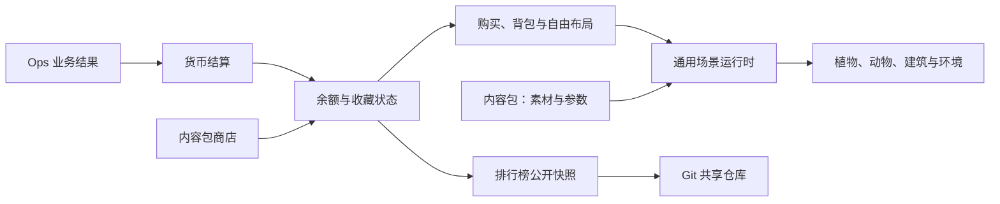

# OpsCopilot 养成与收藏系统设计

> 状态：冻结。养成功能仅作为默认关闭的实验功能保留，不继续推进本文的后续迭代。
>
> 启用位置：设置 → 高级选项 → 实验功能 → 启用养成功能。保存后生效；关闭时隐藏入口、停止信号轮询和工作事件结算，保留已有收藏数据。桌面与 Teams 插件沿用本地 Ops 配置，新启动的实例读取已保存开关；已运行的其他实例需重新启动以同步开关。
>
> 恢复开发须先确认产品方向和范围。本文剩余内容作为冻结设计保留，不代表发布承诺。
>
> 适用范围：OpsCopilot 桌面端与 Teams 插件共用的养成能力
>
> 关联文档：[现有花园产品设计](garden-design.md)、[现有呈现架构](garden-presentation-architecture.md)、[主题与皮肤设计](theme-design.md)

## 1. 定位

养成与收藏系统是 OpsCopilot 的环境型陪伴功能。它在用户工作时安静记录有效行为，在用户主动展开时提供可观赏、可交互的动态场景。它不承担工作提醒、任务管理或强制留存，不得争夺用户执行运维工作的注意力。

系统后续不局限于植物。收藏元素可以是植物、动物、建筑或其他题材；场景可以通过内容包切换季节、节日和整体风格。新增常见题材时，应主要交付美术素材与声明式参数，不为具体物种编写专属业务代码。

## 2. 已确认的产品规则

### 2.1 最小打扰

养成窗口关闭时：

- 有效业务行为继续在后端结算；
- 不加载场景和动画素材；
- 不运行动画循环、路径计算和排行榜同步；
- 不弹窗、不显示红点数字、不要求用户领取或确认；
- 有效工作产生货币或收藏变化时，入口图标最多进行一次轻微闪动；多次变化合并为一次提示；
- 闪动结束后入口恢复普通状态，不形成待办压力；
- 启用“减少动态效果”时，以短暂颜色变化代替闪动。

养成窗口展开时，系统可以完整展示场景、收藏详情和排行榜。此时如果发生新的成长，场景可以静默更新，但不得用模态弹窗打断用户。

### 2.2 等级与形态

- 每个收藏实例的等级范围为 `0–100`；
- 每 10 级切换一个明显形态；
- 50 级以后继续升级，但不再要求新的形态素材；
- 六个形态区间固定为 `0–9`、`10–19`、`20–29`、`30–39`、`40–49`、`50–100`；
- 升级过程不需要单独播放，用户下次展开场景时直接看到当前形态；
- 等级和形态只影响收藏呈现，不影响 OpsCopilot 权限、安全策略或业务结果。

形态计算规则为：

```text
stage = min(floor(level / 10), 5)
```

### 2.3 当前不需要数据迁移

该功能尚未正式上线或发布。新状态模型直接替换开发期实现，不设计旧数据迁移、兼容读取或双写路径。开发期花园数据可以清理并重新生成。

首次正式发布后，后续 schema 变化才需要显式迁移规则。

### 2.4 图鉴

图鉴属于可选增强能力，不是首批闭环的必要条件。实现时应使用独立窗口或大尺寸模态页面，不受停靠养成窗口高度限制。养成主场景不为了容纳图鉴而增加常驻控件。

## 3. 核心模型

### 3.1 工作事件与货币

工作事件描述用户完成了哪一类有效工作，与题材和美术无关。首批事件领域包括：

| 通道 | 对应行为领域 |
| --- | --- |
| `session` | 连接与会话 |
| `command` | 快捷命令复用 |
| `script` | 脚本与自动化 |
| `transfer` | 文件传输 |
| `guard` | 安全约束与受控操作 |
| `knowledge` | 诊断与知识沉淀 |

业务代码只提交已确认成功、可去重的事件，不认识植物、动物或建筑。状态层按事件类型和日上限结算通用货币“灵感币”；事件不会直接创造、指定或升级某个收藏元素。用户使用货币从当前内容包的商店选择收藏，因此工作方式与收藏题材解耦。

### 3.2 收藏元素与收藏实例

收藏元素由内容包定义，例如薄荷、狐狸、温室或节日雪人。每个元素声明商品信息、六个形态、品质素材、动作能力和场景放置规则。

收藏实例是用户实际拥有的个体，持久化字段保持题材无关：

| 字段 | 说明 |
| --- | --- |
| `itemId` | 内容包内稳定的收藏元素标识 |
| `instanceId` | 收藏实例标识 |
| `level` / `xp` | 0–100 级及当前经验 |
| `shiny` | 普通或闪光品质 |
| `acquiredAt` | 获得时间 |
| `lastGrewAt` | 最近成长时间 |
| `milestones` | 不含敏感业务数据的纪念记录 |
| `placement` | 是否入场及归一化坐标、缩放和水平朝向 |

用户设置的场景落点、缩放和水平朝向需要持久化。动物等元素围绕落点产生的临时移动坐标、当前动作和动画帧不持久化，这些属于场景运行时状态。

### 3.3 主题与成长规则的边界

- 余额、累计收入与支出、库存实例、用户布局、等级、经验、品质和防刷规则归状态层所有；
- 场景、形象、动作素材、移动范围和风格文案归内容包所有；
- 更换主题不得改变用户余额、库存、布局、等级、品质或排行榜得分；
- Teams 只承载 OpsCopilot 前台，不参与养成结算、内容解释和排行榜规则。

## 4. 内容包架构

内容能力分为四类资源，可以组合成一套收藏主题。

### 4.1 场景包

场景包声明：

- 昼夜背景与环境视觉资源；
- 场景纵横比和安全显示区域；
- 地面、空中、水域等活动区域；
- 前景、中景、后景层级；
- 环境光、阴影、夜间亮度和饱和度；
- 可使用的装饰物位置；
- 面板尺寸变化时的裁切与缩放规则。

场景坐标统一使用归一化坐标，避免素材绑定固定像素尺寸。

### 4.2 收藏元素包

每个收藏元素至少声明：

- 名称、说明、价格、分类和初始等级；
- 六个形态的普通素材；
- 可选的闪光素材和成熟姿态变体；
- 素材锚点、点击区域、默认尺寸和层级规则；
- 放置类型与活动区域；
- 可用动作及对应资源；
- 降低动态效果时使用的静态画面。

植物、动物和建筑使用同一份元素清单格式，不按题材拆渲染器。

### 4.3 季节与节日覆盖包

覆盖包可以替换或增加：

- 背景、天气、光照和环境粒子；
- 前景装饰和节日陈设；
- 收藏元素的季节外观；
- 限定内容的展示文案和时间范围。

覆盖包不得修改成长规则。覆盖资源缺失或不兼容时应明确报错，不静默切换到其他主题素材。

### 4.4 内容包安全边界

内容包只包含清单、参数和静态资源，不携带 JavaScript、动态库或其他可执行代码。新增内容只能组合运行时已经支持的动作原语。

如果新题材需要游泳、攀爬或群体互动等新行为，应先将其实现为通用动作原语并完成测试，再允许内容包声明使用。不得在内容包中为单个动物加入特例代码。

### 4.5 美术规格

养成场景的正式美术统一采用像素风。主体素材 `64×64px`，帧动画单帧同尺寸；昼夜场景 `960×320px`（3:1），尺寸用同一流程复核后确认。

像素数本身不决定观感，决定观感的是**绘制源的信息量**。同样是 `64×64`：程序化拼出的色块被放大后是一片糊状颗粒，手绘稿缩到 `64×64` 仍然保留形状、明暗与结构。因此规格的约束落在流程上，而不是分辨率的绝对值：

- 素材必须来自绘制；
- 素材必须经过同一轮归一化配方（见下）处理；
- 显示阶段保持像素边缘，不做平滑插值。

归一化配方是规格的一部分，逐项固定，保证整包观感一致：

| 步骤 | 取值 |
|---|---|
| 源图预缩 | 缩到原尺寸的 `50%`，先压掉细节噪声 |
| 源图预量化 | 把源图量化到约 `24` 色，再进入降采样（实测 24 色最干净，给到 32 色以上反而回噪） |
| 采样 | 众数（每格取出现次数最多的颜色） |
| 去背景 | 四角取色抠图，容差 `36` |
| Alpha | 阈值 `128` 并二值化，边缘不留半透明 |
| 调色板 | 量化到 `96` 色 |
| 抖动 | 无 |
| 描边 | 自动加深，宽度 `1px`，加深系数 `60%` |
| 输出 | `64×64` |

显示尺寸：主体在养成面板里约以 `120px` 呈现，是刻意的约 2 倍最近邻放大——这是像素观感的一部分，不是精度损失。若希望每个素材像素等宽，显示尺寸取素材边长的整数倍（`64×64` 对应 `128px`，而不是 `120px`）。

场景沿用同一流程，但输入是整幅横版画面、没有透明背景，去背景方式与尺寸需要单独确认。

该规格仅约束养成内容美术，不把 OpsCopilot 工作台控件改成像素 UI。

素材来源是**绘制**：手绘或绘图 AI 产出，仓库保存绘制结果并留档绘制源。不允许用坐标、图元或调色板在程序里拼出形象——这类产出只能当占位素材，不能作为正式美术。

程序只参与**一轮归一化**，即上表的配方：预缩、源图预量化、采样、去背景、Alpha 处理、调色板量化、描边、压缩。源图预量化让叶子色块更平整，但不预量化也能用——它是改善项，不是可交付与否的前提。归一化**不得改变形象本身**：不得用放大结果替代更精细的绘制，不得新增或删除形状。

文件布局、交付契约和门禁校验见 [养成内容包与呈现运行时](garden-presentation-architecture.md) 第 4.2 节。

## 5. 动作与帧动画

### 5.1 动作是内容包的一等能力

动物的待机、进食、移动、飞行、睡觉等动作可能由帧动画表现。内容包必须能够分别声明动作片段，而不是只提供一张静态图片或一个全局摇摆开关。

首批标准动作包括：

| 动作 | 用途 |
| --- | --- |
| `idle` | 待机、呼吸、眨眼或轻微观察 |
| `move` | 地面移动 |
| `eat` | 进食 |
| `sleep` | 休息 |
| `hop` | 跳跃移动 |
| `fly` | 空中移动 |
| `react` | 用户点击后的短暂回应 |

元素不需要支持全部动作。植物通常只有 `idle`，建筑可以完全静止或只有灯光变化，动物按素材能力选择动作集合。

### 5.2 帧动画素材格式

动作片段支持精灵图集或有序帧序列。每个片段至少声明：

- 资源位置；
- 帧宽、帧高和帧数；
- 图集行列或帧序列顺序；
- 播放帧率；
- 是否循环；
- 动作完成后的状态；
- 是否支持水平翻转；
- 静态替代帧。

示意清单：

```json
{
  "placement": "ground-roaming",
  "zone": "meadow",
  "clips": {
    "idle": { "src": "fox-idle.webp", "frames": 8, "columns": 4, "fps": 6, "loop": true },
    "move": { "src": "fox-walk.webp", "frames": 12, "columns": 6, "fps": 10, "loop": true },
    "eat": { "src": "fox-eat.webp", "frames": 10, "columns": 5, "fps": 8, "loop": false },
    "sleep": { "src": "fox-sleep.webp", "frames": 6, "columns": 3, "fps": 4, "loop": true }
  },
  "behavior": {
    "speed": [0.02, 0.05],
    "idleSeconds": [3, 9],
    "moveSeconds": [2, 6],
    "eatWeight": 0.12,
    "sleepWeight": 0.05
  }
}
```

字段名称在实施时可以调整，但“动作片段与行为参数分离”的约束不变。

### 5.3 计算运动与帧动画的职责

- 场景运行时计算位置、路径、速度、朝向、区域边界和前后层级；
- 动作片段表现当前行为，例如移动时播放 `move`，停下后播放 `idle`；
- 行为切换由通用状态机完成，内容包只提供允许的动作、时长范围和权重；
- 同一实例使用稳定随机种子，重新展开时允许重新开始活动，但不能出现明显抖动或瞬移；
- 元素被点击时可以短暂播放 `react`，随后回到正常状态；
- 场景不可见或窗口关闭时，所有帧动画和路径计算立即暂停。

### 5.4 放置与移动类型

首批支持四种放置类型：

| 类型 | 行为 |
| --- | --- |
| `anchored` | 固定位置，适合植物和建筑 |
| `ambient` | 固定位置执行原地动画 |
| `ground-roaming` | 在地面区域移动，适合动物 |
| `air-roaming` | 在空中区域移动，适合鸟和蝴蝶 |

水域移动等新类型不进入首批范围，后续按通用动作原语扩展。

### 5.5 资源与性能要求

- 动画素材在养成窗口打开后按需加载；
- 优先使用图集减少请求和解码对象数量；
- 每个动作设置分辨率、帧数、帧率和压缩后的体积上限；
- 同屏活动元素数量必须有上限，超出部分使用静态或休眠状态；
- 页面不可见时暂停帧推进；
- 降低动态效果时使用静态替代帧，不播放连续帧动画；
- 内容包构建必须检查总体积，避免突破插件文件限制；
- 素材按归一化配方重制后，单主体、单图集和单包总量的预算按实测重新确定；插件包体积上限是该预算的硬约束，实施前需先确认该上限的具体数值。

## 6. 场景与交互

### 6.1 观赏模式

养成窗口展开后应适合作为长期挂置的动态场景。场景填满可用区域，逻辑坐标保持稳定，不因排行榜展开而重新排列收藏元素。

场景中的交互保持轻量：

- 点击收藏元素查看详情；
- 悬停或聚焦时显示名称；
- 不常驻展示升级任务和待领取状态；
- 闪光品质通过素材、微光和文字共同表达；
- 键盘可以访问所有可交互元素。

### 6.2 商店、背包与布置模式

- 商店展示当前内容包声明的可购买元素，不按植物、动物或建筑拆分交互；
- 购买成功后元素先进入背包，不自动占据场景；
- 用户在布置模式中选择背包元素进入场景，并可拖动到元素所属活动区域内；
- 布置模式关闭后，拖动和收回控件不可用，避免观赏时误操作；
- 窄停靠窗口中的背包使用短暂底部托盘，元素放下后自动消失，不遮挡场景；
- 同一元素可以拥有多个实例。购买时有机会获得闪光品质，第 40 次未命中时保底；保底计数隐藏，不形成催促消费的进度条；
- 当前货币只由可验证的 Ops 工作事件产生，不提供付费购买或重复点击刷取入口。

### 6.3 左侧排行榜

排行榜位于养成窗口左侧：

- 收起时保留约 32px 的竖向入口；
- 展开时覆盖在场景左侧，不挤压或重排场景；
- 常规宽度建议为 220–260px；
- 窄窗口中自动使用覆盖模式；
- 排行榜没有未读红点，不主动弹出；
- 排行数据只在用户展开排行榜、主动刷新或明确配置的空闲时机同步。

## 7. Git 排行榜

### 7.1 定位

Git 排行榜是团队内部的轻量荣誉榜，不是强可信竞技系统。本地 Git 身份可以修改，因此排行榜不承诺防作弊，也不把排名与权限、付费或稀有掉落绑定。

### 7.2 身份

- 使用本地 Git `user.name` 作为默认显示名；
- 首次加入时生成稳定的本地 `participantId`，避免同名覆盖；
- 可以使用邮箱摘要辅助识别，但不得发布原始邮箱；
- 没有 Git 身份或未加入排行时，养成系统继续正常使用；
- 用户明确加入后才向共享仓库发布数据。

### 7.3 文件组织

排行榜采用每人一个文件的结构，避免所有用户修改同一个文件：

```text
ranking/
  season-2026-09/
    participant-a.json
    participant-b.json
```

公开快照只包含排行榜需要的聚合数据，例如显示名、养成等级、收藏数量、闪光数量、本期积分和更新时间。不得发布完整花园存档、命令、服务器、文件路径或事件明细。

客户端拉取全部成员快照并在本地聚合排序。同步失败只影响排行榜，不影响养成状态和 OpsCopilot 核心功能。

## 8. 运行边界



- 业务结果、货币、库存、品质和布局状态由 Go 后端负责；
- 通用场景运行时由桌面端和 Teams 插件共用；
- 内容包只提供素材和声明式参数；
- 排行榜只发布聚合快照；
- Teams 宿主不理解养成业务，也不保存 OpsCopilot 私有数据。

## 9. 迭代计划

### 迭代一：状态模型与静默行为基线（已完成）

交付内容：

- 等级调整为 0–100；
- 六个形态区间调整为每 10 级一档，50 级后固定；
- 将工作事件与收藏元素解耦；
- 直接替换开发期状态结构，不实现迁移和兼容读取；
- 删除强制领取、红点数字和升级弹窗语义；
- 增加只驱动入口短暂闪动的变化信号；
- 明确窗口关闭时的资源释放与性能测试。

验收：窗口关闭时不加载场景资源、不运行动画和 Git 同步；业务事件仍能安静结算。

当前实现以 schema v3 直接替换开发期状态：工作事件结算货币，收藏实例保持题材无关；入口通过轻量 revision 感知变化，桌面端与 Teams 插件在关闭状态不挂载场景 DOM。旧开发数据不迁移，需清理后重新生成。

### 迭代二：通用内容包（已完成）

交付内容：

- 场景包、收藏元素包和季节覆盖包契约；
- 六阶段素材、闪光素材、锚点、活动区域和动作片段格式；
- 包版本、资源完整性和兼容性校验；
- 素材体积与帧动画规格门禁；
- 将现有植物素材迁入新内容包，删除植物专属渲染分支。

验收：使用纯数据测试包将内容换成动物或建筑，不修改场景组件代码也能正确加载。

场景、元素、季节覆盖和动作资源均已改为声明式数据；官方像素素材已迁入 `ops-pixel-habitat`，旧的植物 SVG 渲染分支已删除。构建阶段会核对素材真实大小、尺寸、总体积和帧动画规格。纯数据动物包与建筑包均通过同一个 `ContentGardenScene` 装载。

### 迭代三：动态场景运行时（已完成）

交付内容：

- `anchored`、`ambient`、`ground-roaming`、`air-roaming` 四种放置类型；
- `idle`、`move`、`eat`、`sleep`、`hop`、`fly`、`react` 标准动作；
- 精灵图集和帧序列播放器；
- 通用动作状态机、区域移动、朝向、层级和基础避让；
- 隐藏暂停、按需加载和减少动态效果模式；
- 满幅场景布局，消除当前宽屏空白。

验收：测试动物能够在限定区域移动、进食和休息，植物能够原地摇曳，关闭窗口后相关运行开销停止。

当前实现采用内容包契约 v2 / 呈现运行时 v2。元素必须显式声明动作时长、权重以及移动所需的速度和避让半径。统一状态机支持四种放置类型和七种标准动作，精灵图与帧序列共用帧播放器；移动保持在凸活动区域内，并计算朝向、纵深与基础避让。页面隐藏、窗口关闭和减少动态效果模式都会停止动画调度，同屏活动元素上限为 12。场景在宽屏下填满可用区域，窄屏仍可横向游览。

### 迭代四：首套完整收藏主题（已完成）

交付内容：

- 至少三种具有完整六阶段素材的植物；
- 至少一种地面动物，具备待机、移动和休息或进食动作；
- 至少一种空中环境元素；
- 普通与闪光品质；
- 昼夜场景和统一的收藏详情视觉。

验收：植物、动物和环境元素可以在同一场景协调共存，不存在具体物种的专属运行时代码。

当前默认内容包为 `ops-woodland-courtyard`：使用昼夜像素场景与六种可购买元素，元素尺寸、价格、分类、素材、动作和活动区域均由内容包声明。所有题材差异来自内容包清单与静态资源，运行时没有物种分支。构建门禁校验素材尺寸、动画帧规格、真实字节数和资源预算。

### 迭代五：自由收藏经济与场景布置（已完成）

交付内容：

- 有效工作事件按幂等键和日上限结算灵感币；
- 内容包声明价格、分类与初始等级；
- 商店、背包、购买、自由摆放、拖动和收回；
- 归一化布局跨桌面端、Teams 插件与进程重启共享；
- 普通与闪光购买结果及 40 次隐藏保底；
- 布置控件与观赏模式隔离，窄窗口不遮挡主场景。

验收：工作事件不会自动生成题材元素；购买后的元素先进入背包，用户摆放并拖动后位置可靠落盘；替换为动物或建筑内容包时不修改状态层和场景交互代码。

### 迭代六：Git 团队排行榜

交付内容：

- 左侧可收起排行榜；
- Git 身份读取、稳定参与者 ID 和主动加入流程；
- 每人独立公开快照；
- 拉取、聚合、排序、发布和错误提示；
- 手动刷新和低干扰同步策略；
- 排行周期和基础归档。

验收：多个用户可以通过同一 Git 仓库更新和查看排行，单人更新不频繁制造合并冲突，排行榜故障不影响本地养成。

### 迭代七：内容发布与可选图鉴

交付内容：

- 内容包安装、启用、切换和卸载；
- 季节和节日覆盖包；
- 内容包预览、兼容性和损坏提示；
- 独立图鉴窗口；
- 更多植物、动物、建筑和环境动作；
- 排行赛季与历史归档。

验收：发布一套新主题或节日内容时，常规情况下只需要新增素材与声明式参数。

## 10. 非目标

- 不把养成系统做成工作待办或强提醒中心；
- 不在关闭状态持续渲染场景或运行动画；
- 不使用排行影响运维权限和业务能力；
- 不把原始命令、终端输出、凭据、服务器地址或文件内容写入养成数据；
- 不允许内容包执行自定义代码；
- 不在当前未发布阶段设计数据迁移和旧格式兼容；
- 不要求首批版本完成图鉴、季节商店或复杂社交功能。

## 11. 实施顺序

主依赖关系为：

```text
状态模型与静默行为
        ↓
通用内容包
        ↓
动态场景运行时
        ↓
首套收藏主题
        ↓
自由收藏经济与场景布置
        ↓
内容发布与持续扩展
```

Git 排行榜的数据层可以在通用内容包稳定后并行开发，但正式交付应在状态模型确定之后。图鉴不阻塞自由收藏经济与排行榜。
