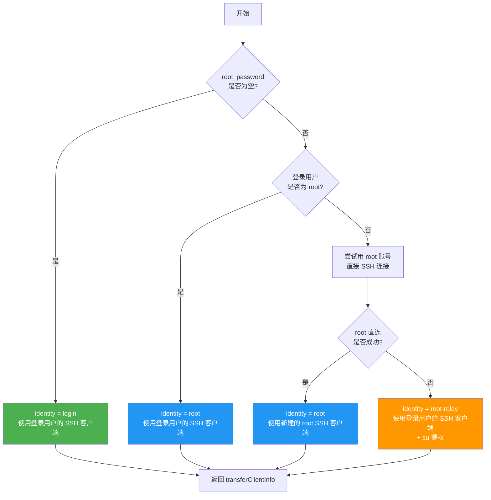
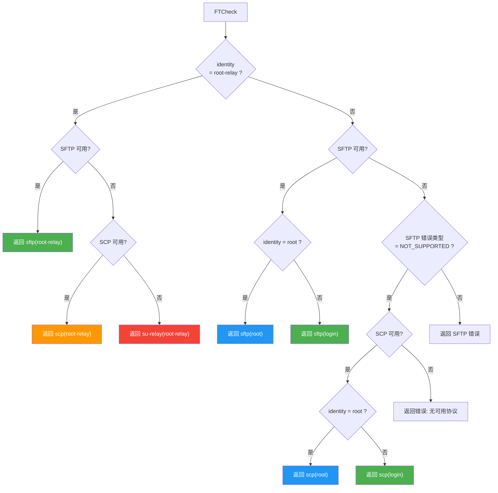
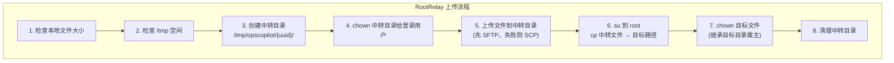
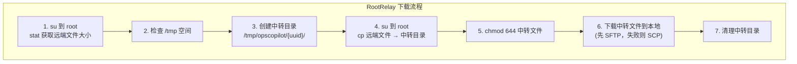
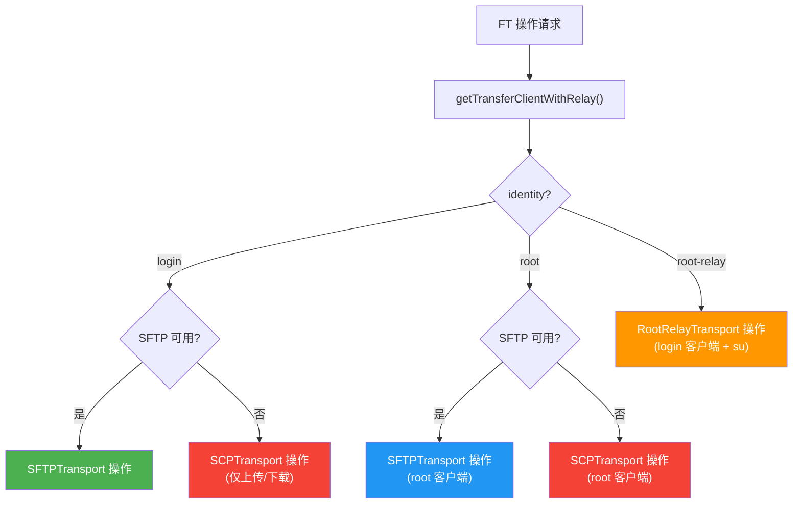
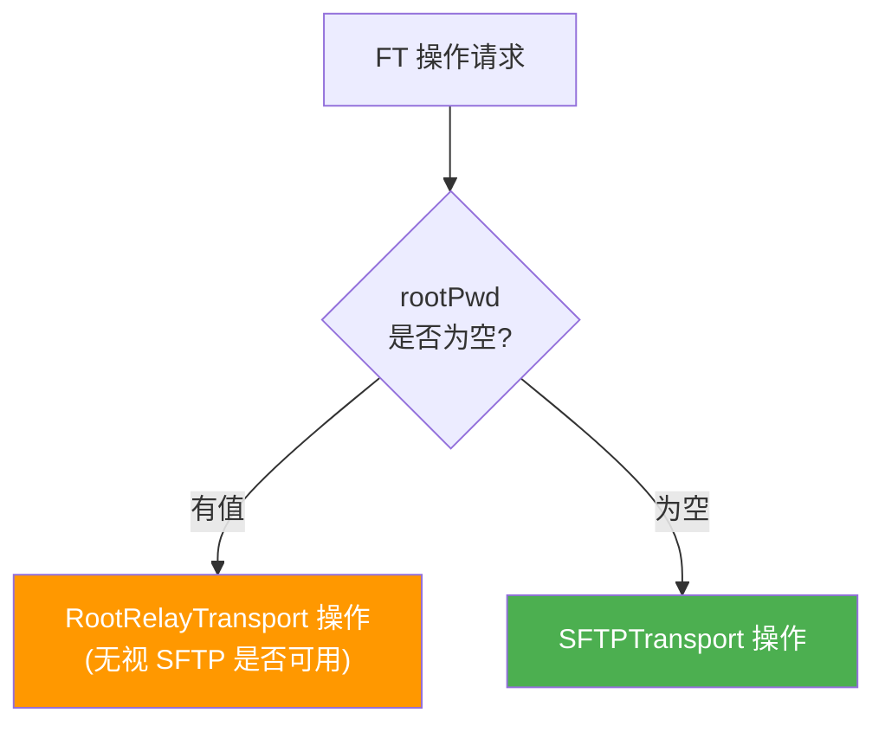
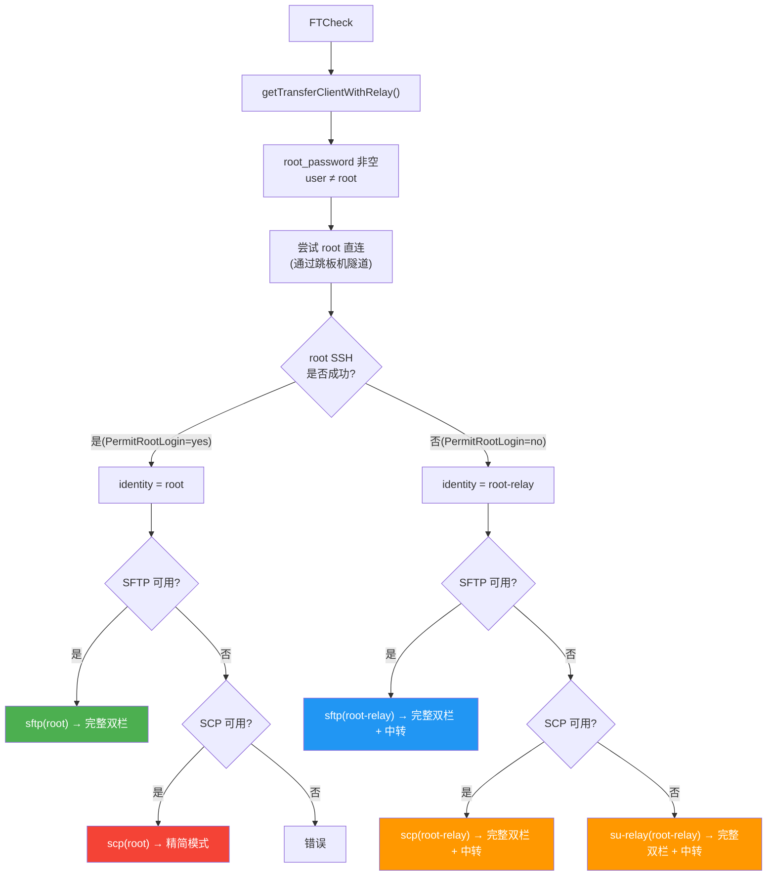
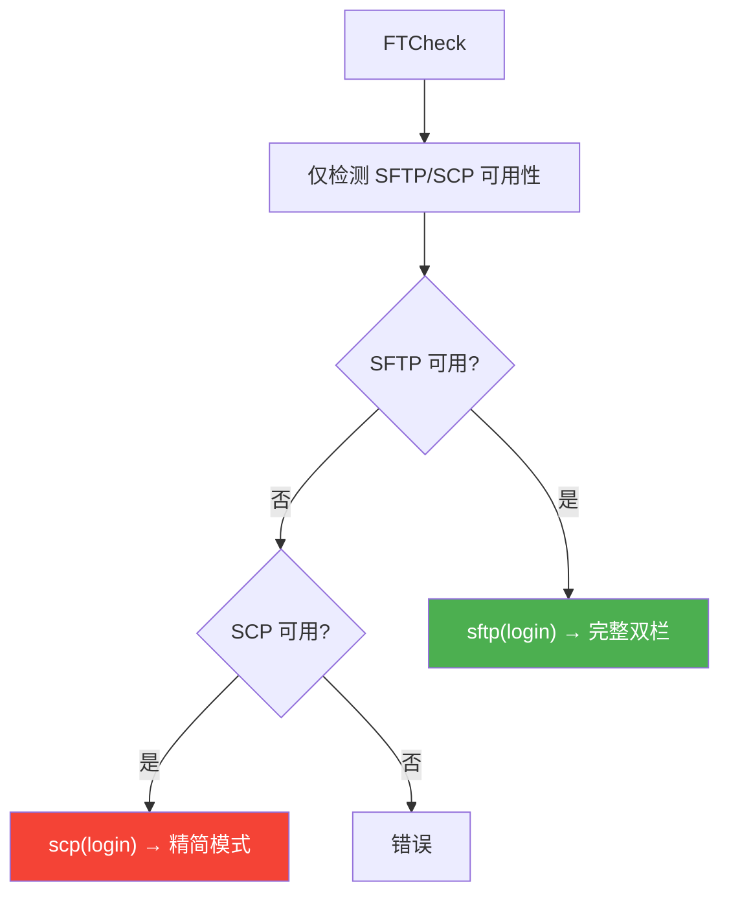

# OpsCopilot 文件传输架构详解

## 关键词

FTP 管理器, UI 模式, RootRelayTransport, SFTP, 跳板机, IPC, 身份判定, 协议检测, 精简模式, FTCheck, SCP, Root-Relay

## 一、整体架构

文件传输功能存在 **两套入口**，共享 **三层传输引擎**：

```
┌─────────────────────────────────────────────────────┐
│                    用户界面 (React)                   │
│         FilesPanel.tsx / FileTransferWindow.tsx      │
└───────────┬──────────────────────┬───────────────────┘
            │                      │
            ▼                      ▼
┌───────────────────┐   ┌─────────────────────────┐
│   主程序 app.go    │   │  FTP 管理器              │
│   (内嵌文件管理)   │   │  cmd/ftpmanager/app.go  │
│                   │   │  (独立窗口 OpsFTP.exe)   │
│  ✅ 完整逻辑      │   │  ⚠️ FTCheck 不完整       │
│  ✅ 跳板机支持    │   │  ✅ 跳板机连接支持        │
│  ✅ Root-Relay    │   │  ⚠️ FTCheck 不区分身份   │
│  ✅ IPC 委托      │   │  ✅ 操作层使用 RootRelay  │
└────────┬──────────┘   └────────────┬─────────────┘
         │                           │
         ▼                           ▼
┌─────────────────────────────────────────────────────┐
│              pkg/filetransfer/ 传输引擎               │
│                                                      │
│   SFTPTransport    SCPTransport    RootRelayTransport │
│   (SFTP 协议)      (SCP 协议)      (su + 临时目录)    │
└────────────────────────┬────────────────────────────┘
                         │
                         ▼
┌─────────────────────────────────────────────────────┐
│              pkg/sshclient/ SSH 连接层                │
│                                                      │
│         直连 / 跳板机隧道 (TCP Forward)               │
│         跳板机 Netcat 回退                            │
└─────────────────────────────────────────────────────┘
```

---

## 二、两套入口对比

### 2.1 主程序 app.go

入口：在 OpsCopilot 主界面侧边栏点击"文件"图标打开。

**特点：**
- `getTransferClientWithRelay()` 会区分三种身份：`login` / `root` / `root-relay`
- `FTCheck()` 根据身份返回不同的协议字符串
- `OpenFileManager()` 可启动独立的 FTP 管理器进程

### 2.2 FTP 管理器 cmd/ftpmanager/app.go

入口：OpsFTP.exe 独立进程，支持 **IPC 模式** 和 **独立模式**。

| 特性 | IPC 模式 | 独立模式 |
|------|---------|---------|
| 触发条件 | 主程序启动时自动连接 IPC | IPC 连接失败时回退 |
| 连接管理 | 委托主程序 | 自己创建 SSH 连接 |
| 跳板机支持 | ✅ 走主程序完整逻辑 | ✅ `autoConnect()` 读取 Bastion 配置 |
| FTCheck | ✅ 委托主程序，返回正确身份 | ⚠️ **始终返回 `login` 身份** |
| 文件操作 | ✅ 委托主程序 | ⚠️ 仅区分 `rootPwd` 是否存在 |

**独立模式下的 Bug：**

`FTCheck()` (第 526-550 行) 只检测 SFTP/SCP 可用性，**不判断身份**：

```go
// cmd/ftpmanager/app.go:536-549
sftpTr := filetransfer.NewSFTPTransport(client)
_, _, sftpErr := sftpTr.Check(ctx)
if sftpErr == nil {
    return "sftp(login)"    // ← 永远是 login
}
scpTr := filetransfer.NewSCPTransport(client)
ok, _, err := scpTr.Check(ctx)
if ok {
    return "scp(login)"     // ← 永远是 login
}
```

而实际操作层（FTList/FTUpload 等）**会根据 `rootPwd` 选择 RootRelayTransport**：

```go
// cmd/ftpmanager/app.go:268-274
if rootPwd != "" {
    relay := filetransfer.NewRootRelayTransport(client, rootPwd, loginUser)
    entries, err = relay.List(ctx, remotePath)  // ← 实际走了 root-relay
} else {
    tr := filetransfer.NewSFTPTransport(client)
    entries, err = tr.List(ctx, remotePath)
}
```

**结果：** FTCheck 说"常规直连"，但操作实际走了 RootRelay → **UI 显示和实际行为不一致**。

---

## 三、身份判定决策树

主程序 `getTransferClientWithRelay()` (app.go:1219) 的判定逻辑：



**关键：** root 直连尝试时，会携带跳板机配置：

```go
// app.go:1248-1255
if cfg.Bastion != nil {
    rootCfg.Bastion = &sshclient.ConnectConfig{
        Host:     cfg.Bastion.Host,
        Port:     cfg.Bastion.Port,
        User:     cfg.Bastion.User,
        Password: cfg.Bastion.Password,
    }
}
```

---

## 四、协议检测决策树

主程序 `FTCheck()` (app.go:1402) 的协议检测逻辑：



---

## 五、前端 UI 映射

FilesPanel.tsx 根据 FTCheck 返回的 protocol 字符串决定显示：

| protocol 值 | 连接方式标签 | 工作方式标签 | UI 模式 |
|-------------|------------|------------|---------|
| `sftp(login)` | SFTP（密码登录） | 常规直连 | 完整双栏 |
| `sftp(root)` | SFTP（Root 直连） | Root 直连 | 完整双栏 |
| `sftp(root-relay)` | SFTP（Root 中转模式） | Root 中转 | 完整双栏 + 中转提示 |
| `scp(root-relay)` | SCP 中转（Root 中转模式） | Root 中转 | 完整双栏 + 中转提示 |
| `su-relay(root-relay)` | SU 中转（Root 中转模式） | Root 中转 | 完整双栏 + 中转提示 |
| `scp(login)` | SCP（兼容模式） | 常规直连 | **精简模式** |
| `scp(root)` | SCP（Root 兼容模式） | 常规直连 | **精简模式** |

**两种 UI 模式：**

- **完整双栏**：左侧本地文件列表，右侧远端文件列表，支持增删改查
- **精简模式 (SCP 降级)**：仅显示上传/下载表单，不支持远端浏览与管理，显示提示：
  > 当前为 SCP 降级模式，仅支持上传/下载，不支持远端浏览与管理。

---

## 六、三种传输引擎

### 6.1 SFTPTransport


**能力：** 全功能 — List, Stat, Upload, Download, Mkdir, Rename, Remove, ReadFile, WriteFile

**前提：** 远端 sshd 开启了 `Subsystem sftp`

### 6.2 SCPTransport


**能力：** 仅 Upload, Download

**前提：** 远端安装了 `scp` 命令

**限制：** 不支持目录浏览和文件管理

### 6.3 RootRelayTransport（核心中转方案）





**能力：** 全功能 — List, Stat, Upload, Download, Mkdir, Rename, Remove, ReadFile, WriteFile

**前提：**
- 登录用户可以 `su` 到 root
- `/tmp` 有足够空间
- su 会话通过 PTY + 密码输入实现

**内部传输选择：** SFTP 优先，SCP 兜底

**su 会话管理：** 持久化（创建一次，复用），通过 Mutex 序列化命令执行

---

## 七、文件操作路由总览

### 7.1 主程序 (app.go) 的路由



**具体操作路由 (app.go)：**

| 操作 | login/root + SFTP | login/root + SCP | root-relay |
|------|-------------------|-----------------|------------|
| List | SFTPTransport.List | ❌ 不支持 | RootRelayTransport.List |
| Stat | SFTPTransport.Stat | ❌ 不支持 | RootRelayTransport.Stat |
| Upload | SFTPTransport.Upload | SCPTransport.Upload | RootRelayTransport.Upload |
| Download | SFTPTransport.Download | SCPTransport.Download | RootRelayTransport.Download |
| Mkdir | SFTPTransport.Mkdir | ❌ 不支持 | RootRelayTransport.Mkdir |
| Remove | SFTPTransport.Remove | ❌ 不支持 | RootRelayTransport.Remove |
| Rename | SFTPTransport.Rename | ❌ 不支持 | RootRelayTransport.Rename |
| ReadFile | SFTPTransport.ReadFile | ❌ 不支持 | RootRelayTransport.ReadFile |
| WriteFile | SFTPTransport.WriteFile | ❌ 不支持 | RootRelayTransport.WriteFile |

### 7.2 FTP 管理器独立模式的路由



**与主程序的差异：**

| 差异点 | 主程序 | FTP 管理器独立模式 |
|--------|--------|-------------------|
| 身份判定 | 三级：login/root/root-relay | 两级：有 rootPwd / 无 rootPwd |
| Root 直连尝试 | ✅ 先尝试 root 直连 | ❌ 不尝试，有 rootPwd 就走 relay |
| SCP 作为操作层 | ✅ SFTP 不可用时用 SCP | ❌ 无 rootPwd 时只用 SFTP |
| RootRelay 内部 | ✅ SFTP 优先，SCP 兜底 | ✅ 同 |
| FTCheck 准确性 | ✅ 返回真实身份 | ❌ 始终返回 login |

---

## 八、当前测试场景的预期行为

### 配置

```
业务机: 39.108.66.227
  user: sopuser
  root_password: zhangyibo123.
  SFTP: 已禁用
  bastion: 39.108.107.148 (sopuser)

跳板机: 39.108.107.148
  user: sopuser
  SFTP: 开放
```

### 主程序预期流程



### FTP 管理器独立模式预期流程



**注意：** FTP 管理器独立模式不区分身份，但操作层仍会使用 RootRelayTransport。

---

## 九、已知问题清单

| # | 问题 | 位置 | 影响 |
|---|------|------|------|
| 1 | FTP 管理器 FTCheck 不区分身份 | cmd/ftpmanager/app.go:526-550 | UI 显示"常规直连"，但实际可能走 root-relay |
| 2 | FTP 管理器不尝试 root 直连 | cmd/ftpmanager/app.go | 有 rootPwd 时直接走 relay，可能多此一举 |
| 3 | FTP 管理器无 rootPwd 时只用 SFTP | cmd/ftpmanager/app.go:486 | SFTP 不可用时不会降级到 SCP |
| 4 | 主程序 SCP 模式不支持远端管理 | app.go:FTList 等 | SCP 精简模式下无法列目录 |
| 5 | 每次操作新建 RootRelayTransport | cmd/ftpmanager/app.go:269 等 | FTP 管理器不复用 su 会话，效率低 |