# 知识库改造落地计划

> 版本: v1.0 | 日期: 2026-04-12 | 状态: 待实施
>
> 配套文档: [知识检索技术方案](knowledge-retrieval-design.md) | [知识管理技术方案](knowledge-management-design.md)

---

## 0. 改造全景

```
当前流程（4-6次LLM调用）:
  用户问题 → extractWeightedTerms(fastProvider) → search_knowledge → read_knowledge_file → LLM回答

目标流程（2-3次LLM调用）:
  用户问题 → Agent直接携带目录上下文 → read_knowledge_file精准读取 → LLM回答
```

### 核心变更

| 变更 | 说明 |
|------|------|
| 新建 `pkg/knowledge/catalog.go` | 目录数据结构（Catalog/ServiceEntry/ModuleEntry/ScenarioEntry） |
| 新建 `pkg/knowledge/indexer.go` | 目录生成器：解析文档 → 提取场景 → 生成 catalog.json → 渲染 LLM 上下文 |
| 修改 `pkg/ai/agent.go` | 目录注入系统提示、移除 search/list 工具、简化 agentToolPrompt |
| 修改 `pkg/tools/knowledge/read_file.go` | 增加 section 参数，支持按场景精准读取 |
| 修改 `pkg/mcpserver/recorder_adapter.go` | 归档增加元数据字段（问题现象/关键词/涉及组件）、归档后更新目录 |
| 修改 `app.go` | 启动时构建目录、注入 Agent |
| 修改 `frontend/.../TroubleshootingPanel.tsx` | preprocessContent 前端预处理 |
| 迁移 `docs/*.md` | 为现有文档补充 Front Matter 和关键词字段 |

### 不改的

- `pkg/knowledge/search.go` — 保留代码不删除（内部可能仍被其他地方引用），但 Agent 不再调用
- `pkg/knowledge/loader.go` — `LoadAll` 在 `AskWithContext` 的 fallback 中仍使用，暂保留
- `pkg/tools/knowledge/search.go` — 保留文件，Agent 不注册此工具即可
- `pkg/tools/knowledge/list_files.go` — 同上

---

## 1. Phase 1：目录数据结构与索引器

### 1.1 新建 `pkg/knowledge/catalog.go`

**数据结构**（参照 knowledge-management-design.md §3.2）：

```go
package knowledge

import "time"

// Catalog 完整目录
type Catalog struct {
    Version   int               `json:"version"`
    BuildAt   time.Time         `json:"buildAt"`
    Services  []ServiceEntry    `json:"services"`
    FileHash  map[string]string `json:"fileHash"`  // path → md5
}

// ServiceEntry 服务层
type ServiceEntry struct {
    Name    string        `json:"name"`
    Modules []ModuleEntry `json:"modules"`
}

// ModuleEntry 模块层
type ModuleEntry struct {
    Name      string          `json:"name"`
    Scenarios []ScenarioEntry `json:"scenarios"`
}

// ScenarioEntry 场景层
type ScenarioEntry struct {
    Title      string   `json:"title"`
    File       string   `json:"file"`
    LineStart  int      `json:"lineStart"`
    LineEnd    int      `json:"lineEnd"`
    Phenomena  string   `json:"phenomena"`
    Keywords   []string `json:"keywords"`
    Components []string `json:"components"`
    Type       string   `json:"type"`  // "sop" | "archive"
}
```

**方法**：

- `func (c *Catalog) TotalScenarios() int` — 统计场景总数
- `func (c *Catalog) FindEntry(filePath string, title string) *ScenarioEntry` — 按文件+标题查找场景
- `func (c *Catalog) RenderForLLM() string` — 渲染为 LLM 上下文文本
- `func (c *Catalog) ReplaceEntries(filePath string, entries []ScenarioEntry)` — 替换指定文件的条目
- `func (c *Catalog) RemoveDeletedFiles(existings map[string]bool)` — 清理已删除文件的条目

**`RenderForLLM()` 输出格式**：

```
## Payment Service (3 modules, 4 scenarios)
### 核心支付模块 (2 scenarios)
- API接口超时(504) | 前端超时,Nginx大量504 | 504,timeout,超时 | payment_system_sop.md#L12
- 订单状态未流转 | 支付成功但PENDING | PENDING,状态,未流转 | payment_system_sop.md#L33
```

### 1.2 新建 `pkg/knowledge/indexer.go`

**核心函数**：

```go
// BuildCatalog 构建/增量更新目录
func BuildCatalog(dir string) (*Catalog, error)

// loadExistingCatalog 加载已有 catalog.json
func loadExistingCatalog(dir string) *Catalog

// walkMarkdownFiles 遍历所有 .md 文件
func walkMarkdownFiles(dir string) (map[string]string, error)

// parseDocument 解析单个文档，提取场景条目
func parseDocument(relPath string, content string) (serviceName string, moduleName string, entries []ScenarioEntry)

// extractFrontMatter 提取 YAML Front Matter
func extractFrontMatter(content string) (map[string]string, string)

// extractScenarios 提取所有 ### 场景 段落
func extractScenarios(content string, relPath string, lineOffset int) []ScenarioEntry

// md5Hash 计算内容哈希
func md5Hash(content string) string
```

**`parseDocument` 解析规则**：

1. 检测 YAML Front Matter（`---` 之间的部分），提取 `service`、`module`
2. 如果没有 Front Matter，检查 `## 服务信息` 表格
3. 扫描所有 `### 场景` 或 `## 场景` 标题
4. 对每个场景提取：
   - `现象` 字段（`- **现象**:` 行）→ phenomena
   - `关键词` 字段（`- **关键词**:` 行）→ keywords
   - `涉及组件` 字段（`- **涉及组件**:` 行）→ components
   - 行号范围（lineStart 到下一个同级标题的 lineEnd）
5. 对于归档文件（含 `type: archive` 或 `## 问题现象` 标题），特殊处理：
   - 从 `## 问题现象` 提取 phenomena
   - 从 `## 关键词` 提取 keywords
   - 从 `## 涉及组件` 提取 components

**`BuildCatalog` 主流程**：

```
loadExistingCatalog
  → walkMarkdownFiles
  → 遍历每个文件：
      hash = md5Hash(content)
      if hash == existing.FileHash[path] → 跳过
      else → parseDocument → ReplaceEntries → 更新 FileHash
  → RemoveDeletedFiles
  → 更新 BuildAt
  → return catalog
```

**文件路径**：catalog.json 存储在 `{knowledgeDir}/.catalog.json`

### 1.3 新建 `pkg/knowledge/catalog_test.go`

测试用例：

- `TestCatalogTotalScenarios` — 统计场景数
- `TestCatalogFindEntry` — 按文件+标题查找
- `TestCatalogRenderForLLM` — 渲染格式校验
- `TestCatalogReplaceEntries` — 增量替换
- `TestCatalogRemoveDeleted` — 清理已删除文件

### 1.4 新建 `pkg/knowledge/indexer_test.go`

测试用例：

- `TestBuildCatalogEmpty` — 空目录
- `TestBuildCatalogFromSOP` — 解析标准 SOP 文档
- `TestBuildCatalogFromArchive` — 解析归档文件
- `TestBuildCatalogIncremental` — 增量更新（hash 未变跳过）
- `TestExtractFrontMatter` — Front Matter 提取
- `TestExtractScenarios` — 场景提取
- `TestParseDocumentWithoutFrontMatter` — 无 Front Matter 时回退到表格推断

**测试用的 fixture 文件**放在 `pkg/knowledge/testdata/` 目录下。

---

## 2. Phase 2：Agent 流程改造

### 2.1 修改 `pkg/ai/agent.go`

#### 2.1.1 修改 `AgentRunOptions`

```go
type AgentRunOptions struct {
    Question     string
    KnowledgeDir string
    SystemPrompt string
    RetryMax     int
    EnableMCP    bool
    Catalog      *knowledge.Catalog  // 新增：注入目录
}
```

#### 2.1.2 替换 `agentToolPrompt`

将当前的 `agentToolPrompt` 常量替换为：

```go
const agentBasePrompt = "你是 OpsCopilot 运维诊断助手。你可以查阅本地知识库来辅助诊断。\n\n" +
    "## 可用工具\n" +
    "1. read_knowledge_file: 读取知识库文档（指定 path 和可选的 section）\n\n" +
    "## 规则\n" +
    "- 参考上方知识库问题目录，找到与用户问题相关的场景，使用 read_knowledge_file 读取对应文档\n" +
    "- 如果目录中没有与用户问题相关的场景，如实告知用户知识库中暂无相关排障文档，不要凭空编造排查建议\n" +
    "- 输出 Markdown 格式，用 ## 分节，命令用 ```bash 代码块\n" +
    "- 用中文回答\n" +
    "- 当调用 MCP 工具时，提供清晰结构化的问题描述\n"
```

注意：不再强制要求 "MUST call search_knowledge"，因为目录已在上下文中。

#### 2.1.3 修改 `RunAgent` 函数

**工具注册变更**：

```go
// 改前：注册3个知识库工具
registry.Register(knowledgetools.NewSearchTool(...))
registry.Register(knowledgetools.NewListFilesTool(...))
registry.Register(knowledgetools.NewReadFileTool(...))

// 改后：只注册1个工具（read_knowledge_file 带 catalog 支持）
registry.Register(knowledgetools.NewReadFileTool(opts.KnowledgeDir, opts.Catalog))
```

**系统提示构建变更**：

```go
// 改前
systemPrompt := agentToolPrompt
if opts.SystemPrompt != "" {
    systemPrompt = agentToolPrompt + "\n\n" + opts.SystemPrompt
}

// 改后
var sb strings.Builder
sb.WriteString(agentBasePrompt)

// 注入目录上下文
if opts.Catalog != nil {
    catalogText := opts.Catalog.RenderForLLM()
    if catalogText != "" {
        sb.WriteString("\n\n## 知识库问题目录\n\n")
        sb.WriteString(catalogText)
        sb.WriteString("\n")
    }
}

if opts.SystemPrompt != "" {
    sb.WriteString("\n\n")
    sb.WriteString(opts.SystemPrompt)
}

systemPrompt := sb.String()
```

**移除 `extractWeightedTerms` 调用链**：

当前 `RunAgent` 通过 `SearchTool` 间接调用 `extractWeightedTerms`。移除 `search_knowledge` 后，`extractWeightedTerms` 在 Agent 主流程中不再被调用。

> `extractWeightedTerms` 函数本身保留（`AskWithContext` 的 fallback 可能用到），但不再在 ReAct 循环中被触发。

#### 2.1.4 修改 `pkg/ai/agent_test.go`

现有测试 `TestAgentLoop` 期望的工具调用序列是 `search → extract → read → answer`，改为：

- Step 1: LLM 看到目录上下文后直接调用 `read_knowledge_file`
- Step 2: LLM 基于读取的内容生成最终回答

需要在测试中构造一个包含目录条目的 `Catalog` 实例，传入 `AgentRunOptions.Catalog`。

### 2.2 修改 `pkg/ai/intent.go`

#### 2.2.1 `AskTroubleshoot` 传入 Catalog

在 `AskTroubleshoot` 方法中，需要获取 Catalog 实例。两种方案：

**方案 A（推荐）：AIService 持有 Catalog 引用**

```go
type AIService struct {
    fastProvider    llm.Provider
    complexProvider llm.Provider
    cfgMgr          *config.Manager
    mcpClient       mcp.Client
    mcpManager      MCPManagerProvider
    catalog         *knowledge.Catalog  // 新增
    knowledgeDir    string              // 新增：用于 Catalog 刷新
}
```

`AskTroubleshoot` 中：

```go
// 改前
resp, err := s.RunAgent(ctx, AgentRunOptions{
    Question:     problem,
    KnowledgeDir: knowledgeDir,
    SystemPrompt: prompt,
    RetryMax:     5,
    EnableMCP:    false,
})

// 改后
resp, err := s.RunAgent(ctx, AgentRunOptions{
    Question:     problem,
    KnowledgeDir: knowledgeDir,
    SystemPrompt: prompt,
    RetryMax:     5,
    EnableMCP:    false,
    Catalog:      s.catalog,
})
```

#### 2.2.2 新增 `UpdateCatalog` 方法

```go
func (s *AIService) UpdateCatalog(knowledgeDir string) error {
    catalog, err := knowledge.BuildCatalog(knowledgeDir)
    if err != nil {
        return err
    }
    s.catalog = catalog
    s.knowledgeDir = knowledgeDir
    return nil
}
```

### 2.3 修改 `app.go`

#### 2.3.1 启动时构建目录

在 `NewApp()` 中，`aiService` 创建之后、`return app` 之前：

```go
// 构建知识库目录
knowledgeDir := app.resolveKnowledgeBase()
if knowledgeDir != "" {
    if err := aiService.UpdateCatalog(knowledgeDir); err != nil {
        fmt.Printf("Warning: Failed to build knowledge catalog: %v\n", err)
    } else {
        fmt.Printf("[App] Knowledge catalog built: %d scenarios\n", aiService.catalog.TotalScenarios())
    }
}
```

---

## 3. Phase 3：精准段落读取

### 3.1 修改 `pkg/tools/knowledge/read_file.go`

#### 3.1.1 构造函数增加 catalog 参数

```go
// 改前
type ReadFileTool struct {
    knowledgeDir string
}

func NewReadFileTool(knowledgeDir string) *ReadFileTool

// 改后
type ReadFileTool struct {
    knowledgeDir string
    catalog      *knowledge.Catalog  // 可为 nil
}

func NewReadFileTool(knowledgeDir string, catalog *knowledge.Catalog) *ReadFileTool
```

#### 3.1.2 参数定义增加 section

```go
func (t *ReadFileTool) Parameters() json.RawMessage {
    return json.RawMessage(`{
        "type": "object",
        "properties": {
            "path": {"type": "string", "description": "文件路径，如 payment_system_sop.md"},
            "section": {"type": "string", "description": "场景标题（可选），如 API接口超时(504)。指定后只返回该场景的段落内容"}
        },
        "required": ["path"],
        "additionalProperties": false
    }`)
}
```

#### 3.1.3 Execute 支持按段落读取

```go
func (t *ReadFileTool) Execute(ctx context.Context, args map[string]interface{}, emitStatus tools.StatusEmitter) (string, error) {
    path, _ := args["path"].(string)
    section, _ := args["section"].(string)  // 新增

    if path == "" {
        return "", fmt.Errorf("path参数不能为空")
    }

    if emitStatus != nil {
        if section != "" {
            emitStatus("reading", fmt.Sprintf("正在阅读文档: %s → %s...", path, section))
        } else {
            emitStatus("reading", fmt.Sprintf("正在阅读文档: %s...", path))
        }
    }

    // 如果指定了 section 且有 catalog，尝试精准读取
    if section != "" && t.catalog != nil {
        entry := t.catalog.FindEntry(path, section)
        if entry != nil {
            content, err := t.readSection(entry)
            if err == nil {
                return content, nil
            }
            // 精准读取失败，fallback 到全文件读取
        }
    }

    // 全文件读取（原逻辑）
    content, err := knowledge.ReadFile(t.knowledgeDir, path)
    if err != nil {
        return "", fmt.Errorf("读取文件失败: %w", err)
    }
    if len(content) > 20000 {
        return content[:20000] + "\n...(truncated)...", nil
    }
    return content, nil
}
```

#### 3.1.4 新增 `readSection` 方法

```go
func (t *ReadFileTool) readSection(entry *knowledge.ScenarioEntry) (string, error) {
    fullPath := filepath.Join(t.knowledgeDir, entry.File)
    content, err := os.ReadFile(fullPath)
    if err != nil {
        return "", err
    }

    lines := strings.Split(string(content), "\n")

    // lineStart/lineEnd 是 1-based
    start := entry.LineStart - 1
    if start < 0 {
        start = 0
    }
    end := entry.LineEnd
    if end > len(lines) {
        end = len(lines)
    }
    if start >= end {
        return "", fmt.Errorf("invalid line range")
    }

    section := strings.Join(lines[start:end], "\n")
    if len(section) > 20000 {
        section = section[:20000] + "\n...(truncated)..."
    }
    return section, nil
}
```

---

## 4. Phase 4：响应格式保障

### 4.1 后端 `normalizeAgentResponse`

**新增文件或添加到** `pkg/ai/intent.go`：

```go
func normalizeAgentResponse(resp string) string {
    s := strings.TrimSpace(resp)

    // 1. 处理 JSON 包装
    // 检测 {"summary": "..."} 模式，自动解包
    if strings.HasPrefix(s, "{") {
        var wrapper map[string]interface{}
        if err := json.Unmarshal([]byte(s), &wrapper); err == nil {
            if summary, ok := wrapper["summary"].(string); ok && summary != "" {
                s = summary
            }
        }
    }

    // 2. 处理孤立的代码块标记
    // 统计 ``` 出现次数，奇数时移除最后一个
    count := strings.Count(s, "```")
    if count%2 == 1 {
        lastIdx := strings.LastIndex(s, "```")
        s = s[:lastIdx] + s[lastIdx+3:]
    }

    return strings.TrimSpace(s)
}
```

**在 `AskTroubleshoot` 中使用**：

```go
// 改前（enableMCP=false 分支）
return CleanJSONResponse(resp), nil

// 改后
return normalizeAgentResponse(resp), nil
```

### 4.2 前端 `preprocessContent`

**修改文件**：`frontend/src/components/Sidebar/TroubleshootingPanel.tsx`

在 `renderMessageContent` 函数开头添加预处理：

```typescript
const preprocessContent = (content: string): string => {
    let text = content;

    // 1. 尝试从 JSON 包装中提取文本
    try {
        const trimmed = text.trim();
        if (trimmed.startsWith('{')) {
            const data = JSON.parse(trimmed);
            if (data.summary && typeof data.summary === 'string') {
                text = data.summary;
            }
        }
    } catch {}

    // 2. 确保标题前有空行
    text = text.replace(/([^\n])\n(#{1,6} )/g, '$1\n\n$2');

    return text;
};
```

在 `renderMessageContent` 开头调用：

```typescript
const renderMessageContent = (content: string) => {
    content = preprocessContent(content);
    // ... 后续逻辑不变
};
```

---

## 5. Phase 5：归档改进

### 5.1 修改 `pkg/mcpserver/recorder_adapter.go`

#### 5.1.1 `generateKnowledgeMarkdown` 增加元数据字段

在现有的 `## 根本原因` 之前，插入：

```go
// 问题现象（从 problem 描述提取）
sb.WriteString("\n## 问题现象\n\n")
sb.WriteString(a.current.Problem + "\n")

// 关键词（LLM 提取或留空由索引器推断）
// 暂时留空，索引器会从命令和输出中推断关键词
// 后续可增加 LLM 辅助提取
sb.WriteString("\n## 关键词\n\n")
// 提取命令中的关键词
keywords := extractKeywordsFromCommands(a.current.Commands)
if len(keywords) > 0 {
    sb.WriteString(strings.Join(keywords, ", ") + "\n")
}

// 涉及组件（从服务器列表推断）
sb.WriteString("\n## 涉及组件\n\n")
// 暂时记录涉及的服务器，后续可由 LLM 辅助推断
for server := range a.current.Servers {
    sb.WriteString(fmt.Sprintf("- %s\n", server))
}
```

同时添加 YAML Front Matter：

```go
// 在文件开头添加 Front Matter
sb.WriteString(fmt.Sprintf("---\nservice: auto\nmodule: auto\ntype: archive\n---\n\n"))
sb.WriteString(fmt.Sprintf("# %s\n\n", a.current.Problem))
```

#### 5.1.2 新增简单的关键词提取函数

```go
// extractKeywordsFromCommands 从命令中提取简单关键词
func extractKeywordsFromCommands(commands []MCPRecordedCommand) []string {
    seen := make(map[string]bool)
    var keywords []string
    for _, cmd := range commands {
        // 提取命令名称（第一个词）
        parts := strings.Fields(cmd.Command)
        if len(parts) > 0 {
            name := parts[0]
            if !seen[name] && len(name) > 1 {
                seen[name] = true
                keywords = append(keywords, name)
            }
        }
    }
    if len(keywords) > 10 {
        keywords = keywords[:10]
    }
    return keywords
}
```

#### 5.1.3 归档后更新目录

在 `archiveToKnowledge()` 末尾，写入文件之后：

```go
// 归档后增量更新目录
catalog, err := knowledge.BuildCatalog(a.knowledgeDir)
if err != nil {
    fmt.Printf("[MCP] Warning: failed to update catalog after archive: %v\n", err)
}
// 如果 App 层持有 catalog 引用，需要通知更新
// 这通过回调或直接引用实现（见 5.2）
```

### 5.2 通知机制：归档后刷新 Catalog

**方案**：`MCPRecorderAdapter` 增加一个 `onCatalogUpdate` 回调。

```go
type MCPRecorderAdapter struct {
    recorder        *recorder.Recorder
    current         *MCPSessionInfo
    knowledgeDir    string
    mu              sync.RWMutex
    onCatalogUpdate func()  // 新增：目录更新回调
}

func (a *MCPRecorderAdapter) SetOnCatalogUpdate(fn func()) {
    a.onCatalogUpdate = fn
}
```

在 `archiveToKnowledge` 成功后调用：

```go
if a.onCatalogUpdate != nil {
    a.onCatalogUpdate()
}
```

**`app.go` 中设置回调**：

```go
mcpRecorderAdapter.SetOnCatalogUpdate(func() {
    if err := aiService.UpdateCatalog(knowledgeDir); err != nil {
        log.Printf("[App] Warning: failed to refresh catalog: %v", err)
    }
})
```

---

## 6. Phase 6：现有文档迁移

### 6.1 迁移 `docs/payment_system_sop.md`

添加 YAML Front Matter + 场景级关键词字段：

```markdown
---
service: Payment Service
module: 核心支付模块
---

# 支付系统架构与排查手册

### 场景一：API 接口超时 (504 Gateway Timeout)

- **所属模块**: 核心支付模块
- **页面/接口**: POST /api/payment/create
- **现象**: 前端提示请求超时，Nginx 日志出现大量 504
- **关键词**: 504, timeout, 超时, 网关超时, 接口超时, nginx
- **涉及组件**: Nginx, Core Service, MySQL, Redis

### 场景二：订单状态未流转

- **所属模块**: 核心支付模块
- **页面/接口**: 回调接口 POST /api/payment/callback
- **现象**: 用户支付成功，但订单状态仍为 "PENDING"
- **关键词**: PENDING, 状态未更新, 回调失败, 订单, 未流转
- **涉及组件**: callback-worker, Redis, Core Service
```

### 6.2 迁移 `docs/network_troubleshooting.md`

同样的模式：添加 Front Matter（service: Network Service）+ 场景级字段。

### 6.3 迁移 `docs/database_maintenance.md`

检查格式，补充 Front Matter 和场景级字段。

### 6.4 检查 `docs/file-transfer-architecture.md`

确认是否为排查文档。如果是架构说明文档则不入目录（索引器可根据内容判断，无 `### 场景` 标题的文档不生成条目）。

---

## 7. 实施顺序与依赖关系

```mermaid
graph TD
    P1["Phase 1<br/>catalog.go + indexer.go<br/>+ 测试"]
    P2["Phase 3<br/>read_file.go<br/>精准读取"]
    P3["Phase 2<br/>agent.go 改造<br/>目录注入"]
    P4["Phase 4<br/>响应格式保障"]
    P5["Phase 5<br/>归档改进"]
    P6["Phase 6<br/>文档迁移"]

    P1 --> P2
    P1 --> P3
    P2 --> P3
    P3 --> P4
    P1 --> P5
    P5 --> P6

    style P1 fill:#1a3a5a,stroke:#4a9eff
    style P3 fill:#1a2a1a,stroke:#6bff6b
```



### 建议实施顺序

| 步骤 | 任务 | 依赖 | 估时 |
|------|------|------|------|
| 1 | Phase 1：`catalog.go` 数据结构 + 单元测试 | 无 | 基础 |
| 2 | Phase 1：`indexer.go` 解析器 + 单元测试 | 步骤 1 | 核心 |
| 3 | Phase 3：`read_file.go` 增加 section 支持 | 步骤 1 | 简单 |
| 4 | Phase 2：`agent.go` 改造 + 测试更新 | 步骤 1-3 | 关键 |
| 5 | Phase 2：`app.go` 启动构建 + `intent.go` 传 Catalog | 步骤 4 | 简单 |
| 6 | Phase 4：`normalizeAgentResponse` + 前端预处理 | 步骤 4 | 简单 |
| 7 | Phase 5：归档改进 + 回调机制 | 步骤 1 | 中等 |
| 8 | Phase 6：现有文档迁移 | 步骤 2 | 手工 |

---

## 8. 文件变更清单

### 新建文件

| 文件 | 说明 |
|------|------|
| `pkg/knowledge/catalog.go` | Catalog/ServiceEntry/ModuleEntry/ScenarioEntry 数据结构 + RenderForLLM |
| `pkg/knowledge/indexer.go` | BuildCatalog 增量索引器 |
| `pkg/knowledge/catalog_test.go` | Catalog 相关单元测试 |
| `pkg/knowledge/indexer_test.go` | 索引器单元测试 |
| `pkg/knowledge/testdata/*.md` | 测试用 fixture 文档 |

### 修改文件

| 文件 | 改动点 | 改动量 |
|------|--------|--------|
| `pkg/ai/agent.go` | AgentRunOptions 加 Catalog、agentToolPrompt 替换、RunAgent 工具注册简化 | 中 |
| `pkg/ai/agent_test.go` | 测试用例更新（Mock ScriptedProvider 序列变更） | 中 |
| `pkg/ai/intent.go` | AIService 加 catalog 字段、UpdateCatalog 方法、normalizeAgentResponse、传 Catalog 到 RunAgent | 中 |
| `pkg/tools/knowledge/read_file.go` | 构造函数加 catalog、Parameters 加 section、Execute 按段落读取 | 中 |
| `pkg/mcpserver/recorder_adapter.go` | generateKnowledgeMarkdown 增加 Front Matter/元数据、归档后更新目录回调 | 中 |
| `app.go` | 启动时 BuildCatalog、设置回调 | 小 |
| `frontend/.../TroubleshootingPanel.tsx` | preprocessContent 函数 | 小 |

### 迁移文件

| 文件 | 操作 |
|------|------|
| `docs/payment_system_sop.md` | 添加 Front Matter + 场景级关键词字段 |
| `docs/network_troubleshooting.md` | 添加 Front Matter + 场景级关键词字段 |
| `docs/database_maintenance.md` | 检查格式、补充字段 |

---

## 9. 验证方案

### 9.1 单元测试

```bash
# Phase 1
go test ./pkg/knowledge/... -v -run TestCatalog
go test ./pkg/knowledge/... -v -run TestIndexer
go test ./pkg/knowledge/... -v -run TestBuildCatalog
go test ./pkg/knowledge/... -v -run TestRenderForLLM

# Phase 2
go test ./pkg/ai/... -v -run TestAgentLoop
go test ./pkg/ai/... -v -run TestAgentCatalogInjection

# Phase 3
go test ./pkg/tools/knowledge/... -v -run TestReadFileSection
```

### 9.2 集成验证

```bash
# 1. 启动应用 → 确认 docs/.catalog.json 自动生成
# 2. 检查目录结构：是否按 服务 → 模块 → 场景 三级组织
# 3. 检查目录容量：确认 RenderForLLM 输出 < 65K 字符
# 4. 修改 payment_system_sop.md → 重启 → 确认只重新索引该文件（日志确认 hash 比对）
# 5. 完成一次排查归档 → 确认 catalog.json 新增条目
# 6. 输入 "线上付不了钱" → 确认 Agent 读取了 payment_system_sop.md 的正确场景
# 7. 输入目录中没有的问题（如"怎么配置K8s"）→ 确认 Agent 回复"知识库暂无相关文档"
# 8. 确认 Agent LLM 调用次数 ≤ 3 次
# 9. 确认归档文件包含 Front Matter + 问题现象/关键词字段
```

### 9.3 回归验证

- 确保 `AskWithContext` 的 fallback 仍正常工作（不经过 Catalog）
- 确保 MCP 增强模式（enableMCP=true）的并行流程不受影响
- 确保前端 TroubleshootingPanel 的 Markdown 渲染正常

---

## 10. 风险与缓解

| 风险 | 影响 | 缓解 |
|------|------|------|
| 目录渲染超 65K | LLM 上下文溢出 | RenderForLLM 内置压缩逻辑：超限时去掉 phenomena，只保留标题+关键词+文件 |
| 文档格式不标准 | 解析不到场景 | 索引器容错：无场景的文档不生成条目，不影响其他文档 |
| Catalog 内存占用 | 服务启动变慢 | 增量更新 + hash 比对，只重新解析变更文件 |
| LLM 不调用 read_knowledge_file | 直接回答无依据 | prompt 中明确"参考上方目录"，且提供 read_knowledge_file 作为唯一工具 |
| 归档文件元数据不完整 | 索引效果差 | 第一版用简单规则提取，后续可增加 LLM 辅助提取（Phase 5.1.2 中预留） |
| 旧版测试用例失败 | CI 红灯 | Phase 2 中同步更新 agent_test.go |
