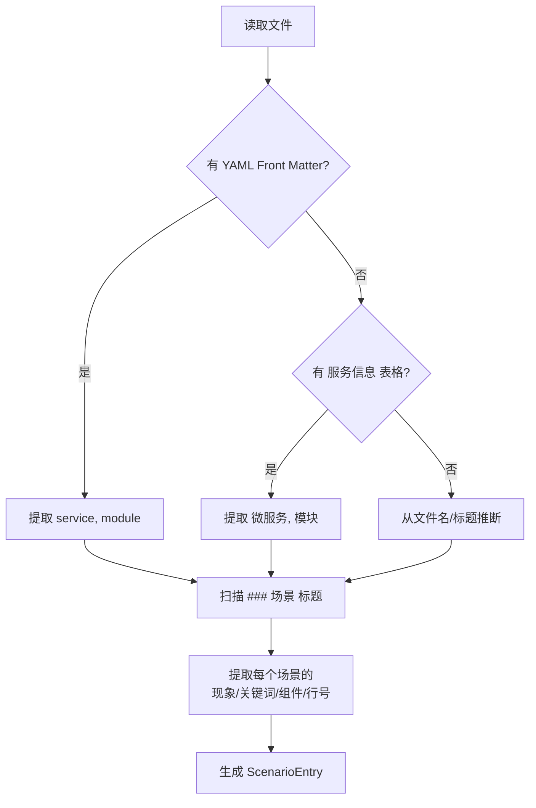
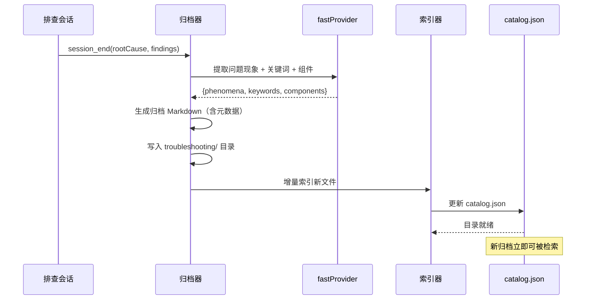

# 知识管理技术方案

> 版本: v1.0 | 日期: 2026-04-11 | 状态: 设计中
>
> 配套文档: [知识检索技术方案](knowledge-retrieval-design.md)

---

## 1. 设计目标

建立知识库的**完整生命周期管理**：

```
文档编写 → 目录索引 → 检索使用 → 排查归档 → 自动入目录 → 再次检索
```

核心要求：

1. **文档格式标准化** — 统一的结构，便于自动提取目录
2. **多级目录自动生成** — 从文档中提取 服务→模块→场景 三级目录
3. **目录增量刷新** — 文档变更时只重新索引变更文件
4. **归档自动入目录** — 排查记录归档后立即可被检索
5. **目录体量可控** — 始终 < 65K 字符，确保可作为 LLM 上下文

---

## 2. 文档格式规范

### 2.1 排查手册标准格式

每个排查文档应包含**文档级元信息**和**多个问题场景**：

```markdown
---
service: Payment Service          # 微服务名称
module: 核心支付模块              # 功能模块
owner: team-pay                   # 负责团队（可选）
---

# 支付系统排查手册

## 服务信息

| 字段 | 值 |
|------|------|
| 微服务 | Payment Service |
| 模块 | 核心支付模块 |
| 技术栈 | Go + MySQL + Redis |

## 场景：API 接口超时 (504 Gateway Timeout)

- **所属模块**: 核心支付模块
- **页面/接口**: POST /api/payment/create
- **现象**: 前端提示请求超时，Nginx 日志出现大量 504
- **关键词**: 504, timeout, 超时, 网关超时, 接口超时, nginx, gateway timeout
- **涉及组件**: Nginx, Core Service, MySQL, Redis

**可能原因**:
1. Core Service 负载过高
2. 数据库慢查询导致线程阻塞
3. 网络抖动

**排查步骤**:
1. 查看 Nginx 日志，确认超时接口：
   ```bash
   tail -n 100 /var/log/nginx/access.log | grep "504"
   ```
2. 检查 Core Service 负载：
   ```bash
   top -p $(pgrep core-service)
   ```

## 场景：订单状态未流转

- **所属模块**: 核心支付模块
- **页面/接口**: 回调接口 POST /api/payment/callback
- **现象**: 用户支付成功，但订单状态仍为 "PENDING"
- **关键词**: PENDING, 状态未更新, 回调失败, 订单, 未流转
- **涉及组件**: callback-worker, Redis, Core Service

**排查步骤**:
1. 查询特定订单日志：
   ```bash
   grep "Order-12345" /var/log/app/payment.log
   ```
```

### 2.2 格式字段说明

#### 文档级元信息

| 字段 | 必填 | 说明 | 目录用途 |
|------|------|------|---------|
| `service` | 是 | 微服务名称 | 目录第一级（服务层） |
| `module` | 否 | 功能模块 | 目录第二级（模块层） |
| `owner` | 否 | 负责团队 | 不入目录，仅记录 |

元信息通过 YAML Front Matter（`---` 之间的部分）或 `## 服务信息` 表格提供。索引器优先读 Front Matter，回退读表格。

#### 场景级字段

| 字段 | 必填 | 说明 | 目录用途 |
|------|------|------|---------|
| 所属模块 | 否* | 场景所属子模块 | 可覆盖文档级 module |
| 页面/接口 | 否 | 涉及的 API 路径或页面 | 不入目录，供 LLM 参考 |
| 现象 | 是 | 用户可见的问题症状 | 目录条目的核心内容 |
| 关键词 | 是 | 同义词、错误码、别名 | 目录匹配的关键依据 |
| 涉及组件 | 是 | 相关服务/中间件 | 目录匹配辅助 |

### 2.3 归档文件标准格式

排查会话归档后自动生成，遵循以下格式：

```markdown
---
service: auto                    # 自动推断（从命令/日志中识别）
module: auto
type: archive
---

# [问题标题]

## 概述
- **开始时间**: 2026-04-11 14:30:00
- **结束时间**: 2026-04-11 14:35:00
- **持续时间**: 300 秒
- **涉及服务器**: 2 台

## 问题现象

[LLM 从会话描述中自动提取的问题现象摘要]

## 关键词

[LLM 自动提取的诊断关键词，如：timeout, 504, 支付超时, nginx]

## 涉及组件

[LLM 自动推断，如：Nginx, Core Service, MySQL]

## 根本原因

[根因分析]

## 解决方案

[解决方案]

## 执行的命令

### 命令 1: tail -n 100 /var/log/nginx/access.log
- **服务器**: 10.0.0.1
- **退出码**: 0
**输出**:
```
...
```

---
*会话ID: xxx* | *归档时间: 2026-04-11 14:35:00*
```

---

## 3. 多级目录结构

### 3.1 目录层级

```mermaid
graph TD
    ROOT["目录根"] --> S1["服务层<br/>微服务名称"]
    ROOT --> S2["服务层<br/>..."]

    S1 --> M1["模块层<br/>功能模块"]
    S1 --> M2["模块层<br/>..."]

    M1 --> E1["场景层<br/>具体问题"]
    M1 --> E2["场景层<br/>..."]

    E1 --> D1["现象 | 关键词 | 文件定位"]
    E2 --> D2["现象 | 关键词 | 文件定位"]

    style ROOT fill:#1a3a5a,stroke:#4a9eff
    style S1 fill:#1a3a5a,stroke:#4a9eff
    style M1 fill:#2a4a3a,stroke:#4aff9e
    style E1 fill:#3a3a1a,stroke:#ffaa4a
```



### 3.2 Catalog 数据结构

```go
// Catalog 完整目录
type Catalog struct {
    Version  int               `json:"version"`
    BuildAt  time.Time         `json:"buildAt"`
    Services []ServiceEntry    `json:"services"`
    FileHash map[string]string `json:"fileHash"` // path → md5
}

// ServiceEntry 服务层
type ServiceEntry struct {
    Name    string         `json:"name"`    // 微服务名称
    Modules []ModuleEntry  `json:"modules"`
}

// ModuleEntry 模块层
type ModuleEntry struct {
    Name     string          `json:"name"`     // 功能模块
    Scenarios []ScenarioEntry `json:"scenarios"`
}

// ScenarioEntry 场景层
type ScenarioEntry struct {
    Title      string   `json:"title"`      // 场景标题
    File       string   `json:"file"`       // 文件路径
    LineStart  int      `json:"lineStart"`  // 起始行号
    LineEnd    int      `json:"lineEnd"`    // 结束行号
    Phenomena  string   `json:"phenomena"`  // 问题现象（简短）
    Keywords   []string `json:"keywords"`   // 搜索关键词
    Components []string `json:"components"` // 涉及组件
    Type       string   `json:"type"`       // "sop" | "archive"
}
```

### 3.3 catalog.json 示例

```json
{
  "version": 1,
  "buildAt": "2026-04-11T10:00:00Z",
  "services": [
    {
      "name": "Payment Service",
      "modules": [
        {
          "name": "核心支付模块",
          "scenarios": [
            {
              "title": "API接口超时(504)",
              "file": "payment_system_sop.md",
              "lineStart": 12,
              "lineEnd": 31,
              "phenomena": "前端提示请求超时，Nginx日志出现大量504",
              "keywords": ["504", "timeout", "超时", "网关超时", "接口超时", "nginx"],
              "components": ["Nginx", "Core Service", "MySQL", "Redis"],
              "type": "sop"
            },
            {
              "title": "订单状态未流转",
              "file": "payment_system_sop.md",
              "lineStart": 33,
              "lineEnd": 44,
              "phenomena": "用户支付成功，但订单状态仍为PENDING",
              "keywords": ["PENDING", "状态未更新", "回调失败", "订单", "未流转"],
              "components": ["callback-worker", "Redis"],
              "type": "sop"
            }
          ]
        },
        {
          "name": "回调模块",
          "scenarios": []
        }
      ]
    },
    {
      "name": "Network Service",
      "modules": [
        {
          "name": "基础网络",
          "scenarios": [
            {
              "title": "无法连接公网",
              "file": "network_troubleshooting.md",
              "lineStart": 14,
              "lineEnd": 19,
              "phenomena": "ping 8.8.8.8 超时",
              "keywords": ["ping", "公网", "无法上网", "外网", "路由", "DNS"],
              "components": ["网卡", "路由器", "DNS"],
              "type": "sop"
            },
            {
              "title": "应用端口无法访问",
              "file": "network_troubleshooting.md",
              "lineStart": 28,
              "lineEnd": 33,
              "phenomena": "客户端报错Connection Refused",
              "keywords": ["connection refused", "端口", "防火墙", "安全组"],
              "components": ["iptables", "ufw"],
              "type": "sop"
            }
          ]
        }
      ]
    }
  ],
  "fileHash": {
    "payment_system_sop.md": "a1b2c3d4e5f6...",
    "network_troubleshooting.md": "g7h8i9j0k1l2..."
  }
}
```

---

## 4. 目录渲染

### 4.1 渲染为 LLM 上下文

将 `catalog.json` 渲染为紧凑的文本，注入 Agent 系统提示。

**关键：渲染结果必须突出层级结构，帮助 LLM 快速剪枝。** 每个服务和模块行附带场景数摘要。

```go
func (c *Catalog) RenderForLLM() string {
    var sb strings.Builder
    for _, svc := range c.Services {
        totalScenarios := 0
        for _, mod := range svc.Modules {
            totalScenarios += len(mod.Scenarios)
        }
        sb.WriteString(fmt.Sprintf("## %s (%d modules, %d scenarios)\n",
            svc.Name, len(svc.Modules), totalScenarios))

        for _, mod := range svc.Modules {
            sb.WriteString(fmt.Sprintf("### %s (%d scenarios)\n",
                mod.Name, len(mod.Scenarios)))
            for _, s := range mod.Scenarios {
                keywords := strings.Join(s.Keywords, ",")
                sb.WriteString(fmt.Sprintf(
                    "- %s | %s | %s | %s#L%d\n",
                    s.Title, s.Phenomena, keywords, s.File, s.LineStart,
                ))
            }
        }
    }
    return sb.String()
}
```

渲染结果示例：

```
## Payment Service (3 modules, 4 scenarios)
### 核心支付模块 (2 scenarios)
- API接口超时(504) | 前端超时,Nginx大量504 | 504,timeout,超时,接口超时 | payment_system_sop.md#L12
- 订单状态未流转 | 支付成功但PENDING | PENDING,状态,未流转,回调失败 | payment_system_sop.md#L33
### 回调模块 (1 scenario)
- 回调超时 | 商户未收到回调 | callback,回调,超时 | payment_system_sop.md#L45
### 对账模块 (1 scenario)
- 对账不平 | 对账差异 | 对账,差异,金额不一致 | payment_system_sop.md#L60

## Network Service (1 module, 2 scenarios)
### 基础网络 (2 scenarios)
- 无法连接公网 | ping 8.8.8.8 超时 | ping,公网,无法上网 | network_troubleshooting.md#L14
- 应用端口无法访问 | Connection Refused | connection refused,端口,防火墙 | network_troubleshooting.md#L28
```

注意括号中的数量摘要（如 `(3 modules, 4 scenarios)`）——LLM 看到后可以快速判断：
- "Payment Service 有 4 个场景，和支付相关，值得看"
- "Network Service 只有 2 个场景，和支付无关，跳过"

### 4.2 容量控制（仅超限时触发）

**正常情况下目录总量 5-15K 字符，远低于 65K，无需任何处理。** 以下仅在超限时作为保底手段。

```mermaid
flowchart TD
    RENDER[渲染完整目录] --> SIZE{字符数 > 65K?}
    SIZE -->|否，绝大多数情况| USE[直接使用<br/>LLM 利用层级剪枝]
    SIZE -->|是，超限| COMPRESS[压缩：移除 phenomena<br/>只保留 标题 | 关键词 | 文件]
    COMPRESS --> SIZE2{仍 > 65K?}
    SIZE2 -->|否| USE2[使用压缩目录]
    SIZE2 -->|是| MODULE[降级：只展示服务+模块层<br/>LLM 先选模块，再展示场景]
    MODULE --> USE3[使用两阶段目录]

    style SIZE fill:#1a2a1a,stroke:#6bff6b
```

| 级别 | 格式 | 每条目大小 | 适用场景 |
|------|------|-----------|---------|
| 完整 | `标题 | 现象 | 关键词 | 文件` | ~120 字符 | **默认**，总量 ≤ 65K |
| 压缩 | `标题 | 关键词 | 文件` | ~80 字符 | 完整 > 65K 时 |
| 模块级 | 只展示 `服务 > 模块 (N场景)` | ~30 字符 | 压缩后仍 > 65K 时 |

---

## 5. 目录索引器

### 5.1 索引流程

```mermaid
flowchart TD
    START[应用启动] --> LOAD[加载现有 catalog.json]
    LOAD --> WALK[扫描 docs/ 所有 .md 文件]
    WALK --> HASH{文件 hash 变更?}
    HASH -->|未变更| KEEP[保留旧 entries]
    HASH -->|新增/变更| PARSE[解析文档]
    PARSE --> META[提取 Front Matter 或 服务信息表]
    META --> SECTIONS[提取所有 ### 场景 段落]
    SECTIONS --> BUILD[构建 ServiceEntry → ModuleEntry → ScenarioEntry]
    BUILD --> UPDATE[更新 catalog]
    KEEP --> SAVE[保存 catalog.json]
    UPDATE --> SAVE
    SAVE --> RENDER[渲染为 LLM 上下文 → 缓存]
    RENDER --> DONE[目录就绪]

    style START fill:#1a3a5a,stroke:#4a9eff
    style DONE fill:#1a2a1a,stroke:#6bff6b
```



### 5.2 文档解析规则



解析优先级：

| 来源 | 优先级 | 示例 |
|------|--------|------|
| YAML Front Matter | 最高 | `---\nservice: Payment Service\n---` |
| 服务信息表格 | 中 | `## 服务信息` 下的表格 |
| 文件名/目录推断 | 最低 | `payment_system_sop.md` → "payment" |

### 5.3 归档文件的特殊处理

归档文件没有手写的 Front Matter，索引器需要：

1. 从 `## 问题现象` 提取 phenomena
2. 从 `## 关键词` 提取 keywords
3. 从 `## 涉及组件` 提取 components
4. **推断 service/module**：基于关键词匹配已有的服务目录（如包含 "timeout"、"504"、"支付" → 归入 Payment Service）

---

## 6. 目录刷新机制

### 6.1 增量更新

```go
func BuildCatalog(dir string) (*Catalog, error) {
    existing := loadCatalog(dir)

    // 收集当前所有 md 文件
    currentFiles := walkMarkdownFiles(dir)

    for path, content := range currentFiles {
        hash := md5Hash(content)

        // 未变更 → 跳过
        if existing.FileHash[path] == hash {
            continue
        }

        // 变更/新增 → 重新解析
        entries := parseDocument(path, content)
        existing.ReplaceEntries(path, entries)
        existing.FileHash[path] = hash
    }

    // 删除已移除文件的 entries
    existing.RemoveDeleted(currentFiles)
    existing.BuildAt = time.Now()

    return existing, nil
}
```

### 6.2 触发时机

| 场景 | 触发方式 | 更新范围 |
|------|---------|---------|
| 应用启动 | 自动 | 增量（hash 比对） |
| 排查归档完成 | 自动 | 增量（仅新文件） |
| 文档被外部修改 | 启动时检测 | 增量（变更文件） |
| 手动重建 | UI 按钮 | 全量 |

### 6.3 归档后自动入目录



归档时 LLM 辅助提取元数据的 Prompt：

```
根据以下排查会话摘要，提取用于知识库索引的元数据：

会话标题：{problem}
根本原因：{rootCause}
关键发现：{findings}
执行的命令：{command summary}

请输出 JSON:
{
  "phenomena": "问题现象的简短描述（1句话）",
  "keywords": ["关键词1", "关键词2", ...],
  "components": ["组件1", "组件2", ...],
  "service": "所属微服务（如无法确定则填 unknown）"
}
```

---

## 7. 归档文件管理

### 7.1 存储结构

保持按日期的平铺结构，通过目录索引实现逻辑组织：

```
docs/
├── .catalog.json                                          # 自动生成的目录
├── payment_system_sop.md                                  # 手写 SOP
├── network_troubleshooting.md                             # 手写 SOP
├── database_maintenance.md                                # 手写 SOP
└── troubleshooting/                                       # 归档目录
    ├── 2026-03-14_日志源开启失败调查_35e675ac.md
    ├── 2026-04-11_支付接口超时_a1b2c3d4.md
    └── 2026-04-15_数据库连接池耗尽_e5f6g7h8.md
```

`.catalog.json` 中的 `components` 和 `keywords` 字段提供逻辑分类能力，无需物理子目录。

### 7.2 归档模板改进

改进 `generateKnowledgeMarkdown`（`pkg/mcpserver/recorder_adapter.go`），增加以下字段：

```markdown
## 问题现象
[LLM 自动提取]

## 关键词
[LLM 自动提取，逗号分隔]

## 涉及组件
[LLM 自动推断]
```

这些字段确保归档文件也能被索引器正确提取，进入多级目录。

---

## 8. 现有文档迁移

### 8.1 需要迁移的文件

| 文件 | 操作 |
|------|------|
| `docs/payment_system_sop.md` | 添加 Front Matter，补充场景级关键词/组件字段 |
| `docs/network_troubleshooting.md` | 添加 Front Matter，补充场景级关键词/组件字段 |
| `docs/database_maintenance.md` | 添加 Front Matter，检查格式 |
| `docs/file-transfer-architecture.md` | 确认是否为排查文档，如不是则不入目录 |
| `docs/troubleshooting/*` | 已有基本格式，补充"问题现象"和"关键词"字段 |

### 8.2 迁移示例

`payment_system_sop.md` 改前：

```markdown
# 支付系统架构与排查手册

### 场景一：API 接口超时 (504 Gateway Timeout)
**现象**：前端提示请求超时，Nginx 日志出现大量 504。
**可能原因**：
...
```

`payment_system_sop.md` 改后：

```markdown
---
service: Payment Service
module: 核心支付模块
---

# 支付系统架构与排查手册

### 场景一：API 接口超时 (504 Gateway Timeout)

- **所属模块**: 核心支付模块
- **页面/接口**: POST /api/payment/create
- **现象**: 前端提示请求超时，Nginx 日志出现大量 504
- **关键词**: 504, timeout, 超时, 网关超时, 接口超时, nginx
- **涉及组件**: Nginx, Core Service, MySQL, Redis

**可能原因**:
...
```

---

## 9. 文件变更清单

| 文件 | 操作 | 说明 |
|------|------|------|
| `pkg/knowledge/catalog.go` | 新建 | Catalog / ServiceEntry / ModuleEntry / ScenarioEntry |
| `pkg/knowledge/indexer.go` | 新建 | 目录生成、增量更新、LLM 上下文渲染 |
| `pkg/mcpserver/recorder_adapter.go` | 修改 | 归档增加元数据字段、归档后更新目录 |
| `docs/payment_system_sop.md` | 修改 | 添加 Front Matter 和关键词字段 |
| `docs/network_troubleshooting.md` | 修改 | 添加 Front Matter 和关键词字段 |
| `pkg/knowledge/catalog_test.go` | 新建 | 目录结构测试 |
| `pkg/knowledge/indexer_test.go` | 新建 | 索引器测试 |

---

## 10. 验证方案

```bash
# 单元测试
go test ./pkg/knowledge/... -v -run TestCatalog
go test ./pkg/knowledge/... -v -run TestIndexer
go test ./pkg/knowledge/... -v -run TestRenderForLLM

# 集成验证
# 1. 启动应用 → 确认 docs/.catalog.json 自动生成
# 2. 检查目录结构：是否按 服务 → 模块 → 场景 三级组织
# 3. 检查目录容量：确认渲染后文本 < 65K
# 4. 修改 payment_system_sop.md → 重启 → 确认只重新索引该文件
# 5. 完成一次排查归档 → 确认 catalog.json 新增条目
# 6. 确认新归档可被检索到
```