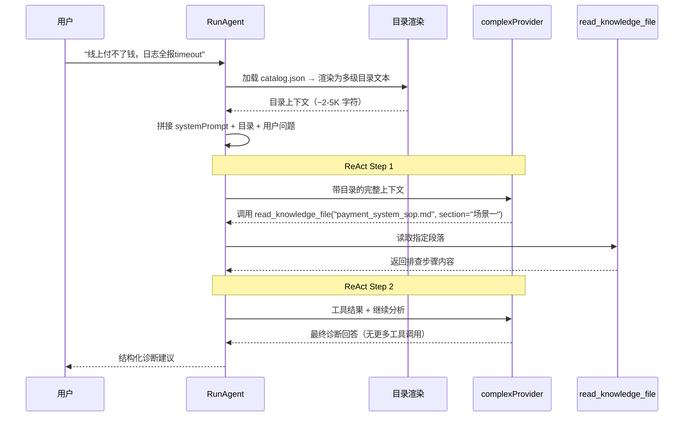

# 知识检索技术方案

> 版本: v1.0 | 日期: 2026-04-11 | 状态: 设计中
>
> 配套文档: [知识管理技术方案](knowledge-management-design.md)

---

## 1. 设计思路

### 1.1 核心理念：目录是 LLM 的参考上下文

**多级目录的本质是为 LLM 提供一份结构化的知识库概览，LLM 拿到后自行判断该看哪里。**

多级结构的意义不是让 LLM 做"精准定位"，而是**做粗粒度的排除**——把明显无关的服务/模块剪掉，让 LLM 的注意力集中在相关范围内。至于在相关范围内怎么选、选几个，交给 LLM 自己判断。

```
用户: "线上付不了钱，日志全在报timeout"

LLM 的自然推理:
  扫一眼目录 → "付不了钱" 和支付相关，和数据库/日志无关
  → 直接跳到 Payment Service 下面的几个场景看
  → 选了 "API接口超时(504)" → 读取文档
```

**LLM 不需要逐层做决策。它扫一眼就能排除大片无关内容，这是多级结构的价值。**

### 1.2 剪枝原则

剪枝的目标是**合适**，不是**精准**：

| 原则 | 说明 |
|------|------|
| **剪明显无关的** | 数据库服务的条目和"付不了钱"无关，可以不传入 |
| **保留可能有用的** | 支付服务下所有模块的场景都传入，让 LLM 自己选 |
| **硬指标：上下文大小** | 传入的目录片段必须 < 65K 字符，这是硬约束 |
| **软指标：LLM 自主决断** | 传入多少、传多详细，由 LLM 上下文容量和目录实际规模决定 |

**不要过度剪枝。** 把"明显无关"的剪掉就够了，剩下的交给 LLM。剪枝过狠会丢失 LLM 可能需要的参考信息。

### 1.3 与本地匹配的区别

| 对比项 | 本地关键词匹配 | LLM + 多级目录 |
|--------|---------------|----------------|
| 语义理解 | 无 | LLM 天然支持 |
| 定位方式 | 线性扫描 | 粗粒度排除 + LLM 自主判断 |
| 口语化支持 | 差 | 好 |
| 定位精度 | 取决于算法 | 不追求精准，追求合适 |

### 1.4 约束

- 传入 LLM 的目录片段 **≤ 65K 字符**（硬指标）
- 目录为**多级树形**（服务 → 模块 → 场景），帮助 LLM 快速排除无关分支
- 正常场景下（5-15 个服务、100-300 个场景）**直接传入完整目录，不做任何剪枝**
- 只在目录总量超过 65K 时才做粗粒度裁剪

---

## 2. 检索流程

### 2.1 完整流程

```mermaid
flowchart TD
    USER[用户输入口语化描述] --> CTX[构造上下文]
    CTX --> |"系统提示 + 多级目录 + 用户问题"| AGENT[Agent ReAct 循环]
    AGENT --> MATCH{目录中有匹配?}
    MATCH -->|是| READ[read_knowledge_file 精准读取]
    MATCH -->|否| HONEST[如实告知：知识库暂无相关文档]
    READ --> ANSWER[生成诊断回答]

    style USER fill:#1a3a5a,stroke:#4a9eff
    style ANSWER fill:#1a2a1a,stroke:#6bff6b
    style HONEST fill:#3a3a1a,stroke:#ffaa4a
```



### 2.2 上下文构造

Agent 的系统提示由三部分拼接：

```
┌─────────────────────────────────────────────┐
│ Part 1: Agent 基础提示                       │
│   工具说明、输出格式、行为规则               │
├─────────────────────────────────────────────┤
│ Part 2: 多级问题目录（从 catalog.json 渲染）  │
│   以下是你可查阅的知识库文档目录：            │
│                                               │
│   ## 支付服务 (Payment Service)               │
│   ### 核心支付模块                            │
│   - API接口超时(504) | 现象：前端超时...      │
│     → payment_system_sop.md#L12              │
│   - 订单状态未流转 | 现象：PENDING...        │
│     → payment_system_sop.md#L33              │
│   ### 回调模块                                │
│   - ...                                       │
│   ## 网络服务                                  │
│   ### ...                                     │
├─────────────────────────────────────────────┤
│ Part 3: 用户原始问题                          │
│   "线上付不了钱了，日志全在报timeout"         │
└─────────────────────────────────────────────┘
```

LLM 看到目录后，自然知道应该读取 `payment_system_sop.md` 的 API接口超时 场景。

### 2.3 时序图



对比改前的 4-6 次 LLM 调用，改后只需 2-3 次，且首次调用就携带了目录上下文。

---

## 3. 多级目录

### 3.1 多级结构的作用

多级结构的价值是让 LLM **快速排除大片无关内容**，而不是精准定位到唯一一个场景。

对比两种格式，LLM 处理"线上付不了钱"时的注意力分布：

**平铺格式**：LLM 必须逐行扫完 200 行才能判断哪些相关

**多级格式**：LLM 扫一眼服务层就知道该看 Payment Service，其他服务直接跳过

**关键是"快速排除"，不是"精准定位"。** LLM 看到多级目录后自然会把注意力集中在相关分支，这是 LLM 的推理能力，不需要我们规定它怎么剪。

### 3.2 渲染格式

每个场景条目压缩为单行：

```
{标题} | {现象摘要} | {关键词} | {文件}#L{行号}
```

服务行和模块行带数量摘要，帮助 LLM 感知规模：

```
## Payment Service (3 modules, 4 scenarios)
### 核心支付模块 (2 scenarios)
- API接口超时(504) | 前端超时,Nginx大量504 | 504,timeout,超时,接口超时 | payment_system_sop.md#L12
- 订单状态未流转 | 支付成功但PENDING | PENDING,状态,未流转,回调失败 | payment_system_sop.md#L33
### 回调模块 (1 scenario)
- 回调超时 | 商户未收到回调 | callback,回调,超时,通知失败 | payment_system_sop.md#L45
### 对账模块 (1 scenario)
- 对账不平 | 对账差异 | 对账,差异,金额不一致 | payment_system_sop.md#L60

## Network Service (1 module, 2 scenarios)
### 基础网络 (2 scenarios)
- 无法连接公网 | ping 8.8.8.8 超时 | ping,公网,无法上网 | network_troubleshooting.md#L14
- 应用端口无法访问 | Connection Refused | connection refused,端口,防火墙 | network_troubleshooting.md#L28

## Database Service (1 module, 2 scenarios)
### 连接管理 (2 scenarios)
- 连接池满 | too many connections | 连接池,耗尽 | database_maintenance.md#L10
- 慢查询阻塞 | 查询超过阈值 | 慢查询,slow query | database_maintenance.md#L25
```

### 3.3 容量估算

| 维度 | 估算 |
|------|------|
| 单个场景条目 | ~120 字符 |
| 服务/模块层级标题 | ~40 字符/层 |
| 100 个场景的目录 | ~15K 字符 |
| 300 个场景的目录 | ~40K 字符 |
| 65K 上限可容纳 | ~500 个场景 |

**绝大多数场景下目录总量在 10-30K，远低于 65K，直接完整传入即可。**

### 3.4 裁剪策略（仅超限时使用）

只在目录总量 > 65K 时才做粗粒度裁剪。**正常情况直接传完整目录。**

```mermaid
flowchart TD
    FULL[完整目录] --> SIZE{总量 > 65K?}
    SIZE -->|否| PASS[直接传入完整目录]
    SIZE -->|是| TRIM[粗粒度裁剪：<br/>压缩条目格式 / 收窄范围]
    TRIM --> RESULT[裁剪后 ≤ 65K]
    RESULT --> PASS2[传入裁剪后的目录]

    style SIZE fill:#1a2a1a,stroke:#6bff6b
    style TRIM fill:#3a2a1a,stroke:#ffa500
```



裁剪是**粗粒度**的，不需要精准——把目录缩减到合适大小即可：

| 策略 | 做法 | 效果 |
|------|------|------|
| 压缩条目 | 去掉 phenomena，只留 `标题 \| 关键词 \| 文件` | 每条 ~120 字符 → ~80 字符 |
| 收窄范围 | 根据用户问题的领域词，只传入相关服务 + 临近服务 | 整体量级下降 |

不需要做精准的"只传匹配的那几个场景"——那反而限制了 LLM 的参考视野。

---

## 4. Prompt 设计

### 4.1 Agent 系统提示（含目录）

```
你是 OpsCopilot 运维诊断助手。你可以查阅本地知识库来辅助诊断。

## 可用工具
1. read_knowledge_file: 读取知识库文档（指定 path 和可选的 section）

## 知识库问题目录

{此处插入从 catalog.json 渲染的多级目录}

## 规则
- 参考上方目录，找到与用户问题相关的场景，使用 read_knowledge_file 读取对应文档
- 如果目录中没有与用户问题相关的场景，如实告知用户知识库中暂无相关排障文档，不要凭空编造排查建议
- 输出 Markdown 格式，用 ## 分节，命令用 ```bash 代码块
- 用中文回答
```

注意几个要点：
- **工具只有 `read_knowledge_file`**，没有 `search_knowledge`、`list_knowledge_files`。检索完全依赖目录，不提供全文搜索作为后路
- **查不到就说查不到**，不鼓励 LLM 凭空猜测。对用户来说"知识库暂无此问题的记录"远好于编造的排查建议
- 怎么用目录是 LLM 自己的事，不规定推理路径

### 4.2 查不到时的处理

目录中没有匹配场景时，Agent 应直接回复，而非尝试猜测：

```mermaid
flowchart TD
    AGENT[Agent 推理] --> CHECK{目录中有匹配场景?}
    CHECK -->|是| READ[read_knowledge_file<br/>精准读取段落]
    READ --> ANSWER[基于文档生成诊断]
    CHECK -->|否| HONEST[如实回复：<br/>知识库暂无相关排障文档]

    style HONEST fill:#3a3a1a,stroke:#ffaa4a
    style ANSWER fill:#1a2a1a,stroke:#6bff6b
```



**为什么不用全文搜索兜底？**

全文搜索基于关键词匹配，在目录已经覆盖不了的情况下，全文搜索大概率也搜不到有价值的内容，反而可能返回不相关的片段让 LLM 产生错误联想。不如直接告诉用户"查不到"，让用户决定下一步（补充文档、换个描述、或用 MCP 工具直接上机排查）。

---

## 5. 精准段落读取

### 5.1 read_knowledge_file 扩展

现有工具读取整个文件，改为支持按场景精准读取：

```
参数:
  path: string (必填) — 文件路径，如 "payment_system_sop.md"
  section: string (选填) — 场景标题，如 "场景一：API接口超时"
```

当指定 `section` 时：
- 利用 `catalog.json` 中的 `lineStart` / `lineEnd` 定位
- 只返回该段落内容（从 lineStart 到下一个同级/更高级标题）
- 避免读取整个文件，节省 token

### 5.2 段落定位逻辑

```go
func ReadSection(filePath string, section string) (string, error) {
    // 1. 从 catalog 中查找 section 的 lineStart / lineEnd
    entry := catalog.FindEntry(filePath, section)
    if entry == nil {
        // fallback: 读取整个文件
        return ReadFullFile(filePath)
    }

    // 2. 按行号读取指定范围
    lines := readLines(filePath, entry.LineStart, entry.LineEnd)
    return strings.Join(lines, "\n"), nil
}
```

---

## 6. 响应格式保障

### 6.1 输出格式约束

在 Agent 提示中明确：

```
输出格式要求：
- 使用 Markdown 格式
- 用 ## 标题分节（问题分析、可能原因、建议操作）
- 命令放在 ```bash 代码块中
- 步骤使用有序列表
- 不要用 JSON 包装你的回答
```

### 6.2 后处理

Agent 返回结果后，`normalizeAgentResponse` 处理边界情况：

| 场景 | 处理 |
|------|------|
| Markdown 被 JSON 包装 | 检测 `{"summary": "..."}` 模式，自动解包 |
| 孤立反引号标记 | 奇数个 ``` 时移除最后一个 |

### 6.3 前端预处理

`TroubleshootingPanel` 增加 `preprocessContent`：

1. 尝试从 JSON 包装中提取文本内容
2. 确保标题前有空行（修复 `文字\n## 标题` → `文字\n\n## 标题`）

---

## 7. 文件变更清单

| 文件 | 操作 | 说明 |
|------|------|------|
| `pkg/knowledge/catalog.go` | 新建 | 目录数据结构 |
| `pkg/knowledge/indexer.go` | 新建 | 目录渲染（catalog.json → LLM 上下文文本） |
| `pkg/tools/knowledge/read_file.go` | 修改 | 增加 section 参数支持精准读取 |
| `pkg/ai/agent.go` | 修改 | 目录注入系统提示、移除 search_knowledge 工具、normalizeAgentResponse |
| `pkg/ai/intent.go` | 修改 | normalizeAgentResponse |
| `frontend/.../TroubleshootingPanel.tsx` | 修改 | preprocessContent |

---

## 8. 验证方案

```bash
# 单元测试
go test ./pkg/knowledge/... -v -run TestCatalog
go test ./pkg/knowledge/... -v -run TestIndexer
go test ./pkg/ai/... -v -run TestAgentLoop

# 手动验证场景
# 1. 输入 "线上付不了钱" → 确认 Agent 读取了 payment_system_sop.md 的正确场景
# 2. 输入目录中没有的问题 → 确认 Agent 回复 "知识库暂无相关文档"，不编造
# 3. 检查 Agent 日志确认目录上下文被正确注入
# 4. 确认 LLM 调用次数 ≤ 2 次
```
