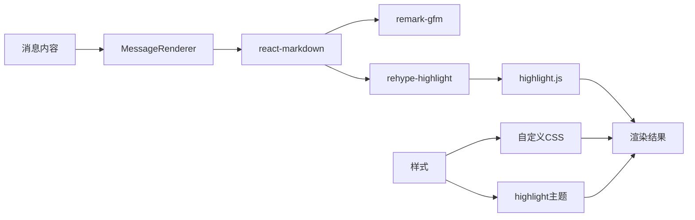

# AI问答Markdown渲染方案

## 问题描述
当前AI问答功能返回的消息内容无法渲染Markdown格式,所有内容都以纯文本形式显示。这导致AI返回的格式化内容(如代码块、列表、标题等)无法正确展示。

## 问题分析

### 当前实现
在 [`AIChatPanel.tsx:96`](../frontend/src/components/Sidebar/AIChatPanel.tsx:96) 中,消息内容直接使用纯文本渲染:

```tsx
<div style={styles.messageContent}>{msg.content}</div>
```

### 根本原因
- 没有使用Markdown解析和渲染库
- 缺少代码语法高亮支持
- 没有针对Markdown内容的样式优化

## 技术方案

### 1. 依赖库选择

推荐使用以下库:

#### 主要库
- **react-markdown**: React的Markdown渲染组件,轻量且功能完善
- **remark-gfm**: 支持GitHub风格Markdown(GFM),包括表格、删除线、任务列表等
- **rehype-highlight**: 代码块语法高亮
- **highlight.js**: 语法高亮核心库

#### 替代方案
- **react-markdown** + **rehype-raw**: 如需支持HTML内容
- **markdown-it**: 更强大但较重的Markdown解析器

### 2. 组件架构

```
AIChatPanel (现有组件)
  └── MessageRenderer (新建组件)
        └── ReactMarkdown
              ├── CodeBlock (自定义代码块组件)
              └── 其他自定义渲染器
```

### 3. 实现步骤

#### 步骤1: 安装依赖
```bash
npm install react-markdown remark-gfm rehype-highlight highlight.js
```

或使用yarn:
```bash
yarn add react-markdown remark-gfm rehype-highlight highlight.js
```

#### 步骤2: 创建MessageRenderer组件
创建 `frontend/src/components/Sidebar/MessageRenderer.tsx`:

**功能特性:**
- 渲染Markdown内容
- 代码块语法高亮
- 支持GFM特性(表格、任务列表等)
- 适配暗色主题
- 代码块复制功能(可选)

**组件接口:**
```typescript
interface MessageRendererProps {
  content: string;
  role: 'user' | 'ai';
}
```

#### 步骤3: 更新AIChatPanel组件
修改 [`AIChatPanel.tsx:96`](../frontend/src/components/Sidebar/AIChatPanel.tsx:96):

```tsx
// 替换前
<div style={styles.messageContent}>{msg.content}</div>

// 替换后
<MessageRenderer content={msg.content} role={msg.role} />
```

#### 步骤4: 添加样式配置

**代码高亮主题选择:**
- `atom-one-dark`: 经典暗色主题,与VSCode风格接近
- `github-dark`: GitHub暗色风格
- `monokai`: 流行的暗色主题

**自定义样式需求:**
- 代码块背景色与消息气泡协调
- 链接颜色适配暗色主题
- 表格边框与分隔线样式
- 行内代码样式优化

### 4. 代码实现要点

#### 4.1 基础Markdown渲染
```typescript
import ReactMarkdown from 'react-markdown';
import remarkGfm from 'remark-gfm';
import rehypeHighlight from 'rehype-highlight';

<ReactMarkdown
  remarkPlugins={[remarkGfm]}
  rehypePlugins={[rehypeHighlight]}
>
  {content}
</ReactMarkdown>
```

#### 4.2 自定义代码块组件
```typescript
components={{
  code({node, inline, className, children, ...props}) {
    const match = /language-(\w+)/.exec(className || '');
    return !inline ? (
      <div className="code-block-wrapper">
        <div className="code-header">
          <span>{match ? match[1] : 'code'}</span>
          <button onClick={() => copyToClipboard(String(children))}>
            复制
          </button>
        </div>
        <code className={className} {...props}>
          {children}
        </code>
      </div>
    ) : (
      <code className="inline-code" {...props}>
        {children}
      </code>
    );
  }
}}
```

#### 4.3 样式集成
```typescript
// 导入highlight.js样式
import 'highlight.js/styles/atom-one-dark.css';

// 或在组件内动态导入
useEffect(() => {
  import('highlight.js/styles/atom-one-dark.css');
}, []);
```

### 5. 样式设计

#### 5.1 消息容器样式调整
- AI消息: 左对齐,灰色背景,最大宽度95%
- 用户消息: 右对齐,蓝色背景,最大宽度85%

#### 5.2 Markdown元素样式
```css
/* 标题 */
h1, h2, h3, h4, h5, h6 {
  margin: 0.5em 0;
  color: #fff;
}

/* 代码块 */
pre {
  background: #1e1e1e;
  border-radius: 4px;
  padding: 12px;
  overflow-x: auto;
}

/* 行内代码 */
code {
  background: rgba(255, 255, 255, 0.1);
  padding: 2px 6px;
  border-radius: 3px;
  font-family: 'Consolas', 'Monaco', monospace;
}

/* 链接 */
a {
  color: #4fc3f7;
  text-decoration: none;
}

/* 列表 */
ul, ol {
  margin: 0.5em 0;
  padding-left: 1.5em;
}

/* 表格 */
table {
  border-collapse: collapse;
  width: 100%;
  margin: 0.5em 0;
}

th, td {
  border: 1px solid #444;
  padding: 6px 12px;
}
```

### 6. 功能增强(可选)

#### 6.1 代码复制功能
- 为每个代码块添加复制按钮
- 使用Clipboard API实现复制
- 复制成功后显示提示

#### 6.2 LaTeX公式支持
如需支持数学公式,可添加:
- `remark-math`
- `rehype-katex`

#### 6.3 图片优化
- 图片懒加载
- 点击图片放大预览
- 外部图片代理(安全考虑)

### 7. 性能优化

#### 7.1 组件优化
```typescript
// 使用React.memo避免不必要的重渲染
export default React.memo(MessageRenderer);
```

#### 7.2 大文本处理
- 对超长内容进行截断或折叠
- 虚拟滚动优化消息列表

#### 7.3 语法高亮优化
- 按需加载语言支持
- 使用highlight.js的轻量版本

### 8. 测试计划

#### 8.1 功能测试
- [ ] 基础Markdown语法(标题、粗体、斜体、列表)
- [ ] 代码块渲染和语法高亮
- [ ] GFM特性(表格、任务列表、删除线)
- [ ] 链接和图片
- [ ] 混合内容渲染

#### 8.2 样式测试
- [ ] 暗色主题适配
- [ ] 不同消息角色的样式差异
- [ ] 响应式布局
- [ ] 代码块滚动

#### 8.3 边界情况
- [ ] 空内容
- [ ] 纯文本消息
- [ ] 超长代码块
- [ ] 特殊字符转义

### 9. 实现示例

#### 测试用例
AI返回以下Markdown内容应正确渲染:

```markdown
# 标题示例

这是**粗体**和*斜体*文本。

## 代码示例

\`\`\`javascript
function hello() {
  console.log('Hello, World!');
}
\`\`\`

## 列表示例

- 项目1
- 项目2
  - 子项目2.1
  - 子项目2.2

## 表格示例

| 列1 | 列2 | 列3 |
|-----|-----|-----|
| 数据1 | 数据2 | 数据3 |

## 任务列表

- [x] 已完成任务
- [ ] 待完成任务
```

### 10. 潜在问题与解决方案

#### 问题1: 样式冲突
**解决方案**: 使用CSS模块或styled-components隔离样式

#### 问题2: XSS安全风险
**解决方案**: 
- react-markdown默认已做安全处理
- 避免使用rehype-raw(允许原始HTML)
- 对用户输入进行验证

#### 问题3: 打包体积增大
**解决方案**:
- 使用highlight.js/lib/core + 按需注册语言
- 代码分割和懒加载

#### 问题4: 移动端适配
**解决方案**:
- 代码块横向滚动
- 表格响应式处理
- 字体大小自适应

## 技术栈总结



## 下一步行动

1. **Code模式**: 实现上述技术方案
2. **测试验证**: 确保各种Markdown格式正确渲染
3. **样式调优**: 根据实际效果微调样式
4. **用户反馈**: 收集使用反馈并持续优化

## 预期效果

实现后,AI返回的消息将能够:
- ✅ 正确渲染标题、列表、表格等Markdown元素
- ✅ 代码块带语法高亮
- ✅ 支持GFM扩展语法
- ✅ 样式美观,与暗色主题协调
- ✅ 提升用户阅读体验
